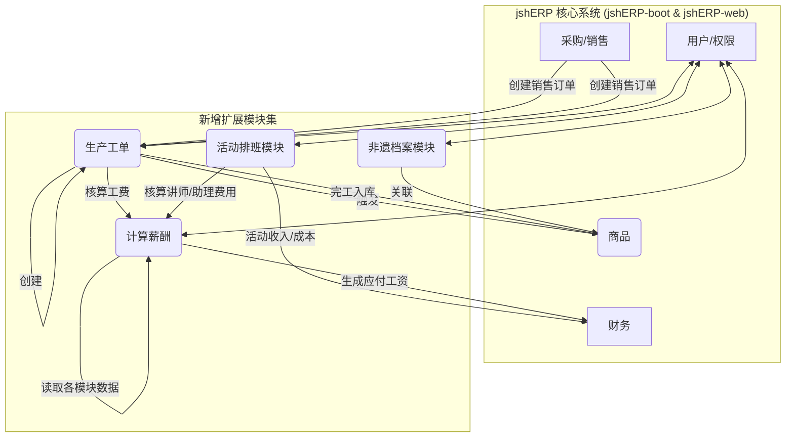

### **jshERP 聆花文化二次开发最佳实践方案**

---

#### **1. 核心理念与架构**

*   **核心原则**：严格遵循“最小侵入”原则，不动摇`jshERP`核心代码库与数据库表结构。所有新功能均通过独立、松耦合的“扩展模块”实现。
*   **技术架构**：采用“核心系统 + 扩展模块集”的模式。扩展模块作为独立的业务单元，通过调用`jshERP`的API和共享数据库（只追加新表，不修改旧表）与核心系统通信，确保数据一致性。

**架构交互示意图:**

---

#### **2. 扩展模块详细设计规划**

##### **2.1 (新增) 生产工坊模块 (workshop)**

*   **目的**: 管理从订单到成品的全过程，精细化追踪手工艺品制作流程与成本。
*   **关键特性**:
    1.  销售订单关联生产工单。
    2.  工单的工序分解与物料（BOM）管理。
    3.  制作人员移动端扫码报工（拍照上传、确认数量）。
    4.  工费自动核算（计件/计时）。
    5.  半成品、成品入库流程。
*   **数据库设计 (新增表)**:
    *   `jsh_workshop_order` (生产工单主表)
        *   `id`, `order_no` (工单号), `source_bill_id` (关联销售单ID), `material_id` (关联产品ID), `quantity`, `start_date`, `due_date`, `status` (状态:待生产/生产中/已完工), `total_material_cost`, `total_labor_cost`, `tenant_id`, `delete_flag`, etc.
    *   `jsh_workshop_bom` (生产物料清单表)
        *   `id`, `order_id`, `material_id` (原料/半成品ID), `required_quantity`, `actual_quantity`, `tenant_id`, etc.
    *   `jsh_workshop_log` (生产报工记录表)
        *   `id`, `order_id`, `process_name` (工序名), `operator_id` (操作员ID), `completed_quantity`, `labor_cost` (本次工费), `log_time`, `image_url` (上传图片), `tenant_id`, etc.
*   **后端API设计 (新增Controller: `WorkshopController.java`)**:
    *   `GET /workshop/orders`: 查询工单列表。
    *   `POST /workshop/order`: 从销售订单创建工单。
    *   `GET /workshop/order/{id}`: 获取工单详情（含BOM和报工记录）。
    *   `POST /workshop/log`: 制作人员提交报工记录。
    *   `POST /workshop/order/{id}/finish`: 完结工单并触发成品入库。
*   **前端UI设计 (新增视图: `views/workshop/`)**:
    *   `WorkshopOrderList.vue`: 生产工单管理列表。
    *   `WorkshopOrderDetail.vue`: 工单详情页，展示进度、物料和报工日志。
    *   `WorkshopMobileLog.vue`: (移动端优化) 简洁的报工页面。

##### **2.2 (新增) 活动与排班模块 (activity)**

*   **目的**: 统一管理非遗团建活动和咖啡店日常排班。
*   **关键特性**:
    1.  活动日历视图。
    2.  场地、讲师、助理等资源管理与冲突检测。
    3.  活动预算与成本核算。
    4.  咖啡店图形化拖拽排班。
*   **数据库设计 (新增表)**:
    *   `jsh_activity` (活动主表)
        *   `id`, `name`, `customer_id` (关联客户), `start_time`, `end_time`, `venue_id`, `status`, `income_budget`, `cost_budget`, `tenant_id`, etc.
    *   `jsh_activity_resource` (活动资源占用表)
        *   `id`, `activity_id`, `resource_type` (场地/讲师/助理), `resource_id`, `cost`, `tenant_id`, etc.
    *   `jsh_shift_schedule` (排班表)
        *   `id`, `employee_id`, `shift_date`, `start_time`, `end_time`, `location` (如: 咖啡店), `tenant_id`, etc.
*   **后端API设计 (新增Controller: `ActivityController.java`, `ShiftController.java`)**:
    *   `GET /activity/list`: 获取活动列表/日历数据。
    *   `POST /activity/add`: 新建活动。
    *   `GET /shift/schedule`: 获取排班视图数据。
    *   `POST /shift/schedule`: 保存排班信息。
*   **前端UI设计 (新增视图: `views/activity/`)**:
    *   `ActivityCalendar.vue`: 活动日历视图。
    *   `ActivityForm.vue`: 活动创建/编辑表单。
    *   `ShiftSchedule.vue`: 图形化排班界面。

##### **2.3 (新增) 薪酬核算中心 (payroll)**

*   **目的**: 自动归集各模块数据，计算复杂薪酬。
*   **关键特性**:
    1.  薪酬结构配置。
    2.  每月自动/手动触发薪酬计算。
    3.  生成薪酬明细清单。
    4.  薪酬数据归档与查询。
*   **数据库设计 (新增表)**:
    *   `jsh_payroll_sheet` (薪酬单主表)
        *   `id`, `employee_id`, `period` (薪酬周期，如'2025-07'), `base_salary`, `piece_rate_wage`, `commission`, `deductions`, `final_pay`, `status`, `tenant_id`, etc.
    *   `jsh_payroll_detail` (薪酬明细表)
        *   `id`, `sheet_id`, `source_type` (来源:生产/销售/活动), `source_bill_id`, `amount`, `description`, `tenant_id`, etc.
*   **后端API设计 (新增Controller: `PayrollController.java`)**:
    *   `POST /payroll/calculate`: 触发指定月份的薪酬计算。
    *   `GET /payroll/sheet`: 查询员工薪酬单。
    *   `GET /payroll/sheet/{id}`: 获取薪酬单详情。
*   **前端UI设计 (新增视图: `views/payroll/`)**:
    *   `PayrollDashboard.vue`: 薪酬计算触发和历史记录查看。
    *   `PayrollSheetDetail.vue`: 员工薪酬明细展示。

##### **2.4 (扩展) 产品与客户信息**

*   **目的**: 在不修改原表的前提下，为产品和客户增加丰富的业务字段。
*   **数据库设计 (新增表)**:
    *   `jsh_material_plus` (产品信息扩展表)
        *   `id`, `material_id` (关联`jsh_material.id`), `artisan_id` (匠人ID), `story` (作品故事), `lifecycle_info` (生命周期信息), `digital_code` (数字鉴证码), `tenant_id`, etc.
    *   `jsh_customer_plus` (客户信息扩展表)
        *   `id`, `customer_id` (关联`jsh_supplier.id`), `channel_type`, `deposit_amount` (押金), `settlement_terms` (结算方式), `tenant_id`, etc.
*   **后端API设计**:
    *   修改 `MaterialService` 和 `SupplierService` (客户服务)。在查询详情的接口中，同步查询 `plus` 表的数据并合并返回。
    *   在新增/修改的接口中，同步处理 `plus` 表的数据写入。
*   **前端UI设计**:
    *   修改 `MaterialModal.vue` 和 `CustomerModal.vue` 等表单，增加新字段的输入框。数据提交时，将主表和扩展表的数据一并发送到后端。

---

#### **3. 实施清单 (Implementation Checklist)**

1.  **环境准备**:
    *   [ ] 确认开发环境Docker容器运行正常。
    *   [ ] 备份现有数据库。

2.  **数据库变更**:
    *   [ ] 创建新表：`jsh_workshop_order`, `jsh_workshop_bom`, `jsh_workshop_log`。
    *   [ ] 创建新表：`jsh_activity`, `jsh_activity_resource`, `jsh_shift_schedule`。
    *   [ ] 创建新表：`jsh_payroll_sheet`, `jsh_payroll_detail`。
    *   [ ] 创建新表：`jsh_material_plus`, `jsh_customer_plus`。
    *   [ ] (可选)创建 `jsh_knowledge_archive` 用于非遗知识库。

3.  **后端开发 (jshERP-boot)**:
    *   [ ] 创建新的 `com.jsh.erp.expansion` 包，用于存放所有扩展模块代码。
    *   [ ] 在 `expansion` 包下，分别创建 `workshop`, `activity`, `payroll` 等子包。
    *   [ ] 为每个新模块编写对应的 `Controller`, `Service`, `Mapper`, `Entity`。
    *   [ ] 修改 `MaterialService` 和 `SupplierService`，添加对 `plus` 扩展表的读写逻辑。
    *   [ ] 编写各模块间的业务逻辑联动代码（如：销售单完成时，提供一个按钮或触发器来创建生产工单）。

4.  **前端开发 (jshERP-web)**:
    *   [ ] 在 `src/views/` 目录下创建 `workshop`, `activity`, `payroll` 等新目录。
    *   [ ] 开发各新模块的列表、表单、详情等 `.vue` 组件。
    *   [ ] 在 `src/router/router.config.js` 中添加新模块的路由配置和菜单项。
    *   [ ] 在 `src/store/modules/` 中可能需要为复杂模块添加新的 `vuex` 状态管理。
    *   [ ] 修改 `MaterialModal.vue` 和 `CustomerModal.vue` 等现有组件，添加对扩展字段的支持。

5.  **测试与部署**:
    *   [ ] 对各扩展模块进行单元测试和集成测试。
    *   [ ] 测试新旧模块联动流程是否通畅。
    *   [ ] 更新 Docker 配置文件（如果需要），并重新构建和部署应用。

此计划详细定义了二次开发的范围和技术路径，可作为后续执行阶段的直接依据。
