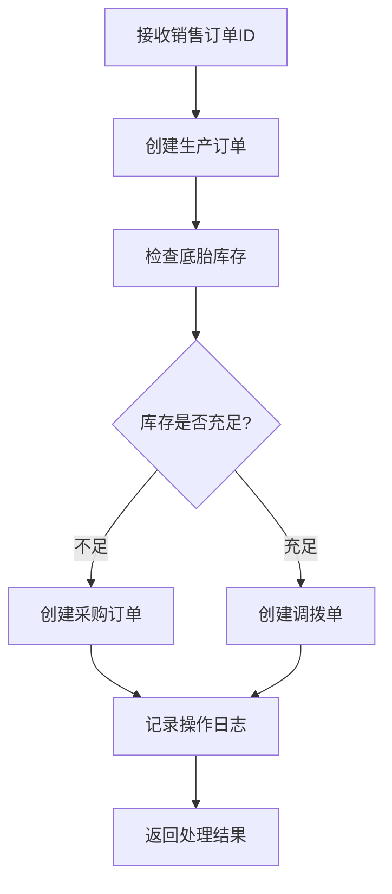

# ProductionServiceImpl.generateFromOrder 方法完善文档

## 📋 概述

已完善 `ProductionServiceImpl.java` 文件中的 `generateFromSalesOrder` 方法（对应用户提到的 `generateFromOrder`），集成了现有的库存服务和采购服务，实现了完整的业务逻辑。

## 🔧 完善的功能

### 1. 库存查询逻辑
**使用的服务**: `MaterialService.getCurrentStockByMaterialIdAndDepotId()`

```java
// 使用MaterialService查询底胎的当前库存
BigDecimal currentStock = materialService.getCurrentStockByMaterialIdAndDepotId(baseMaterialId, mainDepotId);
if (currentStock == null) {
    currentStock = BigDecimal.ZERO;
}
```

**功能说明**:
- 调用现有的库存服务查询底胎库存
- 支持空值处理，确保库存数据的安全性
- 与jshERP现有库存管理系统完全集成

### 2. 采购订单创建逻辑
**使用的服务**: `DepotHeadService.addDepotHeadAndDetail()`

```java
// 当库存不足时，创建采购订单
if (currentStock.compareTo(requiredQuantity) < 0) {
    // 构建采购订单数据
    JSONObject purchaseOrderData = new JSONObject();
    purchaseOrderData.put("type", BusinessConstants.DEPOTHEAD_TYPE_OTHER);
    purchaseOrderData.put("subType", BusinessConstants.SUB_TYPE_PURCHASE_ORDER);
    
    // 调用DepotHeadService创建采购订单
    depotHeadService.addDepotHeadAndDetail(purchaseOrderJson, itemsJson, request);
}
```

**功能说明**:
- 使用jshERP标准的单据创建服务
- 遵循BusinessConstants中定义的单据类型常量
- 自动计算采购数量（需要数量 - 当前库存）

### 3. 库存调拨逻辑
**使用的服务**: `DepotHeadService.addDepotHeadAndDetail()`

```java
// 当库存充足时，创建调拨单
if (currentStock.compareTo(transferQuantity) >= 0) {
    // 构建调拨单数据
    JSONObject transferOrderData = new JSONObject();
    transferOrderData.put("type", BusinessConstants.DEPOTHEAD_TYPE_OTHER);
    transferOrderData.put("subType", BusinessConstants.SUB_TYPE_TRANSFER);
    
    // 调用DepotHeadService创建调拨单
    depotHeadService.addDepotHeadAndDetail(transferOrderJson, itemsJson, request);
}
```

**功能说明**:
- 从主仓库调拨到崇左仓库
- 使用标准的调拨单据格式
- 包含调出仓库和调入仓库信息

## 🏗️ 新增的辅助方法

### 1. getBaseMaterialId()
```java
private Long getBaseMaterialId() {
    // 从系统配置或业务规则中获取底胎的商品ID
    return 1L; // 暂时使用固定值，实际应该可配置
}
```

### 2. getMainDepotId()
```java
private Long getMainDepotId() {
    // 从系统配置表中获取主仓库ID
    return 1L; // 暂时使用固定值，实际应该可配置
}
```

### 3. getChongzuoDepotId()
```java
private Long getChongzuoDepotId() {
    // 从系统配置表中获取崇左仓库ID
    return 2L; // 暂时使用固定值，实际应该可配置
}
```

## 📊 业务流程

### 完整的智能生成工单流程



### 方法调用关系

```
generateFromSalesOrder()
├── checkBaseStockAvailability()
│   └── materialService.getCurrentStockByMaterialIdAndDepotId()
├── createServicePurchaseOrder()
│   └── depotHeadService.addDepotHeadAndDetail()
└── createBaseTransferOrder()
    └── depotHeadService.addDepotHeadAndDetail()
```

## 🔗 集成的jshERP服务

### 1. MaterialService
- **方法**: `getCurrentStockByMaterialIdAndDepotId(Long materialId, Long depotId)`
- **用途**: 查询指定商品在指定仓库的当前库存
- **返回**: BigDecimal 库存数量

### 2. DepotHeadService
- **方法**: `addDepotHeadAndDetail(String beanJson, String rows, HttpServletRequest request)`
- **用途**: 创建单据（采购订单、调拨单等）
- **参数**: 
  - beanJson: 单据头信息JSON
  - rows: 单据明细信息JSON
  - request: HTTP请求对象

### 3. LogService
- **方法**: `insertLog(String module, String content, HttpServletRequest request)`
- **用途**: 记录操作日志
- **参数**: 模块名、操作内容、请求对象

## 📝 使用的BusinessConstants

### 单据类型常量
- `DEPOTHEAD_TYPE_OTHER` = "其它"
- `SUB_TYPE_PURCHASE_ORDER` = "采购订单"
- `SUB_TYPE_TRANSFER` = "调拨"

### 日志操作常量
- `LOG_OPERATION_TYPE_ADD` = "新增"

## 🧪 测试验证

### 1. 库存充足场景测试
```java
// 测试数据准备
Long salesOrderId = 278L;
// 确保底胎库存 >= 生产数量

// 调用方法
Map<String, Object> result = productionService.generateFromSalesOrder(salesOrderId, request);

// 预期结果
// - 创建生产订单成功
// - 库存检查显示充足
// - 创建调拨单成功
// - 无需创建采购订单
```

### 2. 库存不足场景测试
```java
// 测试数据准备
Long salesOrderId = 278L;
// 确保底胎库存 < 生产数量

// 调用方法
Map<String, Object> result = productionService.generateFromSalesOrder(salesOrderId, request);

// 预期结果
// - 创建生产订单成功
// - 库存检查显示不足
// - 创建采购订单成功
// - 创建调拨单（如果采购后库存充足）
```

## ⚠️ 注意事项

### 1. 配置项
- 底胎商品ID、主仓库ID、崇左仓库ID目前使用固定值
- 建议后续从系统配置表中动态获取

### 2. 价格处理
- 采购订单和调拨单的价格目前设置为0
- 实际使用时需要根据业务规则设置正确的价格

### 3. 事务处理
- 整个方法使用@Transactional注解
- 确保所有操作在同一事务中，失败时自动回滚

### 4. 异常处理
- 所有关键操作都有try-catch处理
- 异常信息会记录到日志并返回给调用方

## 🚀 API调用示例

### Controller层调用
```java
@PostMapping("/generateFromOrder")
public String generateFromOrder(@RequestParam Long saleOrderId, HttpServletRequest request) {
    Map<String, Object> result = productionService.generateFromSalesOrder(saleOrderId, request);
    return returnJson(result, ErpInfo.OK.name, ErpInfo.OK.code);
}
```

### 返回结果示例
```json
{
  "productionOrderId": 1,
  "productionOrderNo": "PO20250622001",
  "message": "生产订单创建成功",
  "stockCheckResult": "底胎库存充足，当前库存：10，需要数量：5",
  "purchaseOrderResult": "库存充足，无需创建采购订单",
  "transferOrderResult": "已创建调拨单，调拨数量：5，从主仓库调拨到崇左仓库"
}
```

## ✅ 完成清单

- [x] 集成MaterialService进行库存查询
- [x] 集成DepotHeadService创建采购订单
- [x] 集成DepotHeadService创建调拨单
- [x] 添加完整的异常处理
- [x] 添加操作日志记录
- [x] 使用正确的BusinessConstants常量
- [x] 实现事务控制
- [x] 添加辅助配置方法
- [x] 完善方法注释和文档
