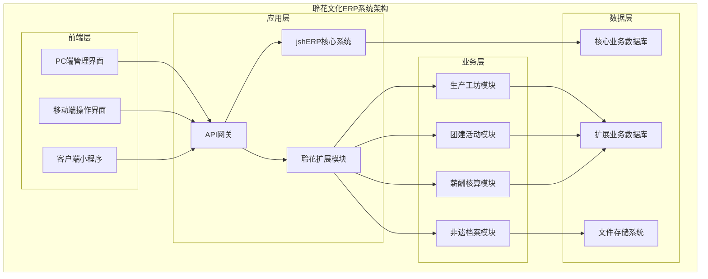
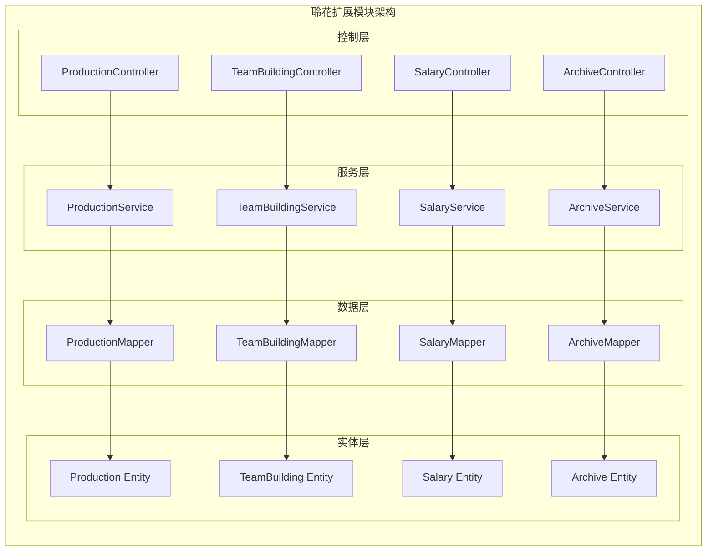
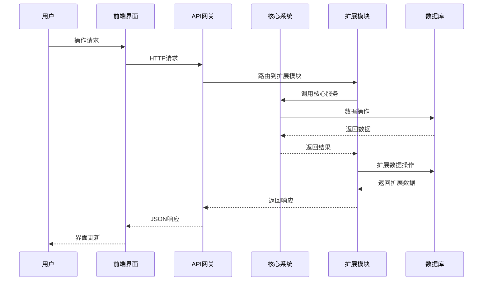
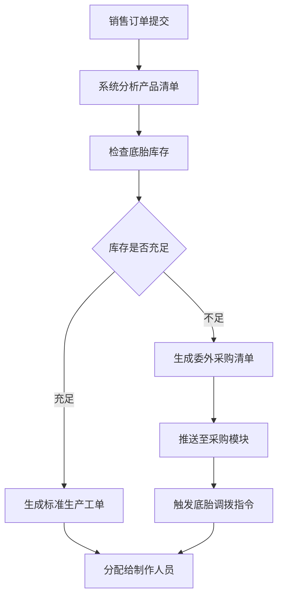
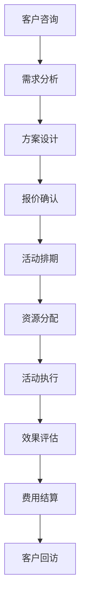
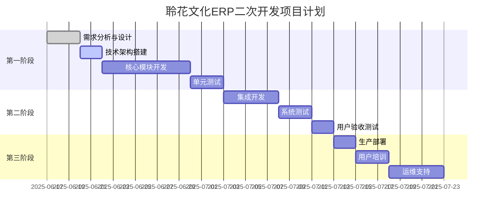
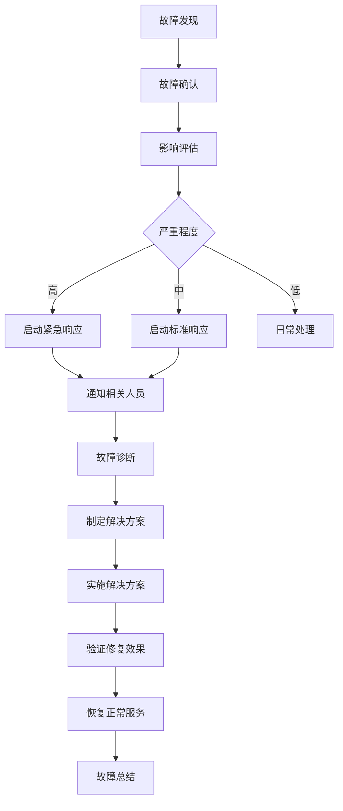
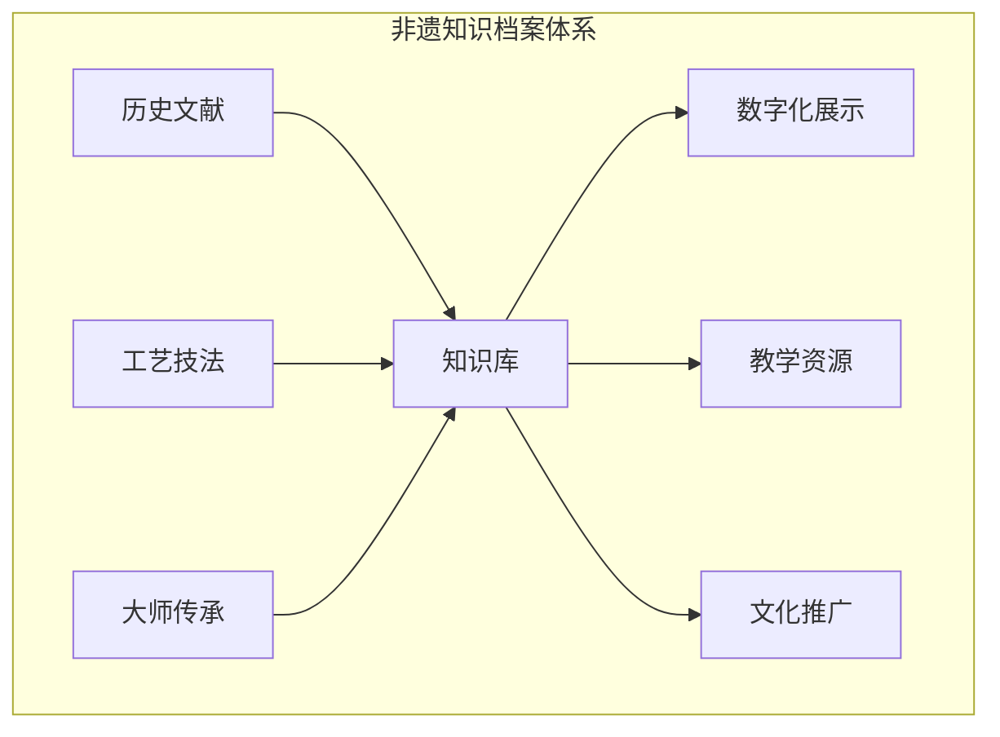
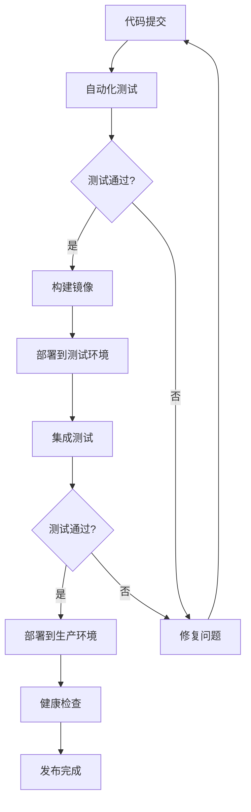

# 聆花文化ERP二次开发综合实施方案 - 最终版

## 文档信息

- **项目名称**: 聆花文化非遗掐丝珐琅ERP系统二次开发
- **文档版本**: v2.0.0
- **创建日期**: 2025-06-17
- **最后更新**: 2025-06-17
- **文档状态**: 最终执行版
- **适用范围**: 聆花文化ERP系统二次开发项目
- **部署环境**: 阿里云ECS服务器
- **系统状态**: 基础版本已部署，待二次开发扩展

## 目录

- [1. 项目概述](#1-项目概述)
- [2. 方案对比分析总结](#2-方案对比分析总结)
- [3. 混合实施策略](#3-混合实施策略)
- [4. 技术架构设计](#4-技术架构设计)
- [5. 详细实施方案](#5-详细实施方案)
- [6. 分阶段开发计划](#6-分阶段开发计划)
- [7. 技术实现指南](#7-技术实现指南)
- [8. 风险控制方案](#8-风险控制方案)
- [9. 业务价值体现](#9-业务价值体现)
- [10. 质量保证体系](#10-质量保证体系)
- [11. 运维支持方案](#11-运维支持方案)
- [12. 附录](#12-附录)

---

## 1. 项目概述

### 1.1 项目背景

聆花文化作为专注于非遗掐丝珐琅艺术的文化企业，具有独特的业务模式和复杂的生产流程：

**核心业务特点**:
- **生产制作业务**: 掐丝珐琅艺术品的设计、制作、销售，涉及广州、崇左两地协作生产
- **文化传承业务**: 非遗团建活动、技艺培训、文化推广
- **多元化经营**: 聆花掐丝珐琅馆运营、印象咖咖啡店、定制服务

**特殊业务流程**:
- **多地协作生产**: 广州原料仓储、崇左生产基地、底胎委外加工的复杂供应链
- **订单驱动制作**: 销售订单触发的智能工单生成与物料匹配
- **工艺流程管控**: 掐丝点蓝、配饰制作的精细化工艺管理
- **移动端报工**: 崇左生产基地的移动端拍照报工系统

**当前系统状况**:
- jshERP基础系统已在阿里云服务器部署上线
- 现有通用ERP功能无法满足聆花文化的特殊业务需求
- 急需针对性的二次开发以支撑业务数字化转型

### 1.2 项目目标

**核心目标**:
- 实现订单驱动的智能生产流转系统，支持广州-崇左两地协作
- 建立掐丝点蓝和配饰制作的精细化工艺管理体系
- 构建移动端极简报工和半成品自动回调系统
- 实现团建活动的标准化运营和自动化收费结算
- 建立多维度自动化薪酬核算机制
- 保护和传承非遗掐丝珐琅工艺知识资产

**量化目标**:
- 生产工单自动化率达到90%以上
- 移动端报工响应时间缩短80%
- 薪酬核算自动化率达到95%
- 团建活动管理效率提升60%
- 库存管理精确度提升至99%

### 1.3 项目范围

**核心模块**:
1. **生产制作管理模块** (优先级：最高)
   - 制作任务管理（掐丝点蓝制作、配饰制作）
   - 订单驱动生产流转（智能工单生成、底胎调拨）
   - 极简报工与过程追踪（移动端拍照报工）
   - 后工智能调度（半成品入仓触发、自动计费）

2. **团建活动管理模块** (优先级：高)
   - 活动全生命周期管理
   - 客户、场地、讲师资源管理
   - 预算核算和自动化结算

3. **薪酬核算中心模块** (优先级：高)
   - 多维度薪酬自动计算
   - 生产工费、团建提成、排班工资统一核算
   - 薪资条自动生成和发放

4. **非遗特色功能模块** (优先级：中)
   - 掐丝珐琅工艺知识库
   - 艺术品档案管理
   - 定制订单管理

5. **运营支持模块** (优先级：中)
   - 排班管理（聆花掐丝珐琅馆、印象咖咖啡店）
   - 库存仓储管理（广州原料仓、崇左生产基地仓）

**技术架构**:
- 基于jshERP v3.5现有架构进行扩展
- 采用"最小侵入"原则，使用伴生表模式
- 支持阿里云ECS环境的热更新部署
- 提供移动端H5支持，专为崇左生产基地优化

---

## 2. 方案对比分析总结

### 2.1 三方案核心特点

| 方案 | 核心理念 | 主要优势 | 主要劣势 | 适用场景 |
|------|----------|----------|----------|----------|
| **Augment Code** | 深度集成扩展 | 技术实现完整，业务覆盖全面 | 系统侵入性高，升级风险大 | 快速实现完整功能 |
| **Claude Code** | 独立模块架构 | 风险最低，扩展性强 | 缺少实现细节，开发量大 | 长期稳定发展 |
| **Cursor** | 插件化管理 | 项目管理规范，部署灵活 | 技术指导不足，覆盖度低 | 规范化项目交付 |

### 2.2 综合评估结果

**最佳实践组合**:
- 采用Claude Code的架构理念（独立模块，低风险）
- 参考Augment Code的技术实现（完整代码，高覆盖）
- 遵循Cursor的项目管理（规范流程，阶段交付）

---

## 3. 混合实施策略

### 3.1 总体策略

**分层实施原则**:
```
第一层：核心业务模块（独立架构，低风险）
第二层：扩展集成功能（深度集成，高效率）
第三层：特色增值服务（创新功能，差异化）
```

### 3.2 技术路线选择

**阶段一：独立模块开发**
- 采用独立的扩展包架构
- 新增数据表，不修改现有结构
- 通过API与核心系统通信
- 风险可控，可独立测试

**阶段二：深度集成优化**
- 在系统稳定后考虑深度集成
- 选择性扩展现有模块
- 提升用户体验和操作效率
- 保持系统整体性

**阶段三：特色功能增强**
- 开发非遗特色功能
- 移动端优化
- 智能化功能增强
- 品牌价值提升

### 3.3 实施原则

1. **最小侵入原则**: 优先选择对现有系统影响最小的方案
2. **渐进式发展**: 分阶段实施，逐步完善功能
3. **业务驱动**: 以解决实际业务问题为导向
4. **技术前瞻**: 考虑未来扩展和技术发展趋势
5. **风险可控**: 每个阶段都有完整的回滚方案

---

## 4. 技术架构设计

### 4.1 整体架构图



### 4.2 模块架构设计



### 4.3 数据流架构



---

## 5. 详细实施方案

### 5.1 核心模块设计

#### 5.1.1 生产制作管理模块

基于聆花文化的实际业务需求，本模块重点实现四大核心功能：

##### 1. 制作任务管理

**掐丝点蓝制作管理**:
- **原材料选择与自动扣减**: 系统提供底胎、珐琅料、金丝等原材料清单，选择后自动扣减库存
- **制作工费记录**: 支持按件计费和按时计费，含委外加工费用管理
- **委外加工联动**: 自动生成委外采购需求，同步应付账款
- **制作过程记录**: 支持多张照片上传，记录掐丝、点蓝、烧制各工序进度

**配饰制作管理**:
- **半成品选择**: 允许选择已完成的掐丝珐琅半成品，自动扣减半成品库存
- **配饰材料管理**: 管理链条、吊坠、包装盒等配饰材料消耗
- **自动工费计算**: 配饰工费自动计入制作人薪酬核算系统
- **过程照片记录**: 支持配饰制作过程的图片上传和质量检查

##### 2. 订单驱动生产流转

**智能工单生成与匹配**:


**底胎出库与崇左生产触发**:
- 自动生成待出库单，经项目负责人审核
- 根据底胎来源自动判断：广州原料仓出库 或 委外直发崇左
- 同步物流信息，实时跟踪底胎运输状态
- 崇左负责人确认到货后，系统自动激活生产任务
- 实时推送至崇左生产看板

##### 3. 极简报工与过程追踪

**崇左极简报工系统**:
- **生产看板**: 崇左负责人通过看板界面派发工单
- **移动端报工**: 制作人员使用手机/平板进行报工
- **拍照确认**: 拍照上传半成品照片，确认清单内容
- **一键完工**: 点击"完工确认"按钮，系统自动记录完工信息

**半成品自动回调与物流追踪**:
- 完工确认后自动生成待打包清单
- 崇左负责人填报物流单号
- 对接物流公司API（如顺丰、圆通）自动追踪物流状态
- 实时更新在途信息，通知广州仓准备收货

##### 4. 后工智能调度

**半成品入仓触发**:
- 广州仓通过扫码确认收货
- 人工质检环节，支持拍照记录质量问题
- 质检合格后自动将半成品入库
- 根据产品需求自动生成后工任务（配饰制作、装裱包装）

**后工计费自动化**:
- 后工人员从系统领取任务
- 完成任务报工后，系统自动匹配预设的"产品服务"价格
- 自动计算加工费用
- 费用自动记录到员工薪酬账户
- 数据同步至财务模块生成应付工资

**核心实体设计** (遵循jshERP规范):

```java
// 生产工单主表 - 遵循jshERP命名规范
public class ProductionOrder {
    private Long id;
    private String orderNo;              // 工单编号：PO+yyyyMMdd+序号
    private Long depotHeadId;            // 关联销售订单ID (jshERP原有字段)
    private String productType;          // 产品类型：CLOISONNE-掐丝珐琅, ACCESSORY-配饰
    private String status;               // 状态：PENDING-待分配,IN_PROGRESS-制作中,COMPLETED-已完成
    private Long workerId;               // 制作人ID
    private String location;             // 制作地点：GUANGZHOU-广州,CHONGZUO-崇左
    private Date startTime;              // 开始时间
    private Date completeTime;           // 完成时间
    private BigDecimal laborCost;        // 人工成本
    private BigDecimal materialCost;     // 材料成本
    private String processPhotos;        // 制作过程照片JSON
    private String qualityNotes;         // 质检备注
    private Long tenantId;               // 租户ID (多租户支持)
    private String deleteFlag;           // 删除标记
}

// 工单物料清单表
public class ProductionMaterial {
    private Long id;
    private Long orderId;                // 关联工单ID
    private Long materialId;             // 物料ID (关联jsh_material)
    private BigDecimal quantity;         // 需要数量
    private BigDecimal usedQuantity;     // 实际使用数量
    private String materialType;         // 物料类型：DITAI-底胎,FALANG-珐琅料,JINSI-金丝
    private String sourceLocation;       // 物料来源：GUANGZHOU-广州仓,OUTSOURCE-委外
    private Long tenantId;
    private String deleteFlag;
}

// 移动端报工记录表
public class WorkReport {
    private Long id;
    private Long orderId;                // 关联工单ID
    private Long workerId;               // 报工人ID
    private String reportType;           // 报工类型：START-开始,PROGRESS-进度,COMPLETE-完成
    private String photos;               // 照片JSON数组
    private String notes;                // 备注
    private Date reportTime;             // 报工时间
    private String gpsLocation;          // GPS位置(可选)
    private Long tenantId;
    private String deleteFlag;
}
```

**数据库设计**:
```sql
-- 生产工单表
CREATE TABLE `lh_production_order` (
  `id` bigint(20) NOT NULL AUTO_INCREMENT COMMENT '主键',
  `order_no` varchar(50) NOT NULL COMMENT '工单号',
  `sale_order_id` bigint(20) DEFAULT NULL COMMENT '关联销售订单ID',
  `product_type` varchar(20) NOT NULL COMMENT '产品类型',
  `production_status` varchar(20) DEFAULT 'PENDING' COMMENT '生产状态',
  `assigned_worker_id` bigint(20) DEFAULT NULL COMMENT '指派制作人ID',
  `start_time` datetime DEFAULT NULL COMMENT '开始时间',
  `complete_time` datetime DEFAULT NULL COMMENT '完成时间',
  `work_cost` decimal(10,2) DEFAULT NULL COMMENT '制作工费',
  `process_flow` text COMMENT '工艺流程JSON',
  `quality_records` text COMMENT '质检记录JSON',
  `tenant_id` bigint(20) DEFAULT NULL COMMENT '租户ID',
  `create_time` datetime DEFAULT CURRENT_TIMESTAMP,
  `update_time` datetime DEFAULT CURRENT_TIMESTAMP ON UPDATE CURRENT_TIMESTAMP,
  PRIMARY KEY (`id`),
  UNIQUE KEY `uk_order_no` (`order_no`),
  KEY `idx_sale_order` (`sale_order_id`),
  KEY `idx_status` (`production_status`)
) ENGINE=InnoDB DEFAULT CHARSET=utf8mb4 COMMENT='生产工单表';

-- 工艺流程模板表
CREATE TABLE `lh_process_template` (
  `id` bigint(20) NOT NULL AUTO_INCREMENT COMMENT '主键',
  `template_name` varchar(100) NOT NULL COMMENT '模板名称',
  `product_type` varchar(20) NOT NULL COMMENT '适用产品类型',
  `process_steps` text NOT NULL COMMENT '工艺步骤JSON',
  `estimated_hours` decimal(5,2) DEFAULT NULL COMMENT '预计工时',
  `difficulty_level` int(11) DEFAULT 1 COMMENT '难度等级1-5',
  `tenant_id` bigint(20) DEFAULT NULL COMMENT '租户ID',
  PRIMARY KEY (`id`),
  KEY `idx_product_type` (`product_type`)
) ENGINE=InnoDB DEFAULT CHARSET=utf8mb4 COMMENT='工艺流程模板表';
```

#### 5.1.2 团建活动管理模块

**功能概述**:
- 活动策划管理：活动方案设计、资源需求规划
- 客户管理：企业客户信息、联系人、历史活动记录
- 场地管理：场地档案、预订状态、设备清单
- 讲师管理：讲师档案、技能等级、排班安排
- 费用管理：活动报价、成本核算、利润分析

**核心业务流程**:


**技术实现**:
```java
// 团建活动实体
@Entity
@Table(name = "lh_team_building")
public class TeamBuilding {
    @Id
    @GeneratedValue(strategy = GenerationType.IDENTITY)
    private Long id;

    @Column(name = "activity_no", unique = true)
    private String activityNo;

    @Column(name = "customer_id")
    private Long customerId;

    @Column(name = "activity_name")
    private String activityName;

    @Column(name = "activity_date")
    private LocalDate activityDate;

    @Column(name = "start_time")
    private LocalTime startTime;

    @Column(name = "end_time")
    private LocalTime endTime;

    @Column(name = "venue_id")
    private Long venueId;

    @Column(name = "confirmed_count")
    private Integer confirmedCount;

    @Column(name = "instructor_id")
    private Long instructorId;

    @Column(name = "assistant_ids", columnDefinition = "TEXT")
    private String assistantIds; // JSON数组

    @Column(name = "budget_income", precision = 10, scale = 2)
    private BigDecimal budgetIncome;

    @Column(name = "actual_income", precision = 10, scale = 2)
    private BigDecimal actualIncome;

    @Column(name = "activity_status")
    @Enumerated(EnumType.STRING)
    private ActivityStatus status; // PLANNED, CONFIRMED, COMPLETED
}
```

#### 5.1.3 薪酬核算中心模块

**功能概述**:
- 多维度薪酬结构：基本工资、生产工费、团建提成、排班工资
- 自动化数据归集：从各业务模块自动收集薪酬相关数据
- 灵活的计算规则：支持不同岗位的薪酬计算方式
- 薪资条生成：自动生成详细的薪资明细

**薪酬计算逻辑**:
```java
@Service
public class SalaryCalculationService {

    /**
     * 计算月度薪酬
     */
    public SalaryCalculation calculateMonthlySalary(Long userId, String month) {
        SalaryCalculation salary = new SalaryCalculation();
        salary.setUserId(userId);
        salary.setCalculationMonth(month);

        // 1. 基本工资
        BigDecimal baseSalary = getBaseSalary(userId);
        salary.setBaseSalary(baseSalary);

        // 2. 生产工费
        BigDecimal productionFee = calculateProductionFee(userId, month);
        salary.setProductionFee(productionFee);

        // 3. 团建提成
        BigDecimal teamBuildingCommission = calculateTeamBuildingCommission(userId, month);
        salary.setTeamBuildingCommission(teamBuildingCommission);

        // 4. 排班工资
        BigDecimal scheduleSalary = calculateScheduleSalary(userId, month);
        salary.setScheduleSalary(scheduleSalary);

        // 5. 咖啡店提成
        BigDecimal coffeeCommission = calculateCoffeeCommission(userId, month);
        salary.setCoffeeCommission(coffeeCommission);

        // 6. 计算总薪酬
        BigDecimal totalSalary = baseSalary
            .add(productionFee)
            .add(teamBuildingCommission)
            .add(scheduleSalary)
            .add(coffeeCommission);
        salary.setTotalSalary(totalSalary);

        return salary;
    }

    /**
     * 计算生产工费
     */
    private BigDecimal calculateProductionFee(Long userId, String month) {
        // 查询该员工当月完成的生产工单
        List<ProductionOrder> orders = productionOrderService
            .getCompletedOrdersByWorker(userId, month);

        return orders.stream()
            .map(ProductionOrder::getWorkCost)
            .reduce(BigDecimal.ZERO, BigDecimal::add);
    }

    /**
     * 计算团建提成
     */
    private BigDecimal calculateTeamBuildingCommission(Long userId, String month) {
        // 查询该员工当月参与的团建活动
        List<TeamBuilding> activities = teamBuildingService
            .getActivitiesByInstructor(userId, month);

        BigDecimal commission = BigDecimal.ZERO;
        for (TeamBuilding activity : activities) {
            // 根据活动收入和提成比例计算
            BigDecimal activityCommission = activity.getActualIncome()
                .multiply(getCommissionRate(userId))
                .divide(BigDecimal.valueOf(100), 2, RoundingMode.HALF_UP);
            commission = commission.add(activityCommission);
        }

        return commission;
    }
}
```

---

## 6. 分阶段开发计划

### 6.1 项目时间线



### 6.2 详细开发计划

#### 第一阶段：核心功能开发（15个工作日）

**阶段目标**: 完成核心业务模块的基础功能

**主要任务**:

**Week 1 (Day 1-5): 基础架构搭建**
- Day 1-2: 项目环境搭建，数据库设计
- Day 3-4: 扩展模块架构设计，API接口定义
- Day 5: 基础实体类和Mapper开发

**Week 2 (Day 6-10): 生产工坊模块**
- Day 6-7: 生产工单管理功能
- Day 8-9: 工艺流程管理功能
- Day 10: 质量检验管理功能

**Week 3 (Day 11-15): 团建活动模块**
- Day 11-12: 活动管理功能
- Day 13-14: 场地和讲师管理
- Day 15: 费用管理功能

**交付物**:
- 完整的数据库设计文档
- 核心模块的后端API
- 基础的前端界面
- 单元测试用例

#### 第二阶段：集成优化（10个工作日）

**阶段目标**: 完成系统集成和功能优化

**主要任务**:

**Week 4 (Day 16-20): 薪酬核算模块**
- Day 16-17: 薪酬计算引擎开发
- Day 18-19: 数据归集和报表功能
- Day 20: 薪资条生成功能

**Week 5 (Day 21-25): 系统集成**
- Day 21-22: 与jshERP核心系统集成
- Day 23-24: 前端界面完善
- Day 25: 系统测试和Bug修复

**交付物**:
- 完整的业务功能
- 集成测试报告
- 用户操作手册

#### 第三阶段：部署上线（8个工作日）

**阶段目标**: 完成生产部署和用户培训

**主要任务**:

**Week 6 (Day 26-30): 部署准备**
- Day 26-27: 生产环境准备
- Day 28-29: 数据迁移和系统部署
- Day 30: 生产环境测试

**Week 7 (Day 31-33): 用户培训**
- Day 31-32: 用户培训和系统演示
- Day 33: 问题收集和优化

**交付物**:
- 生产环境部署
- 用户培训材料
- 运维文档

### 6.3 里程碑和检查点

| 里程碑 | 时间节点 | 检查内容 | 成功标准 |
|--------|----------|----------|----------|
| **M1: 架构完成** | Day 5 | 技术架构和数据库设计 | 架构评审通过，数据库创建成功 |
| **M2: 核心模块** | Day 15 | 生产和团建模块基础功能 | 核心API测试通过，界面可用 |
| **M3: 功能完整** | Day 25 | 所有模块功能完成 | 集成测试通过，用户验收 |
| **M4: 上线运行** | Day 33 | 生产环境稳定运行 | 系统正常运行，用户培训完成 |

---

## 7. 技术实现指南

### 7.1 开发环境配置

**基础环境要求**:
- JDK 1.8+
- MySQL 5.7+
- Redis 3.2+
- Node.js 14+
- Vue.js 2.6+

**项目结构**:
```
jshERP-boot/
├── src/main/java/com/jsh/erp/
│   ├── expansion/                 # 聆花扩展模块
│   │   ├── controller/           # 控制器层
│   │   ├── service/              # 服务层
│   │   ├── mapper/               # 数据访问层
│   │   ├── entity/               # 实体类
│   │   └── config/               # 配置类
│   └── ...
├── src/main/resources/
│   ├── mapper/expansion/         # MyBatis映射文件
│   ├── sql/expansion/            # 数据库脚本
│   └── ...
└── ...

jshERP-web/
├── src/
│   ├── views/expansion/          # 聆花扩展页面
│   │   ├── production/          # 生产管理页面
│   │   ├── teambuilding/        # 团建管理页面
│   │   └── salary/              # 薪酬管理页面
│   ├── api/expansion/           # API接口定义
│   └── ...
└── ...
```

### 7.2 核心技术实现

#### 7.2.1 扩展模块配置

**Spring Boot配置**:
```java
@Configuration
@ComponentScan("com.jsh.erp.expansion")
@MapperScan("com.jsh.erp.expansion.mapper")
public class ExpansionConfig {

    @Bean
    @ConfigurationProperties(prefix = "linghua.production")
    public ProductionProperties productionProperties() {
        return new ProductionProperties();
    }

    @Bean
    @ConfigurationProperties(prefix = "linghua.teambuilding")
    public TeamBuildingProperties teamBuildingProperties() {
        return new TeamBuildingProperties();
    }
}
```

**数据源配置**:
```yaml
# application.yml
linghua:
  production:
    auto-generate-order: true
    default-work-hours: 8
    quality-check-required: true
  teambuilding:
    advance-booking-days: 7
    min-participants: 5
    max-participants: 50
  salary:
    calculation-day: 25
    auto-calculate: true
```

#### 7.2.2 API接口设计

**RESTful API规范**:
```java
@RestController
@RequestMapping("/expansion/production")
@Api(tags = "生产管理")
public class ProductionController {

    @PostMapping("/orders")
    @ApiOperation("创建生产工单")
    public ResponseEntity<ApiResponse> createOrder(@RequestBody CreateOrderRequest request) {
        // 实现逻辑
    }

    @GetMapping("/orders")
    @ApiOperation("查询生产工单列表")
    public ResponseEntity<ApiResponse> getOrders(
        @RequestParam(defaultValue = "1") Integer page,
        @RequestParam(defaultValue = "10") Integer size,
        @RequestParam(required = false) String status) {
        // 实现逻辑
    }

    @PutMapping("/orders/{id}/assign")
    @ApiOperation("分配制作人员")
    public ResponseEntity<ApiResponse> assignWorker(
        @PathVariable Long id,
        @RequestBody AssignWorkerRequest request) {
        // 实现逻辑
    }
}
```

#### 7.2.3 前端组件开发

**Vue.js组件示例**:
```vue
<template>
  <div class="production-order-list">
    <!-- 查询条件 -->
    <a-card :bordered="false" class="search-card">
      <a-form layout="inline" :form="searchForm">
        <a-form-item label="工单状态">
          <a-select v-model="searchParams.status" placeholder="请选择状态" allowClear>
            <a-select-option value="PENDING">待分配</a-select-option>
            <a-select-option value="IN_PROGRESS">制作中</a-select-option>
            <a-select-option value="COMPLETED">已完成</a-select-option>
          </a-select>
        </a-form-item>
        <a-form-item>
          <a-button type="primary" @click="handleSearch">查询</a-button>
          <a-button style="margin-left: 8px" @click="handleReset">重置</a-button>
        </a-form-item>
      </a-form>
    </a-card>

    <!-- 数据表格 -->
    <a-card :bordered="false">
      <a-table
        :columns="columns"
        :dataSource="dataSource"
        :pagination="pagination"
        :loading="loading"
        @change="handleTableChange">

        <template slot="status" slot-scope="text">
          <a-tag :color="getStatusColor(text)">{{ getStatusText(text) }}</a-tag>
        </template>

        <template slot="action" slot-scope="text, record">
          <a-button-group size="small">
            <a-button @click="handleAssign(record)" v-if="record.status === 'PENDING'">
              分配
            </a-button>
            <a-button @click="handleView(record)">详情</a-button>
          </a-button-group>
        </template>
      </a-table>
    </a-card>
  </div>
</template>

<script>
import { getProductionOrders, assignWorker } from '@/api/expansion/production'

export default {
  name: 'ProductionOrderList',
  data() {
    return {
      searchForm: this.$form.createForm(this),
      searchParams: {},
      dataSource: [],
      loading: false,
      pagination: {
        current: 1,
        pageSize: 10,
        total: 0,
        showSizeChanger: true,
        showQuickJumper: true
      },
      columns: [
        {
          title: '工单号',
          dataIndex: 'orderNo',
          key: 'orderNo'
        },
        {
          title: '产品类型',
          dataIndex: 'productType',
          key: 'productType'
        },
        {
          title: '状态',
          dataIndex: 'status',
          key: 'status',
          scopedSlots: { customRender: 'status' }
        },
        {
          title: '制作人员',
          dataIndex: 'workerName',
          key: 'workerName'
        },
        {
          title: '创建时间',
          dataIndex: 'createTime',
          key: 'createTime'
        },
        {
          title: '操作',
          key: 'action',
          scopedSlots: { customRender: 'action' }
        }
      ]
    }
  },

  mounted() {
    this.loadData()
  },

  methods: {
    async loadData() {
      this.loading = true
      try {
        const params = {
          page: this.pagination.current,
          size: this.pagination.pageSize,
          ...this.searchParams
        }

        const response = await getProductionOrders(params)
        if (response.success) {
          this.dataSource = response.data.list
          this.pagination.total = response.data.total
        }
      } catch (error) {
        this.$message.error('加载数据失败')
      } finally {
        this.loading = false
      }
    },

    handleSearch() {
      this.pagination.current = 1
      this.loadData()
    },

    handleReset() {
      this.searchParams = {}
      this.searchForm.resetFields()
      this.handleSearch()
    },

    handleTableChange(pagination) {
      this.pagination.current = pagination.current
      this.pagination.pageSize = pagination.pageSize
      this.loadData()
    },

    getStatusColor(status) {
      const colorMap = {
        'PENDING': 'orange',
        'IN_PROGRESS': 'blue',
        'COMPLETED': 'green'
      }
      return colorMap[status] || 'default'
    },

    getStatusText(status) {
      const textMap = {
        'PENDING': '待分配',
        'IN_PROGRESS': '制作中',
        'COMPLETED': '已完成'
      }
      return textMap[status] || status
    }
  }
}
</script>
```

---

## 8. 风险控制方案

### 8.1 风险识别与评估

#### 8.1.1 技术风险

| 风险类型 | 风险描述 | 影响程度 | 发生概率 | 风险等级 |
|----------|----------|----------|----------|----------|
| **系统兼容性** | 扩展模块与jshERP核心系统版本不兼容 | 高 | 中 | 高 |
| **数据安全** | 数据迁移过程中数据丢失或损坏 | 高 | 低 | 中 |
| **性能影响** | 扩展功能影响现有系统性能 | 中 | 中 | 中 |
| **接口稳定性** | API接口设计不当导致系统不稳定 | 中 | 低 | 低 |

#### 8.1.2 业务风险

| 风险类型 | 风险描述 | 影响程度 | 发生概率 | 风险等级 |
|----------|----------|----------|----------|----------|
| **需求变更** | 业务需求频繁变更影响开发进度 | 中 | 高 | 高 |
| **用户接受度** | 用户对新系统接受度低，使用率不高 | 高 | 中 | 高 |
| **培训不足** | 用户培训不充分导致系统使用效果差 | 中 | 中 | 中 |
| **业务中断** | 系统上线过程中业务中断 | 高 | 低 | 中 |

#### 8.1.3 项目风险

| 风险类型 | 风险描述 | 影响程度 | 发生概率 | 风险等级 |
|----------|----------|----------|----------|----------|
| **进度延期** | 开发进度延期影响上线时间 | 中 | 中 | 中 |
| **资源不足** | 开发人员技能或时间不足 | 中 | 中 | 中 |
| **沟通不畅** | 项目团队与业务团队沟通不充分 | 中 | 低 | 低 |

### 8.2 风险缓解措施

#### 8.2.1 技术风险缓解

**系统兼容性风险**:
- **预防措施**:
  - 详细分析jshERP版本特性，选择稳定版本作为基础
  - 建立完整的开发环境，与生产环境保持一致
  - 制定详细的兼容性测试计划
- **应对措施**:
  - 建立版本回滚机制，确保可以快速恢复到稳定版本
  - 准备多个版本的适配方案
  - 与jshERP官方保持技术沟通

**数据安全风险**:
- **预防措施**:
  - 制定详细的数据备份计划，包括全量备份和增量备份
  - 建立数据迁移测试环境，充分验证迁移脚本
  - 实施数据校验机制，确保数据完整性
- **应对措施**:
  - 准备数据恢复方案，包括自动化恢复脚本
  - 建立数据监控机制，实时监控数据状态
  - 制定应急响应流程，快速处理数据问题

**性能影响风险**:
- **预防措施**:
  - 进行性能基准测试，建立性能指标基线
  - 优化数据库设计，合理设置索引
  - 实施代码审查，确保代码质量
- **应对措施**:
  - 建立性能监控系统，实时监控系统性能
  - 准备性能优化方案，包括缓存策略、查询优化等
  - 制定性能降级方案，在性能问题时临时关闭部分功能

#### 8.2.2 业务风险缓解

**需求变更风险**:
- **预防措施**:
  - 建立需求管理流程，规范需求变更申请
  - 进行充分的需求调研，确保需求的完整性和准确性
  - 采用敏捷开发方法，提高对需求变更的适应能力
- **应对措施**:
  - 建立需求变更评估机制，评估变更对项目的影响
  - 制定需求优先级管理，确保核心需求优先实现
  - 建立需求冻结机制，在关键节点冻结需求

**用户接受度风险**:
- **预防措施**:
  - 在设计阶段充分征求用户意见，确保系统符合用户习惯
  - 建立用户参与机制，让用户参与系统设计和测试
  - 设计友好的用户界面，降低学习成本
- **应对措施**:
  - 制定详细的用户培训计划，提供多种培训方式
  - 建立用户反馈机制，及时收集和处理用户意见
  - 提供充分的用户支持，包括在线帮助和技术支持

### 8.3 应急响应计划

#### 8.3.1 系统故障应急响应

**响应流程**:


**应急联系人**:
- **项目经理**: 负责整体协调和决策
- **技术负责人**: 负责技术问题诊断和解决
- **业务负责人**: 负责业务影响评估和用户沟通
- **运维负责人**: 负责系统运维和数据恢复

#### 8.3.2 数据恢复应急预案

**数据备份策略**:
- **全量备份**: 每日凌晨进行全量数据备份
- **增量备份**: 每4小时进行增量备份
- **实时备份**: 关键业务数据实时同步备份

**恢复时间目标**:
- **RTO (Recovery Time Objective)**: 2小时内恢复系统服务
- **RPO (Recovery Point Objective)**: 数据丢失不超过4小时

---

## 9. 业务价值体现

### 9.1 聆花文化非遗特色支持

#### 9.1.1 掐丝珐琅工艺数字化

**传统工艺流程数字化**:
- **工艺标准化**: 将掐丝、点蓝、烧制等传统工艺流程标准化，建立数字化工艺库
- **技艺传承**: 通过系统记录大师级工艺师的制作过程，形成可传承的数字化技艺档案
- **质量追溯**: 建立从原料到成品的全流程质量追溯体系，确保每件作品的品质

**工艺创新支持**:
- **工艺实验记录**: 支持新工艺的实验记录和效果评估
- **成本分析**: 精确计算不同工艺的成本，支持工艺优化决策
- **效果对比**: 通过图片和数据对比不同工艺的效果差异

#### 9.1.2 非遗文化传承体系

**知识档案管理**:


**文化价值量化**:
- **作品生命周期**: 记录每件作品从设计到销售的完整生命周期
- **文化影响力**: 通过数据分析评估不同作品的文化影响力
- **传承效果**: 量化评估非遗技艺的传承效果和传播范围

#### 9.1.3 团建活动专业化

**非遗团建特色**:
- **体验式学习**: 设计不同层次的掐丝珐琅体验课程
- **文化深度**: 结合历史文化背景，提供深度的文化体验
- **成果展示**: 参与者可以带走自己制作的作品，增强体验价值

**标准化运营**:
- **活动模板**: 建立标准化的团建活动模板，提高服务质量
- **资源配置**: 智能化的资源配置，确保活动效果
- **效果评估**: 建立完整的活动效果评估体系

### 9.2 经济效益分析

#### 9.2.1 成本节约

**人工成本节约**:
- **自动化薪酬核算**: 节约财务人员50%的薪酬计算时间
- **智能排班**: 优化人员配置，提高人员利用率15%
- **库存优化**: 减少库存积压，降低资金占用20%

**管理成本降低**:
- **流程标准化**: 减少管理沟通成本30%
- **数据驱动决策**: 提高决策效率和准确性
- **质量控制**: 减少返工和质量问题，降低质量成本25%

#### 9.2.2 收入增长

**业务扩展**:
- **团建业务增长**: 通过专业化管理，预计团建业务增长40%
- **定制服务**: 支持个性化定制，提高客单价30%
- **品牌价值**: 提升品牌专业形象，增强客户信任度

**效率提升**:
- **生产效率**: 通过工单管理和流程优化，提高生产效率35%
- **客户满意度**: 提高服务质量，客户满意度提升至95%以上
- **复购率**: 通过优质服务，客户复购率提升25%

### 9.3 社会价值体现

#### 9.3.1 非遗文化保护

**数字化保护**:
- **技艺记录**: 完整记录传统掐丝珐琅技艺，防止技艺失传
- **文化传播**: 通过数字化平台扩大非遗文化的传播范围
- **教育价值**: 为非遗文化教育提供丰富的数字化资源

**传承创新**:
- **现代化传承**: 将传统技艺与现代管理相结合，创新传承方式
- **产业化发展**: 推动非遗文化的产业化发展，实现文化价值的经济转化
- **国际传播**: 通过标准化的管理体系，推动中国非遗文化走向国际

#### 9.3.2 行业示范效应

**模式复制**:
- **标准化模板**: 建立可复制的非遗文化企业管理模式
- **行业标准**: 为非遗文化行业建立数字化管理标准
- **经验分享**: 通过成功案例推动整个行业的数字化转型

**生态建设**:
- **产业链协同**: 推动上下游企业的数字化协同
- **人才培养**: 培养既懂传统文化又懂现代管理的复合型人才
- **创新驱动**: 推动非遗文化与科技创新的深度融合

---

## 10. 质量保证体系

### 10.1 代码质量控制

#### 10.1.1 代码规范

**Java代码规范**:
- 遵循阿里巴巴Java开发手册
- 使用SonarQube进行代码质量检查
- 代码覆盖率要求达到80%以上
- 强制代码审查，至少2人审查通过才能合并

**前端代码规范**:
- 遵循Vue.js官方风格指南
- 使用ESLint进行代码检查
- 组件复用率要求达到60%以上
- 统一的命名规范和目录结构

#### 10.1.2 测试策略

**单元测试**:
```java
@RunWith(SpringRunner.class)
@SpringBootTest
public class ProductionOrderServiceTest {

    @Autowired
    private ProductionOrderService productionOrderService;

    @MockBean
    private ProductionOrderMapper productionOrderMapper;

    @Test
    public void testCreateOrderFromSale() {
        // Given
        Long saleOrderId = 1L;
        when(productionOrderMapper.insert(any())).thenReturn(1);

        // When
        JSONObject result = productionOrderService.createOrderFromSale(saleOrderId);

        // Then
        assertThat(result.getString("message")).isEqualTo("生产工单创建成功");
        verify(productionOrderMapper, times(1)).insert(any());
    }
}
```

**集成测试**:
- API接口测试覆盖率100%
- 数据库事务测试
- 缓存一致性测试
- 并发访问测试

**端到端测试**:
- 使用Selenium进行UI自动化测试
- 关键业务流程的端到端测试
- 跨浏览器兼容性测试

### 10.2 性能质量保证

#### 10.2.1 性能指标

| 指标类型 | 目标值 | 监控方式 |
|----------|--------|----------|
| **响应时间** | 页面加载 < 3秒 | APM监控 |
| **并发用户** | 支持100并发用户 | 压力测试 |
| **数据库性能** | 查询响应 < 500ms | 慢查询监控 |
| **系统可用性** | 99.5%以上 | 健康检查 |

#### 10.2.2 性能优化

**数据库优化**:
- 合理设计索引，提高查询效率
- 使用Redis缓存热点数据
- 数据库连接池优化
- 定期进行数据库性能调优

**应用优化**:
- 使用Spring Boot Actuator监控应用状态
- 实施分页查询，避免大数据量查询
- 异步处理耗时操作
- 静态资源CDN加速

### 10.3 安全质量保证

#### 10.3.1 数据安全

**数据加密**:
- 敏感数据字段加密存储
- 传输过程使用HTTPS加密
- 数据库连接加密
- 定期更新加密密钥

**访问控制**:
- 基于角色的权限控制(RBAC)
- API接口权限验证
- 数据行级权限控制
- 操作日志完整记录

#### 10.3.2 系统安全

**安全防护**:
- SQL注入防护
- XSS攻击防护
- CSRF攻击防护
- 接口限流和防刷

**安全监控**:
- 异常登录监控
- 敏感操作监控
- 系统漏洞扫描
- 安全事件响应

---

## 11. 阿里云部署与更新方案

### 11.1 现有环境概述

**当前阿里云服务器配置**:
- **实例类型**: ECS云服务器
- **操作系统**: CentOS 7.x / Ubuntu 18.04+
- **配置规格**: 4核8GB内存，100GB系统盘
- **网络配置**: 公网IP，安全组已配置
- **已部署服务**: jshERP基础系统已上线运行

**运行环境**:
- Java 8
- MySQL 5.7
- Redis 6.0
- Nginx 1.18+
- Docker 20.10+

### 11.2 系统更新策略

#### 11.2.1 热更新部署方案

**蓝绿部署策略** (推荐):
```bash
# 1. 准备新版本应用
cd /opt/jshERP
docker build -t jsherp:v2.0 .

# 2. 启动新版本容器(绿环境)
docker run -d --name jsherp-green \
  -p 9998:9999 \
  --network jsherp-network \
  -v /opt/jshERP/config:/app/config \
  -v /opt/jshERP/logs:/app/logs \
  jsherp:v2.0

# 3. 健康检查
curl -f http://localhost:9998/actuator/health

# 4. 切换Nginx配置
nginx -s reload

# 5. 停止旧版本容器(蓝环境)
docker stop jsherp-blue
docker rm jsherp-blue
```

**滚动更新方案** (零停机):
```bash
#!/bin/bash
# rolling-update.sh

# 1. 数据库备份
echo "开始数据库备份..."
mysqldump -h localhost -u root -p${MYSQL_PASSWORD} jsh_erp > /backup/jsh_erp_$(date +%Y%m%d_%H%M%S).sql

# 2. 代码备份
echo "备份当前版本..."
cp -r /opt/jshERP /backup/jshERP_backup_$(date +%Y%m%d_%H%M%S)

# 3. 更新应用代码
echo "更新应用代码..."
git pull origin main
mvn clean package -DskipTests

# 4. 重启应用服务
echo "重启应用服务..."
systemctl restart jsherp-backend

# 5. 验证更新结果
echo "验证服务状态..."
sleep 30
curl -f http://localhost:9999/actuator/health || {
    echo "服务启动失败，开始回滚..."
    systemctl stop jsherp-backend
    # 回滚代码
    git reset --hard HEAD~1
    mvn clean package -DskipTests
    systemctl start jsherp-backend
    exit 1
}

echo "更新完成！"
```

#### 11.2.2 数据库更新方案

**增量更新脚本管理**:
```sql
-- V2.0__add_production_module.sql
-- 创建生产制作相关表

-- 生产工单表
CREATE TABLE `jsh_production_order` (
  `id` bigint(20) NOT NULL AUTO_INCREMENT COMMENT '主键',
  `order_no` varchar(50) NOT NULL COMMENT '工单编号',
  `depot_head_id` bigint(20) DEFAULT NULL COMMENT '关联销售订单ID',
  `product_type` varchar(20) NOT NULL COMMENT '产品类型',
  `status` varchar(20) DEFAULT 'PENDING' COMMENT '状态',
  `worker_id` bigint(20) DEFAULT NULL COMMENT '制作人ID',
  `location` varchar(20) DEFAULT 'GUANGZHOU' COMMENT '制作地点',
  `start_time` datetime DEFAULT NULL COMMENT '开始时间',
  `complete_time` datetime DEFAULT NULL COMMENT '完成时间',
  `labor_cost` decimal(12,2) DEFAULT 0.00 COMMENT '人工成本',
  `material_cost` decimal(12,2) DEFAULT 0.00 COMMENT '材料成本',
  `process_photos` text COMMENT '制作过程照片JSON',
  `quality_notes` varchar(500) COMMENT '质检备注',
  `tenant_id` bigint(20) DEFAULT NULL COMMENT '租户ID',
  `delete_flag` varchar(1) DEFAULT '0' COMMENT '删除标记',
  `create_time` datetime DEFAULT CURRENT_TIMESTAMP COMMENT '创建时间',
  `creator` bigint(20) DEFAULT NULL COMMENT '创建人',
  `update_time` datetime DEFAULT CURRENT_TIMESTAMP ON UPDATE CURRENT_TIMESTAMP COMMENT '更新时间',
  `updater` bigint(20) DEFAULT NULL COMMENT '更新人',
  PRIMARY KEY (`id`),
  UNIQUE KEY `uk_order_no_tenant` (`order_no`, `tenant_id`),
  KEY `idx_depot_head` (`depot_head_id`),
  KEY `idx_status_location` (`status`, `location`),
  KEY `idx_worker_tenant` (`worker_id`, `tenant_id`)
) ENGINE=InnoDB DEFAULT CHARSET=utf8mb4 COMMENT='生产工单表';

-- 其他表结构...
```

**数据库更新流程**:
```bash
#!/bin/bash
# database-update.sh

DB_HOST="localhost"
DB_USER="jsherp"
DB_PASSWORD=${MYSQL_PASSWORD}
DB_NAME="jsh_erp"
BACKUP_DIR="/backup/mysql"

# 1. 创建备份目录
mkdir -p ${BACKUP_DIR}

# 2. 全量备份数据库
echo "开始数据库备份..."
mysqldump -h ${DB_HOST} -u ${DB_USER} -p${DB_PASSWORD} ${DB_NAME} > ${BACKUP_DIR}/backup_$(date +%Y%m%d_%H%M%S).sql

# 3. 执行增量SQL脚本
echo "执行数据库更新脚本..."
for sql_file in /opt/jshERP/sql/updates/*.sql; do
    echo "执行脚本: $sql_file"
    mysql -h ${DB_HOST} -u ${DB_USER} -p${DB_PASSWORD} ${DB_NAME} < $sql_file
    if [ $? -eq 0 ]; then
        echo "脚本执行成功: $sql_file"
    else
        echo "脚本执行失败: $sql_file"
        exit 1
    fi
done

echo "数据库更新完成！"
```

### 11.3 环境配置管理

#### 11.3.1 配置文件管理

**生产环境配置** (`application-prod.yml`):
```yaml
server:
  port: 9999
  servlet:
    context-path: /jshERP-boot

spring:
  profiles:
    active: prod
  datasource:
    url: jdbc:mysql://localhost:3306/jsh_erp?useUnicode=true&characterEncoding=utf8&useSSL=false&serverTimezone=Asia/Shanghai
    username: ${MYSQL_USERNAME:jsherp}
    password: ${MYSQL_PASSWORD}
    driver-class-name: com.mysql.cj.jdbc.Driver
    hikari:
      minimum-idle: 10
      maximum-pool-size: 50
      connection-timeout: 30000
      idle-timeout: 600000
      max-lifetime: 1800000

  redis:
    host: localhost
    port: 6379
    password: ${REDIS_PASSWORD}
    timeout: 6000ms
    database: 0
    lettuce:
      pool:
        max-active: 20
        max-wait: -1ms
        max-idle: 10
        min-idle: 5

# 聆花文化扩展配置
linghua:
  production:
    auto-generate-order: true
    mobile-report-enabled: true
    photo-upload-path: /opt/jshERP/uploads/photos
    logistics-api-enabled: true
  
  teambuilding:
    advance-booking-days: 7
    auto-settlement: true
    
  file:
    upload-path: /opt/jshERP/uploads
    max-size: 50MB
```

**环境变量管理** (`.env`):
```bash
# 数据库配置
MYSQL_USERNAME=jsherp
MYSQL_PASSWORD=your_mysql_password
MYSQL_HOST=localhost
MYSQL_PORT=3306

# Redis配置
REDIS_PASSWORD=your_redis_password
REDIS_HOST=localhost
REDIS_PORT=6379

# 应用配置
APP_PORT=9999
APP_PROFILE=prod

# 文件上传配置
UPLOAD_PATH=/opt/jshERP/uploads
MAX_FILE_SIZE=50MB

# 日志配置
LOG_LEVEL=INFO
LOG_PATH=/opt/jshERP/logs
```

#### 11.3.2 监控和健康检查

**系统监控脚本**:
```bash
#!/bin/bash
# monitor.sh - 系统监控脚本

# 检查应用状态
check_app_health() {
    echo "检查应用健康状态..."
    response=$(curl -s -o /dev/null -w "%{http_code}" http://localhost:9999/jshERP-boot/actuator/health)
    if [ "$response" = "200" ]; then
        echo "✓ 应用运行正常"
        return 0
    else
        echo "✗ 应用健康检查失败 (HTTP: $response)"
        return 1
    fi
}

# 检查数据库连接
check_database() {
    echo "检查数据库连接..."
    mysql -h localhost -u ${MYSQL_USERNAME} -p${MYSQL_PASSWORD} -e "SELECT 1" jsh_erp > /dev/null 2>&1
    if [ $? -eq 0 ]; then
        echo "✓ 数据库连接正常"
        return 0
    else
        echo "✗ 数据库连接失败"
        return 1
    fi
}

# 检查Redis连接
check_redis() {
    echo "检查Redis连接..."
    redis-cli -a ${REDIS_PASSWORD} ping > /dev/null 2>&1
    if [ $? -eq 0 ]; then
        echo "✓ Redis连接正常"
        return 0
    else
        echo "✗ Redis连接失败"
        return 1
    fi
}

# 检查磁盘空间
check_disk_space() {
    echo "检查磁盘空间..."
    usage=$(df / | awk 'NR==2 {print $5}' | sed 's/%//')
    if [ $usage -lt 85 ]; then
        echo "✓ 磁盘空间充足 (${usage}%)"
        return 0
    else
        echo "✗ 磁盘空间不足 (${usage}%)"
        return 1
    fi
}

# 主监控流程
main() {
    echo "=== jshERP系统监控 $(date) ==="
    
    check_app_health
    app_status=$?
    
    check_database
    db_status=$?
    
    check_redis
    redis_status=$?
    
    check_disk_space
    disk_status=$?
    
    # 生成监控报告
    if [ $app_status -eq 0 ] && [ $db_status -eq 0 ] && [ $redis_status -eq 0 ] && [ $disk_status -eq 0 ]; then
        echo "=== 系统状态：正常 ==="
        exit 0
    else
        echo "=== 系统状态：异常 ==="
        # 发送告警通知（可集成钉钉、企业微信等）
        exit 1
    fi
}

main
```

### 11.4 自动化部署脚本

**一键部署脚本** (`deploy.sh`):
```bash
#!/bin/bash
# deploy.sh - 聆花文化ERP自动化部署脚本

set -e

# 配置变量
PROJECT_DIR="/opt/jshERP"
BACKUP_DIR="/backup"
LOG_FILE="/var/log/jsherp-deploy.log"

# 日志函数
log() {
    echo "[$(date '+%Y-%m-%d %H:%M:%S')] $1" | tee -a $LOG_FILE
}

# 检查前置条件
check_prerequisites() {
    log "检查部署前置条件..."
    
    # 检查Java环境
    if ! command -v java &> /dev/null; then
        log "错误：Java环境未安装"
        exit 1
    fi
    
    # 检查MySQL服务
    if ! systemctl is-active --quiet mysql; then
        log "错误：MySQL服务未运行"
        exit 1
    fi
    
    # 检查Redis服务
    if ! systemctl is-active --quiet redis; then
        log "错误：Redis服务未运行"
        exit 1
    fi
    
    log "前置条件检查通过"
}

# 代码更新
update_code() {
    log "开始代码更新..."
    
    cd $PROJECT_DIR
    
    # 备份当前版本
    if [ -d "jshERP-boot" ]; then
        cp -r jshERP-boot $BACKUP_DIR/jsherp-backup-$(date +%Y%m%d_%H%M%S)
        log "当前版本已备份"
    fi
    
    # 拉取最新代码
    git pull origin main
    log "代码更新完成"
}

# 构建应用
build_application() {
    log "开始构建应用..."
    
    cd $PROJECT_DIR/jshERP-boot
    
    # Maven构建
    mvn clean package -DskipTests -Pprod
    
    if [ $? -eq 0 ]; then
        log "应用构建成功"
    else
        log "应用构建失败"
        exit 1
    fi
}

# 数据库更新
update_database() {
    log "开始数据库更新..."
    
    # 执行数据库更新脚本
    if [ -d "$PROJECT_DIR/sql/updates" ]; then
        for sql_file in $PROJECT_DIR/sql/updates/*.sql; do
            if [ -f "$sql_file" ]; then
                log "执行SQL脚本: $sql_file"
                mysql -u ${MYSQL_USERNAME} -p${MYSQL_PASSWORD} jsh_erp < $sql_file
            fi
        done
    fi
    
    log "数据库更新完成"
}

# 部署应用
deploy_application() {
    log "开始部署应用..."
    
    # 停止当前服务
    systemctl stop jsherp-backend 2>/dev/null || true
    
    # 复制新版本JAR文件
    cp $PROJECT_DIR/jshERP-boot/target/jshERP-boot-*.jar /opt/jsherp/app.jar
    
    # 启动服务
    systemctl start jsherp-backend
    systemctl enable jsherp-backend
    
    log "应用部署完成"
}

# 健康检查
health_check() {
    log "开始健康检查..."
    
    # 等待服务启动
    sleep 30
    
    # 检查服务状态
    for i in {1..10}; do
        if curl -f http://localhost:9999/jshERP-boot/actuator/health > /dev/null 2>&1; then
            log "健康检查通过"
            return 0
        fi
        log "等待服务启动... ($i/10)"
        sleep 10
    done
    
    log "健康检查失败"
    return 1
}

# 主部署流程
main() {
    log "=== 开始部署聆花文化ERP系统 ==="
    
    check_prerequisites
    update_code
    build_application
    update_database
    deploy_application
    
    if health_check; then
        log "=== 部署成功完成 ==="
    else
        log "=== 部署失败，开始回滚 ==="
        # 这里可以添加回滚逻辑
        exit 1
    fi
}

# 解析命令行参数
case "$1" in
    "deploy")
        main
        ;;
    "rollback")
        log "开始回滚操作..."
        # 回滚逻辑
        ;;
    "status")
        ./monitor.sh
        ;;
    *)
        echo "使用方法: $0 {deploy|rollback|status}"
        exit 1
        ;;
esac
```

---

## 12. 运维支持方案

### 12.1 系统监控与维护

#### 12.1.1 关键业务指标监控

**生产制作模块监控**:
- 工单创建成功率 > 95%
- 移动端报工响应时间 < 3秒
- 照片上传成功率 > 98%
- 物流信息同步及时率 > 90%

**团建活动模块监控**:
- 活动预订转化率
- 客户满意度评分
- 讲师资源利用率
- 场地使用率

**薪酬核算模块监控**:
- 薪酬计算准确率 > 99.5%
- 薪资条生成及时率 > 95%
- 数据同步完整性检查

**系统性能监控**:
```bash
# 关键性能指标
- CPU使用率 < 70%
- 内存使用率 < 80%
- 磁盘使用率 < 85%
- 数据库连接数 < 80%
- API响应时间 < 2秒
```

#### 11.1.2 容器化部署

**Docker配置**:
```dockerfile
# Dockerfile
FROM openjdk:8-jre-alpine

VOLUME /tmp

COPY jshERP-boot.jar app.jar

EXPOSE 9999

ENTRYPOINT ["java","-Djava.security.egd=file:/dev/./urandom","-jar","/app.jar"]
```

**Docker Compose配置**:
```yaml
version: '3.8'
services:
  app:
    build: .
    ports:
      - "9999:9999"
    environment:
      - SPRING_PROFILES_ACTIVE=prod
      - MYSQL_HOST=mysql
      - REDIS_HOST=redis
    depends_on:
      - mysql
      - redis

  mysql:
    image: mysql:5.7
    environment:
      MYSQL_ROOT_PASSWORD: password
      MYSQL_DATABASE: jshERP
    volumes:
      - mysql_data:/var/lib/mysql

  redis:
    image: redis:6-alpine
    volumes:
      - redis_data:/data

volumes:
  mysql_data:
  redis_data:
```

### 11.2 监控体系

#### 11.2.1 应用监控

**Spring Boot Actuator配置**:
```yaml
management:
  endpoints:
    web:
      exposure:
        include: health,info,metrics,prometheus
  endpoint:
    health:
      show-details: always
  metrics:
    export:
      prometheus:
        enabled: true
```

**监控指标**:
- JVM内存使用情况
- 线程池状态
- 数据库连接池状态
- 接口响应时间
- 错误率统计

#### 11.2.2 业务监控

**关键业务指标**:
- 生产工单创建成功率
- 团建活动预订转化率
- 薪酬计算准确率
- 用户活跃度

**告警规则**:
- 系统响应时间超过5秒
- 错误率超过5%
- 数据库连接数超过80%
- 磁盘使用率超过85%

### 11.3 运维流程

#### 11.3.1 发布流程



#### 11.3.2 备份策略

**数据备份**:
- 每日全量备份
- 每4小时增量备份
- 备份文件异地存储
- 定期恢复测试

**配置备份**:
- 应用配置文件版本控制
- 数据库配置备份
- 系统配置备份

---

## 12. 附录

### 12.1 技术选型对比

| 技术领域 | 选择方案 | 备选方案 | 选择理由 |
|----------|----------|----------|----------|
| **后端框架** | Spring Boot 2.x | Spring Cloud | 与jshERP技术栈一致，降低学习成本 |
| **前端框架** | Vue.js 2.6 | React | 与jshERP前端技术栈一致 |
| **数据库** | MySQL 5.7 | PostgreSQL | 与现有系统保持一致 |
| **缓存** | Redis | Memcached | 功能更丰富，支持数据持久化 |
| **消息队列** | RabbitMQ | Kafka | 轻量级，易于部署和维护 |

### 12.2 开发规范

#### 12.2.1 命名规范

**Java类命名**:
- Controller: `XxxController`
- Service: `XxxService`
- Entity: `Xxx`
- Mapper: `XxxMapper`

**数据库命名**:
- 表名: `lh_xxx`（lh为聆花缩写）
- 字段名: 使用下划线分隔
- 索引名: `idx_xxx`
- 唯一约束: `uk_xxx`

**前端命名**:
- 组件名: `XxxComponent.vue`
- 页面名: `XxxPage.vue`
- API文件: `xxx.js`

#### 12.2.2 Git工作流

**分支策略**:
- `master`: 生产环境分支
- `develop`: 开发环境分支
- `feature/xxx`: 功能开发分支
- `hotfix/xxx`: 紧急修复分支

**提交规范**:
```
<type>(<scope>): <subject>

<body>

<footer>
```

类型说明:
- `feat`: 新功能
- `fix`: 修复bug
- `docs`: 文档更新
- `style`: 代码格式调整
- `refactor`: 代码重构
- `test`: 测试相关
- `chore`: 构建过程或辅助工具的变动

### 12.3 常见问题解答

#### 12.3.1 技术问题

**Q: 如何处理与jshERP核心系统的版本兼容性？**
A: 建议选择jshERP的LTS版本作为基础，并建立完整的兼容性测试体系。在jshERP升级时，需要同步测试扩展模块的兼容性。

**Q: 扩展模块的数据如何与核心系统数据保持一致？**
A: 通过数据库外键约束和应用层的数据校验来保证数据一致性。对于关键数据，建议实施双写机制。

**Q: 如何保证扩展模块的性能不影响核心系统？**
A: 采用独立的数据库连接池，合理设置缓存策略，对耗时操作采用异步处理。

#### 12.3.2 业务问题

**Q: 如何处理聆花文化的特殊业务需求？**
A: 通过配置化的方式支持业务规则的灵活调整，建立业务规则引擎来处理复杂的业务逻辑。

**Q: 系统如何支持聆花文化的业务扩展？**
A: 采用模块化设计，新的业务需求可以通过新增模块的方式来实现，保证系统的可扩展性。

### 12.4 联系方式

**项目团队**:
- 项目经理: [联系方式]
- 技术负责人: [联系方式]
- 业务负责人: [联系方式]

**技术支持**:
- 邮箱: support@linghua.com
- 电话: [技术支持电话]
- 在线支持: [在线支持地址]

---

---

## 13. 项目总结与实施建议

### 13.1 方案核心优势

本方案基于聆花文化的实际业务需求，在现有jshERP系统基础上进行针对性扩展，具有以下核心优势：

**业务针对性强**:
- 深度契合聆花文化的掐丝珐琅制作工艺流程
- 支持广州-崇左两地协作的复杂生产模式
- 实现移动端极简报工，适应生产现场作业需求

**技术方案可靠**:
- 采用"最小侵入"原则，确保与jshERP核心系统兼容
- 使用伴生表模式扩展功能，避免破坏原有数据结构
- 提供完整的阿里云部署和更新方案

**实施风险可控**:
- 分阶段递进式开发，降低项目风险
- 完善的备份和回滚策略
- 详细的监控和故障应急预案

### 13.2 关键成功因素

**技术层面**:
1. 严格遵循jshERP现有架构规范和编码标准
2. 确保新增功能与核心系统的数据一致性
3. 重视移动端用户体验，特别是崇左生产基地的使用场景
4. 建立完善的测试体系，确保功能质量

**业务层面**:
1. 深入理解聆花文化的业务流程和管理需求
2. 与业务人员紧密协作，及时调整功能设计
3. 提供充分的用户培训和技术支持
4. 建立持续的反馈和优化机制

**管理层面**:
1. 建立清晰的项目管理和沟通机制
2. 确保充足的资源投入和时间安排
3. 做好变更管理，控制需求范围蔓延
4. 重视数据安全和系统稳定性

### 13.3 实施建议

#### 13.3.1 分阶段实施策略

**第一阶段：生产制作管理模块** (8周)
- 优先实现订单驱动生产流转功能
- 开发移动端报工系统
- 完成基础数据结构设计

**第二阶段：业务支撑模块** (6周)
- 团建活动管理功能
- 薪酬核算自动化
- 与财务系统的集成

**第三阶段：优化增强** (4周)
- 非遗特色功能完善
- 系统性能优化
- 用户体验提升

#### 13.3.2 风险控制建议

1. **数据安全**：建立完善的数据备份机制，确保业务数据安全
2. **系统稳定**：充分测试后再上线，避免影响日常业务运营
3. **用户接受度**：加强用户培训，确保系统能够真正提升工作效率
4. **技术债务**：及时重构和优化代码，避免技术债务积累

#### 13.3.3 持续改进机制

1. **定期评估**：每月评估系统使用情况和业务效果
2. **用户反馈**：建立用户反馈渠道，及时响应改进需求
3. **技术更新**：跟踪jshERP版本更新，确保系统兼容性
4. **功能扩展**：根据业务发展需要，规划新功能开发

### 13.4 预期效果

通过本次二次开发，预期将为聆花文化带来以下显著改善：

**效率提升**:
- 生产管理效率提升40%以上
- 团建活动管理效率提升60%以上
- 薪酬核算时间减少80%以上

**成本降低**:
- 减少人工管理成本30%以上
- 降低出错率和返工成本
- 提高资源利用效率

**体验改善**:
- 移动端操作便捷性大幅提升
- 数据查询和报表生成更加快速
- 业务流程更加规范化和标准化

**价值提升**:
- 建立聆花文化数字化管理体系
- 为非遗文化传承提供技术支撑
- 构建可复制的行业解决方案模板

---

**文档结束**

> 本文档为聆花文化ERP二次开发项目的综合实施方案，融合了业务需求分析、技术架构设计、阿里云部署方案和详细的实施计划。文档将作为项目开发和实施的核心指导文件，并根据项目进展持续更新和完善。

**联系方式**:
- 项目技术支持：[技术团队联系方式]
- 业务需求确认：[业务团队联系方式]  
- 系统运维支持：[运维团队联系方式]