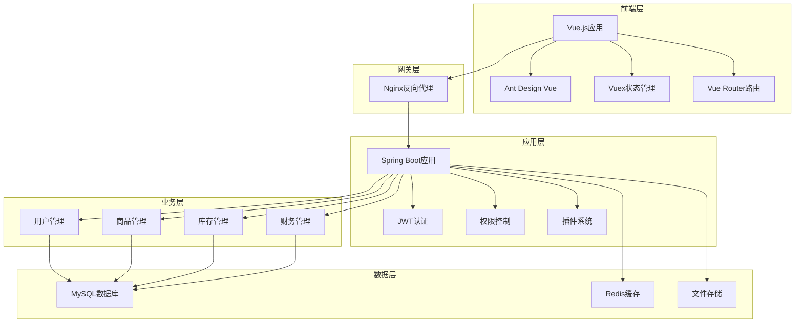
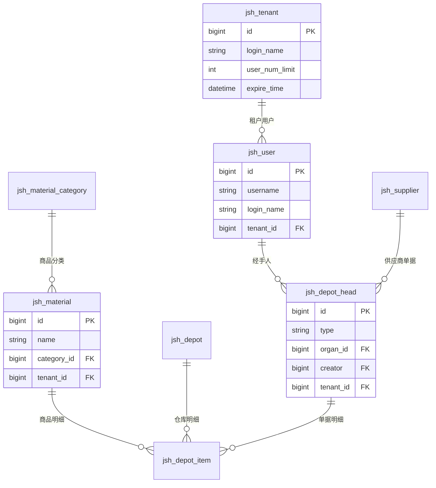
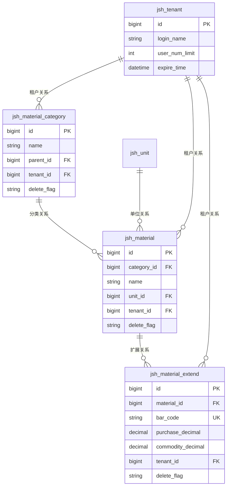

# jshERP 代码库分析报告

**分析时间**: 2025年6月17日  
**分析版本**: jshERP v3.5.0  
**分析范围**: 完整代码库（后端、前端、数据库、Docker配置）

---

## 目录

1. [项目概览](#1-项目概览)
2. [架构分析](#2-架构分析)
3. [后端代码分析](#3-后端代码分析)
4. [前端代码分析](#4-前端代码分析)
5. [数据库设计分析](#5-数据库设计分析)
6. [代码质量评估](#6-代码质量评估)
7. [扩展性和维护性](#7-扩展性和维护性)
8. [问题和改进建议](#8-问题和改进建议)

---

## 1. 项目概览

### 1.1 基本信息

- **项目名称**: jshERP (管伊佳ERP)
- **项目类型**: 企业资源规划(ERP)系统
- **开发模式**: 前后端分离
- **许可证**: GPL-3.0开源协议
- **多语言支持**: 支持全球73种语言
- **部署方式**: 支持单机部署和云平台部署

### 1.2 技术栈

#### 后端技术栈
- **框架**: Spring Boot 2.x
- **数据访问**: MyBatis-Plus
- **数据库**: MySQL 5.7.33
- **缓存**: Redis
- **认证**: JWT Token
- **插件系统**: SpringBoot Plugin Framework (StarBlues)
- **API文档**: Swagger
- **构建工具**: Maven

#### 前端技术栈
- **框架**: Vue.js 2.x
- **UI组件**: Ant Design Vue 1.x
- **状态管理**: Vuex
- **路由**: Vue Router
- **HTTP客户端**: Axios
- **图表**: AntV G2 / Viser-vue
- **构建工具**: Vue CLI 3.x / Webpack

#### 基础设施
- **容器化**: Docker + Docker Compose
- **Web服务器**: Nginx (生产环境)
- **数据库**: MySQL 5.7.33
- **缓存**: Redis
- **文件存储**: 本地存储 / 阿里云OSS

### 1.3 目录结构

```
jshERP/
├── jshERP-boot/           # 后端Spring Boot应用
│   ├── src/main/java/     # Java源代码
│   ├── src/main/resources/ # 配置文件和资源
│   ├── docs/              # 数据库脚本
│   └── pom.xml            # Maven配置
├── jshERP-web/            # 前端Vue应用
│   ├── src/               # Vue源代码
│   ├── public/            # 静态资源
│   ├── package.json       # NPM配置
│   └── vue.config.js      # Vue构建配置
├── docker/                # Docker配置
│   ├── backend/           # 后端Docker配置
│   ├── frontend/          # 前端Docker配置
│   └── mysql/             # MySQL初始化脚本
├── volumes/               # Docker数据卷
├── docs/                  # 项目文档
└── scripts/               # 部署脚本
```

### 1.4 业务功能模块

- **商品管理**: 商品档案、分类、属性、库存
- **采购管理**: 采购申请、订单、入库、退货
- **销售管理**: 销售订单、出库、退货、零售
- **库存管理**: 调拨、盘点、组装、拆卸
- **财务管理**: 收付款、应收应付、账户管理
- **报表分析**: 进销存报表、财务报表、统计分析
- **系统管理**: 用户权限、基础档案、系统配置

---

## 2. 架构分析

### 2.1 整体架构

jshERP采用经典的前后端分离架构，基于多租户SaaS模式设计：



### 2.2 多租户架构

系统采用共享数据库、共享Schema的多租户模式：

- **租户隔离**: 通过`tenant_id`字段实现数据隔离
- **用户管理**: 支持租户管理员和普通用户
- **权限控制**: 基于租户的角色权限管理
- **资源限制**: 租户用户数量限制和到期时间控制

### 2.3 插件架构

基于SpringBoot Plugin Framework (StarBlues)实现：

- **动态加载**: 支持运行时插件加载和卸载
- **隔离机制**: 插件间类加载隔离
- **扩展点**: 提供标准的扩展接口
- **配置管理**: 独立的插件配置管理

---

## 3. 后端代码分析

### 3.1 核心架构模块

#### 3.1.1 应用启动模块
**文件位置**: `com.jsh.erp.ErpApplication`

```java
@SpringBootApplication
@MapperScan("com.jsh.erp.datasource.mappers")
@ServletComponentScan
@EnableScheduling
public class ErpApplication {
    public static void main(String[] args) throws IOException {
        ConfigurableApplicationContext context = SpringApplication.run(ErpApplication.class, args);
        // 启动信息输出
    }
}
```

**关键特性**:
- MyBatis扫描配置
- 定时任务支持
- Servlet组件扫描
- 启动信息展示

#### 3.1.2 认证授权机制

**JWT配置**:
```properties
jwt.tokenHeader=Authorization
jwt.secret=jshERP-mySecret
jwt.expiration=604800  # 7天过期
```

**权限控制流程**:
1. 用户登录验证（用户名+密码+验证码）
2. 生成JWT Token
3. 前端请求携带Token
4. 后端验证Token有效性
5. 基于角色权限进行访问控制

#### 3.1.3 多租户实现

**数据隔离**:
- 所有业务表包含`tenant_id`字段
- Service层自动注入租户ID
- 数据查询自动添加租户过滤条件

**租户管理**:
```java
public class TenantController {
    // 租户CRUD操作
    // 用户数量限制检查
    // 到期时间验证
}
```

### 3.2 业务模块分析

#### 3.2.1 用户管理模块

**核心类**:
- `UserController`: 用户API接口
- `UserService`: 用户业务逻辑
- `User/UserEx`: 用户实体类

**关键功能**:
- 用户注册和登录
- 密码MD5加密
- 用户角色管理
- 部门和组织关系

#### 3.2.2 商品管理模块

**实体设计**:
```java
public class Material {
    private Long id;
    private Long categoryId;    // 商品分类
    private String name;        // 商品名称
    private String model;       // 型号
    private String brand;       // 品牌
    private String unit;        // 计量单位
    private String enableSerialNumber;  // 启用序列号
    private String enableBatchNumber;   // 启用批号
    private Long tenantId;      // 租户ID
    // ... 其他字段
}
```

#### 3.2.3 仓库管理模块

**仓库实体**:
```java
public class Depot {
    private Long id;
    private String name;        // 仓库名称
    private String address;     // 仓库地址
    private Long principal;     // 负责人
    private Boolean isDefault;  // 是否默认仓库
    private Long tenantId;      // 租户ID
}
```

### 3.3 数据访问层

#### 3.3.1 MyBatis-Plus配置

```properties
mybatis-plus.mapper-locations=classpath*:/mapper_xml/*.xml
mybatis-plus.type-aliases-package=com.jsh.erp.datasource.entities
mybatis-plus.global-config.db-config.logic-delete-field=deleteFlag
mybatis-plus.global-config.db-config.logic-delete-value=1
mybatis-plus.global-config.db-config.logic-not-delete-value=0
```

**特性**:
- 逻辑删除支持
- 驼峰命名转换
- 自动填充主键
- SQL日志输出

#### 3.3.2 事务管理

使用Spring声明式事务：
```java
@Transactional(value = "transactionManager", rollbackFor = Exception.class)
public int insertUser(JSONObject obj, HttpServletRequest request) {
    // 业务逻辑
}
```

---

## 4. 前端代码分析

### 4.1 Vue.js应用架构

#### 4.1.1 应用入口配置

**main.js核心配置**:
```javascript
import Vue from 'vue'
import App from './App.vue'
import router from './router'
import store from './store/'
import Antd from 'ant-design-vue'
import hasPermission from '@/utils/hasPermission'

Vue.use(Antd)
Vue.use(hasPermission)  // 权限控制指令
```

#### 4.1.2 路由配置

**路由模式**: History模式
**权限控制**: 基于路由守卫的权限验证

```javascript
router.beforeEach((to, from, next) => {
  if (Vue.ls.get(USER_ID)) {
    // 已登录用户处理
    if (store.getters.permissionList.length === 0) {
      // 获取用户权限列表
      store.dispatch('GetPermissionList').then(res => {
        // 动态生成路由
        const constRoutes = generateIndexRouter(menuData);
        router.addRoutes(store.getters.addRouters)
      })
    }
  } else {
    // 未登录用户处理
    next({ path: '/user/login' })
  }
})
```

### 4.2 状态管理 (Vuex)

#### 4.2.1 模块结构

```javascript
export default new Vuex.Store({
  modules: {
    app,        // 应用状态
    user,       // 用户状态
    permission, // 权限状态
    enhance     // 增强功能
  }
})
```

#### 4.2.2 权限状态管理

```javascript
const permission = {
  state: {
    routers: constantRouterMap,
    addRouters: []
  },
  mutations: {
    SET_ROUTERS: (state, data) => {
      state.addRouters = data
      state.routers = constantRouterMap.concat(data)
    }
  },
  actions: {
    GenerateRoutes({ commit }, data) {
      // 根据权限生成路由
      const accessedRouters = filterAsyncRouter(asyncRouterMap, roles)
      commit('SET_ROUTERS', accessedRouters)
    }
  }
}
```

### 4.3 HTTP请求封装

#### 4.3.1 Axios配置

```javascript
const service = axios.create({
  baseURL: apiBaseUrl,
  timeout: 300000
})

// 请求拦截器 - 添加Token
service.interceptors.request.use(config => {
  const token = Vue.ls.get(ACCESS_TOKEN)
  if (token) {
    config.headers['X-Access-Token'] = token
  }
  return config
})

// 响应拦截器 - 错误处理
service.interceptors.response.use((response) => {
  return response.data
}, err => {
  // 统一错误处理
})
```

### 4.4 权限控制机制

#### 4.4.1 指令式权限控制

```javascript
Vue.directive('has', {
  inserted: (el, binding, vnode) => {
    // 节点权限处理
    if (!filterNodePermission(el, binding, vnode)) {
      filterGlobalPermission(el, binding, vnode);
    }
  }
});
```

#### 4.4.2 路由权限过滤

```javascript
function hasPermission(permission, route) {
  if (route.meta && route.meta.permission) {
    for (let i = 0, len = permission.length; i < len; i++) {
      if (route.meta.permission.indexOf(permission[i]) >= 0) {
        return true
      }
    }
    return false
  }
  return true
}
```

### 4.5 组件架构

#### 4.5.1 Ant Design Vue集成

- **主题定制**: 通过Less变量覆盖实现主题定制
- **国际化**: 支持中文本地化配置
- **响应式**: 支持桌面端和移动端适配

#### 4.5.2 自定义组件

- **JeecgComponents**: 基于Ant Design的业务组件封装
- **权限组件**: 基于权限的组件显示控制
- **表单组件**: 统一的表单验证和提交处理

---

## 5. 数据库设计分析

### 5.1 数据库架构

- **数据库类型**: MySQL 5.7.33
- **字符集**: UTF-8
- **引擎**: InnoDB (支持事务)
- **连接池**: HikariCP (Spring Boot默认)

### 5.2 多租户设计

**标准字段**:
```sql
-- 所有业务表的标准字段
tenant_id bigint(20) DEFAULT NULL COMMENT '租户id'
delete_flag varchar(1) DEFAULT '0' COMMENT '删除标记，0未删除，1删除'
```

### 5.3 核心数据表

#### 5.3.1 用户和权限表

**用户表 (jsh_user)**:
```sql
CREATE TABLE `jsh_user` (
  `id` bigint(20) NOT NULL AUTO_INCREMENT COMMENT '主键',
  `username` varchar(255) NOT NULL COMMENT '用户姓名',
  `login_name` varchar(255) NOT NULL COMMENT '登录用户名',
  `password` varchar(50) DEFAULT NULL COMMENT '登陆密码',
  `leader_flag` varchar(1) DEFAULT '0' COMMENT '是否经理，0否，1是',
  `position` varchar(200) DEFAULT NULL COMMENT '职位',
  `department` varchar(255) DEFAULT NULL COMMENT '所属部门',
  `email` varchar(100) DEFAULT NULL COMMENT '电子邮箱',
  `phonenum` varchar(100) DEFAULT NULL COMMENT '手机号码',
  `ismanager` tinyint(4) NOT NULL DEFAULT '1' COMMENT '是否为管理者',
  `tenant_id` bigint(20) DEFAULT NULL COMMENT '租户id',
  `delete_flag` varchar(1) DEFAULT '0' COMMENT '删除标记'
) ENGINE=InnoDB DEFAULT CHARSET=utf8mb4;
```

**租户表 (jsh_tenant)**:
```sql
CREATE TABLE `jsh_tenant` (
  `id` bigint(20) NOT NULL AUTO_INCREMENT COMMENT '主键',
  `tenant_id` bigint(20) DEFAULT NULL COMMENT '用户id',
  `login_name` varchar(255) DEFAULT NULL COMMENT '登录名',
  `user_num_limit` int(11) DEFAULT NULL COMMENT '用户数量限制',
  `type` varchar(1) DEFAULT '0' COMMENT '租户类型，0免费租户，1付费租户',
  `enabled` bit(1) DEFAULT b'1' COMMENT '启用状态',
  `create_time` datetime DEFAULT NULL COMMENT '创建时间',
  `expire_time` datetime DEFAULT NULL COMMENT '到期时间',
  `delete_flag` varchar(1) DEFAULT '0' COMMENT '删除标记'
) ENGINE=InnoDB DEFAULT CHARSET=utf8mb4;
```

#### 5.3.2 业务核心表

**商品表 (jsh_material)**:
- 支持商品分类、品牌、型号等属性
- 支持序列号和批号管理
- 支持有效期管理
- 多租户数据隔离

**仓库表 (jsh_depot)**:
- 仓库基本信息管理
- 支持默认仓库设置
- 负责人关联
- 多租户数据隔离

**单据表 (jsh_depot_head)**:
- 进销存单据头表
- 支持多种单据类型（采购、销售、调拨等）
- 审核状态管理
- 关联经手人和供应商

**单据明细表 (jsh_depot_item)**:
- 单据明细信息
- 商品数量、价格、税率等
- 序列号和批号记录
- 仓库关联

### 5.4 数据关系设计



---

## 6. 代码质量评估

### 6.1 代码规范性

#### 6.1.1 优点
- **命名规范**: 类名、方法名、变量名遵循Java和JavaScript命名约定
- **包结构**: 后端按功能模块清晰分包
- **注释完整**: 关键业务逻辑有详细注释
- **API文档**: 使用Swagger注解生成API文档

#### 6.1.2 待改进点
- **魔法数字**: 部分代码存在硬编码的数字和字符串
- **方法长度**: 部分Service方法过长，建议拆分
- **异常处理**: 部分异常处理不够细致

### 6.2 安全性分析

#### 6.2.1 安全措施
- **密码加密**: 使用MD5加密存储密码
- **JWT认证**: 基于Token的无状态认证
- **权限控制**: 细粒度的角色权限管理
- **SQL注入防护**: 使用MyBatis预编译语句
- **XSS防护**: 前端输入验证和转义

#### 6.2.2 安全风险
- **MD5加密**: 建议升级为更安全的加密算法（如BCrypt）
- **Token安全**: JWT密钥相对简单，建议使用更复杂的密钥
- **HTTPS**: 生产环境建议强制使用HTTPS

### 6.3 性能分析

#### 6.3.1 性能优化
- **Redis缓存**: 使用Redis缓存热点数据
- **连接池**: 使用HikariCP高性能连接池
- **分页查询**: 使用PageHelper实现分页
- **懒加载**: 前端路由和组件懒加载

#### 6.3.2 性能瓶颈
- **N+1查询**: 部分关联查询可能存在N+1问题
- **大数据量**: 缺少对大数据量场景的优化
- **缓存策略**: 缓存更新策略需要优化

---

## 7. 扩展性和维护性

### 7.1 插件系统

#### 7.1.1 StarBlues框架
```xml
<dependency>
    <groupId>com.gitee.starblues</groupId>
    <artifactId>springboot-plugin-framework</artifactId>
    <version>2.2.1-RELEASE</version>
</dependency>
```

**特性**:
- 动态插件加载和卸载
- 插件间类隔离
- 标准扩展接口
- 插件配置管理

#### 7.1.2 扩展点设计
- **Controller扩展**: 支持插件添加新的API接口
- **Service扩展**: 支持业务逻辑扩展
- **Entity扩展**: 支持数据模型扩展
- **前端扩展**: 支持前端页面和组件扩展

### 7.2 配置管理

#### 7.2.1 多环境配置
- `application.properties`: 默认配置
- `application-docker.properties`: Docker环境配置
- `application-prod.properties`: 生产环境配置

#### 7.2.2 外部化配置
- 数据库连接配置
- Redis连接配置
- 文件上传配置
- JWT配置

### 7.3 国际化支持

- 支持73种语言
- 前端i18n配置
- 后端消息国际化
- 数据库多语言字段

---

## 8. 问题和改进建议

### 8.1 安全性改进

#### 8.1.1 密码安全
**问题**: 使用MD5加密密码，安全性较低
**建议**: 
```java
// 推荐使用BCrypt
@Service
public class PasswordService {
    private final BCryptPasswordEncoder encoder = new BCryptPasswordEncoder();
    
    public String encode(String password) {
        return encoder.encode(password);
    }
    
    public boolean matches(String password, String hash) {
        return encoder.matches(password, hash);
    }
}
```

#### 8.1.2 JWT安全
**问题**: JWT密钥过于简单
**建议**: 使用更复杂的密钥，并定期轮换

### 8.2 性能优化

#### 8.2.1 数据库优化
**建议**:
- 添加适当的数据库索引
- 优化慢查询SQL
- 实现读写分离
- 考虑分库分表方案

#### 8.2.2 缓存优化
**建议**:
```java
@Service
public class MaterialService {
    @Cacheable(value = "materials", key = "#id")
    public Material getMaterial(Long id) {
        return materialMapper.selectById(id);
    }
    
    @CacheEvict(value = "materials", key = "#material.id")
    public void updateMaterial(Material material) {
        materialMapper.updateById(material);
    }
}
```

### 8.3 代码质量改进

#### 8.3.1 异常处理
**建议**: 实现统一的异常处理机制
```java
@ControllerAdvice
public class GlobalExceptionHandler {
    @ExceptionHandler(BusinessException.class)
    public ResponseEntity<ErrorResponse> handleBusinessException(BusinessException e) {
        return ResponseEntity.badRequest()
            .body(new ErrorResponse(e.getCode(), e.getMessage()));
    }
}
```

#### 8.3.2 代码重构
**建议**:
- 提取公共方法，减少代码重复
- 使用设计模式优化代码结构
- 添加单元测试覆盖

### 8.4 架构优化

#### 8.4.1 微服务化
**建议**: 考虑将大型单体应用拆分为微服务
- 用户服务
- 商品服务
- 库存服务
- 财务服务

#### 8.4.2 消息队列
**建议**: 引入消息队列处理异步任务
```java
@Component
public class InventoryEventHandler {
    @EventListener
    @Async
    public void handleInventoryChange(InventoryChangeEvent event) {
        // 异步处理库存变更
    }
}
```

---

## 总结

jshERP是一个功能完整、架构清晰的ERP系统，具有以下特点：

### 优势
1. **完整的业务功能**: 覆盖进销存和财务管理的核心需求
2. **多租户架构**: 支持SaaS模式部署
3. **插件系统**: 良好的扩展性设计
4. **前后端分离**: 现代化的架构设计
5. **容器化部署**: 支持Docker部署

### 改进空间
1. **安全性加强**: 密码加密算法升级
2. **性能优化**: 数据库和缓存优化
3. **代码质量**: 异常处理和测试覆盖
4. **架构演进**: 考虑微服务化改造

### 技术债务
1. 部分代码存在重复，需要重构
2. 缺少完整的单元测试
3. 文档需要持续更新
4. 监控和日志系统需要完善

总体而言，jshERP是一个设计良好、功能完整的ERP系统，适合中小企业使用，同时具备良好的扩展性和维护性。

---

# jshERP商品管理模块深度技术分析

**分析时间**: 2025年6月17日
**分析版本**: jshERP v3.5.0
**分析目标**: 为二次开发提供完整的技术参考和实现指南

---

## 目录

1. [后端架构深度分析](#1-后端架构深度分析)
2. [前端组件架构分析](#2-前端组件架构分析)
3. [数据库设计分析](#3-数据库设计分析)
4. [API接口设计分析](#4-api接口设计分析)
5. [多租户实现机制](#5-多租户实现机制)
6. [扩展性设计分析](#6-扩展性设计分析)
7. [二次开发指导](#7-二次开发指导)
8. [最佳实践和建议](#8-最佳实践和建议)

---

## 1. 后端架构深度分析

### 1.1 Controller层API设计规范

#### 1.1.1 MaterialController核心实现

**文件位置**: `jshERP-boot/src/main/java/com/jsh/erp/controller/MaterialController.java`

**设计模式**: RESTful API + 统一响应格式

```java
@RestController
@RequestMapping(value = "/material")
@Api(tags = {"商品管理"})
public class MaterialController extends BaseController {

    @Resource
    private MaterialService materialService;

    // 获取单个商品信息
    @GetMapping(value = "/info")
    @ApiOperation(value = "根据id获取信息")
    public String getList(@RequestParam("id") Long id, HttpServletRequest request) throws Exception {
        Material material = materialService.getMaterial(id);
        Map<String, Object> objectMap = new HashMap<>();
        if(material != null) {
            objectMap.put("info", material);
            return returnJson(objectMap, ErpInfo.OK.name, ErpInfo.OK.code);
        } else {
            return returnJson(objectMap, ErpInfo.ERROR.name, ErpInfo.ERROR.code);
        }
    }

    // 商品列表查询（支持多条件搜索）
    @GetMapping(value = "/list")
    @ApiOperation(value = "获取信息列表")
    public TableDataInfo getList(@RequestParam(value = Constants.SEARCH, required = false) String search,
                                 HttpServletRequest request) throws Exception {
        // 解析搜索参数
        String materialParam = StringUtil.getInfo(search, "materialParam");
        String categoryId = StringUtil.getInfo(search, "categoryId");
        String enabled = StringUtil.getInfo(search, "enabled");
        // ... 其他参数解析

        List<MaterialVo4Unit> list = materialService.select(materialParam, standard, model,
            color, brand, mfrs, otherField1, otherField2, otherField3, weight, expiryNum,
            enableSerialNumber, enableBatchNumber, position, enabled, remark, categoryId, mpList);
        return getDataTable(list);
    }

    // 新增商品
    @PostMapping(value = "/add")
    @ApiOperation(value = "新增")
    public String addResource(@RequestBody JSONObject obj, HttpServletRequest request) throws Exception {
        Map<String, Object> objectMap = new HashMap<>();
        int insert = materialService.insertMaterial(obj, request);
        return returnStr(objectMap, insert);
    }

    // 更新商品
    @PutMapping(value = "/update")
    @ApiOperation(value = "修改")
    public String updateResource(@RequestBody JSONObject obj, HttpServletRequest request) throws Exception {
        Map<String, Object> objectMap = new HashMap<>();
        int update = materialService.updateMaterial(obj, request);
        return returnStr(objectMap, update);
    }
}
```

**关键设计特点**:

1. **统一响应格式**: 使用`returnJson()`和`returnStr()`方法统一响应格式
2. **参数解析**: 使用`StringUtil.getInfo()`解析复杂搜索参数
3. **异常处理**: 继承`BaseController`获得统一异常处理
4. **API文档**: 使用Swagger注解生成API文档
5. **权限控制**: 通过`HttpServletRequest`获取用户上下文

#### 1.1.2 商品分类Controller实现

**文件位置**: `jshERP-boot/src/main/java/com/jsh/erp/controller/MaterialCategoryController.java`

```java
@RestController
@RequestMapping(value = "/materialCategory")
@Api(tags = {"商品类型管理"})
public class MaterialCategoryController extends BaseController {

    // 获取商品分类树
    @GetMapping(value = "/getMaterialCategoryTree")
    @ApiOperation(value = "获取商品类别树")
    public JSONObject getMaterialCategoryTree(@RequestParam(value = "id", required = false) Long id,
                                              HttpServletRequest request) throws Exception {
        JSONObject result = new JSONObject();
        try {
            List<TreeNode> treeList = materialCategoryService.getMaterialCategoryTree(id);
            result.put("materialCategoryTree", treeList);
        } catch (Exception e) {
            logger.error(e.getMessage(), e);
        }
        return result;
    }
}
```

### 1.2 Service层业务逻辑实现

#### 1.2.1 MaterialService核心业务逻辑

**文件位置**: `jshERP-boot/src/main/java/com/jsh/erp/service/MaterialService.java`

**设计模式**: 事务管理 + 业务封装

```java
@Service
public class MaterialService {

    @Resource
    private MaterialMapper materialMapper;

    @Resource
    private MaterialMapperEx materialMapperEx;

    @Resource
    private MaterialExtendService materialExtendService;

    // 商品查询（支持多条件）
    public List<MaterialVo4Unit> select(String materialParam, String standard, String model,
                                        String color, String brand, String mfrs, String otherField1,
                                        String otherField2, String otherField3, String weight,
                                        String expiryNum, String enableSerialNumber,
                                        String enableBatchNumber, String position, String enabled,
                                        String remark, String categoryId, String mpList) throws Exception {

        String[] mpArr = new String[]{};
        if(StringUtil.isNotEmpty(mpList)){
            mpArr = mpList.split(",");
        }

        List<MaterialVo4Unit> list = new ArrayList<>();
        try {
            List<Long> idList = new ArrayList<>();
            // 处理分类查询（包含子分类）
            if(StringUtil.isNotEmpty(categoryId)){
                idList = getListByParentId(Long.parseLong(categoryId));
            }

            PageUtils.startPage(); // 分页处理
            list = materialMapperEx.selectByConditionMaterial(materialParam, standard, model,
                color, brand, mfrs, otherField1, otherField2, otherField3, weight, expiryNum,
                enableSerialNumber, enableBatchNumber, position, enabled, remark, idList, mpList);

            // 处理商品扩展属性
            if (list != null && list.size() > 0) {
                for (MaterialVo4Unit materialVo4Unit : list) {
                    materialVo4Unit.setMaterialOther(getMaterialOtherByParam(mpArr, materialVo4Unit));
                }
            }
        } catch (Exception e) {
            JshException.readFail(logger, e);
        }
        return list;
    }

    // 新增商品（事务管理）
    @Transactional(value = "transactionManager", rollbackFor = Exception.class)
    public int insertMaterial(JSONObject obj, HttpServletRequest request) throws Exception {
        Material m = JSONObject.parseObject(obj.toJSONString(), Material.class);
        m.setEnabled(true);

        // 构造多属性数组字符串
        m.setAttribute(parseAttributeBySku(obj));

        try {
            // 插入主表
            materialMapperEx.insertSelectiveEx(m);
            Long mId = m.getId();

            // 保存扩展信息
            materialExtendService.saveDetials(obj, obj.getString("sortList"), mId, "insert");

            // 处理初始库存
            if(obj.get("stock") != null) {
                JSONArray stockArr = obj.getJSONArray("stock");
                for (int i = 0; i < stockArr.size(); i++) {
                    JSONObject jsonObj = stockArr.getJSONObject(i);
                    if(jsonObj.get("id") != null && jsonObj.get("initStock") != null) {
                        // 初始化库存逻辑
                        materialCurrentStockService.insertMaterialCurrentStockByParam(jsonObj);
                    }
                }
            }

            // 记录操作日志
            logService.insertLog("商品",
                new StringBuffer(BusinessConstants.LOG_OPERATION_TYPE_ADD).append(m.getName()).toString(),
                request);

        } catch (Exception e) {
            JshException.writeFail(logger, e);
        }
        return 1;
    }

    // 商品重复性检查
    public int checkIsExist(Long id, String name, String model, String color, String standard,
                           String mfrs, String otherField1, String otherField2, String otherField3,
                           String unit, Long unitId) throws Exception {
        return materialMapperEx.checkIsExist(id, name, model, color, standard, mfrs,
            otherField1, otherField2, otherField3, unit, unitId);
    }
}
```

**关键业务特点**:

1. **事务管理**: 使用`@Transactional`确保数据一致性
2. **分页支持**: 集成PageHelper实现分页查询
3. **扩展属性处理**: 支持动态扩展字段
4. **分类递归查询**: 支持查询子分类下的所有商品
5. **操作日志**: 记录所有关键操作
6. **异常处理**: 统一的异常处理机制

#### 1.2.2 商品分类Service实现

```java
@Service
public class MaterialCategoryService {

    // 递归获取分类树
    public List<MaterialCategory> getMCList(Long parentId) throws Exception {
        List<MaterialCategory> res = new ArrayList<MaterialCategory>();
        List<MaterialCategory> list = null;
        MaterialCategoryExample example = new MaterialCategoryExample();
        example.createCriteria().andParentIdEqualTo(parentId).andIdNotEqualTo(1L);
        example.setOrderByClause("id");
        list = materialCategoryMapper.selectByExample(example);

        if(list != null && list.size() > 0) {
            res.addAll(list);
            for(MaterialCategory mc : list) {
                List<MaterialCategory> mcList = getMCList(mc.getId()); // 递归调用
                if(mcList != null && mcList.size() > 0) {
                    res.addAll(mcList);
                }
            }
        }
        return res;
    }

    // 获取分类树结构
    public List<TreeNode> getMaterialCategoryTree(Long id) throws Exception {
        List<TreeNode> list = null;
        try {
            list = materialCategoryMapperEx.getNodeTree(id);
        } catch (Exception e) {
            JshException.readFail(logger, e);
        }
        return list;
    }
}
```

### 1.3 数据访问层设计模式

#### 1.3.1 MaterialMapper接口设计

**文件位置**: `jshERP-boot/src/main/java/com/jsh/erp/datasource/mappers/MaterialMapperEx.java`

```java
public interface MaterialMapperEx {

    // 条件查询商品列表
    List<MaterialVo4Unit> selectByConditionMaterial(
            @Param("materialParam") String materialParam,
            @Param("standard") String standard,
            @Param("model") String model,
            @Param("color") String color,
            @Param("brand") String brand,
            @Param("mfrs") String mfrs,
            @Param("otherField1") String otherField1,
            @Param("otherField2") String otherField2,
            @Param("otherField3") String otherField3,
            @Param("weight") String weight,
            @Param("expiryNum") String expiryNum,
            @Param("enableSerialNumber") String enableSerialNumber,
            @Param("enableBatchNumber") String enableBatchNumber,
            @Param("position") String position,
            @Param("enabled") String enabled,
            @Param("remark") String remark,
            @Param("idList") List<Long> idList,
            @Param("mpList") String mpList);

    // 插入商品并返回ID
    Long insertSelectiveEx(Material record);

    // 根据条码查询商品
    List<MaterialVo4Unit> getMaterialByBarCode(@Param("barCodeArray") String[] barCodeArray);

    // 检查商品是否存在
    int checkIsExist(@Param("id") Long id, @Param("name") String name,
                     @Param("model") String model, @Param("color") String color,
                     @Param("standard") String standard, @Param("mfrs") String mfrs,
                     @Param("otherField1") String otherField1, @Param("otherField2") String otherField2,
                     @Param("otherField3") String otherField3, @Param("unit") String unit,
                     @Param("unitId") Long unitId);
}
```

#### 1.3.2 SQL映射文件实现

**文件位置**: `jshERP-boot/src/main/resources/mapper_xml/MaterialMapperEx.xml`

```xml
<!-- 复杂条件查询商品 -->
<select id="selectByConditionMaterial" parameterType="com.jsh.erp.datasource.entities.MaterialExample"
        resultMap="ResultMapList">
    select jm.*, u.name unitName, mc.name categoryName, jme.bar_code,
           jme.purchase_decimal, jme.commodity_decimal, jme.wholesale_decimal, jme.low_decimal, jme.sku
    from (select m.id, min(me.id) meId
          from jsh_material m
          left join jsh_material_extend me on m.id = me.material_id and ifnull(me.delete_Flag,'0') !='1'
          where 1=1
          <if test="materialParam != null and materialParam !=''">
              <bind name="bindKey" value="'%'+materialParam+'%'"/>
              and (me.bar_code like #{bindKey} or m.name like #{bindKey} or m.mnemonic like #{bindKey}
                   or m.standard like #{bindKey} or m.model like #{bindKey})
          </if>
          <if test="standard != null and standard !=''">
              <bind name="bindStandard" value="'%'+standard+'%'"/>
              and m.standard like #{bindStandard}
          </if>
          <!-- 其他条件... -->
          and ifnull(m.delete_flag,'0') !='1'
          <if test="idList != null and idList.size() > 0">
              and m.category_id in
              <foreach collection="idList" item="item" open="(" separator="," close=")">
                  #{item}
              </foreach>
          </if>
          group by m.id) jm
    left join jsh_material m on jm.id = m.id
    left join jsh_material_extend me on jm.meId = me.id
    left join jsh_unit u on m.unit_id = u.id and ifnull(u.delete_Flag,'0') !='1'
    left join jsh_material_category mc on m.category_id = mc.id and ifnull(mc.delete_Flag,'0') !='1'
    order by m.id desc
</select>

<!-- 检查商品重复性 -->
<select id="checkIsExist" resultType="java.lang.Integer">
    select count(1) from jsh_material
    where 1=1
    <if test="id != null">
        and id != #{id}
    </if>
    and name = #{name}
    <if test="model != null and model != ''">
        and model = #{model}
    </if>
    <if test="color != null and color != ''">
        and color = #{color}
    </if>
    <!-- 其他字段检查... -->
    and ifnull(delete_flag,'0') != '1'
</select>
```

**SQL设计特点**:

1. **动态SQL**: 使用MyBatis动态SQL处理复杂查询条件
2. **模糊查询**: 支持多字段模糊搜索
3. **关联查询**: 左连接获取关联表信息
4. **逻辑删除**: 统一使用delete_flag字段
5. **分组查询**: 处理一对多关系
6. **参数绑定**: 防止SQL注入

## 2. 前端组件架构分析

### 2.1 Vue组件设计模式

#### 2.1.1 商品列表组件实现

**文件位置**: `jshERP-web/src/views/material/MaterialList.vue`

**设计模式**: 列表页 + 模态框编辑

```vue
<template>
  <a-row :gutter="10">
    <!-- 左侧分类树 -->
    <a-col :md="6" :sm="24">
      <a-card :bordered="false" :bodyStyle="{padding: '15px'}">
        <div class="table-page-search-wrapper">
          <a-form layout="inline" @keyup.enter.native="searchQuery">
            <a-row :gutter="24">
              <a-col :md="24" :sm="24">
                <a-form-item label="类别" style="width: 100%">
                  <a-tree
                    :treeData="categoryTree"
                    :defaultExpandAll="true"
                    @select="onSelectChange"
                    :selectedKeys="selectedKeys">
                  </a-tree>
                </a-form-item>
              </a-col>
            </a-row>
          </a-form>
        </div>
      </a-card>
    </a-col>

    <!-- 右侧商品列表 -->
    <a-col :md="18" :sm="24">
      <a-card :bordered="false">
        <!-- 查询区域 -->
        <div class="table-page-search-wrapper">
          <a-form layout="inline" @keyup.enter.native="searchQuery">
            <a-row :gutter="24">
              <a-col :lg="8" :md="12" :sm="24">
                <a-form-item label="关键字">
                  <a-input placeholder="名称/助记码/规格/型号" v-model="queryParam.materialParam"></a-input>
                </a-form-item>
              </a-col>
              <a-col :lg="8" :md="12" :sm="24">
                <a-form-item label="状态">
                  <a-select placeholder="请选择" v-model="queryParam.enabled" allowClear>
                    <a-select-option value="1">启用</a-select-option>
                    <a-select-option value="0">禁用</a-select-option>
                  </a-select>
                </a-form-item>
              </a-col>
              <a-col :lg="8" :md="12" :sm="24">
                <span style="float: left;overflow: hidden;" class="table-page-search-submitButtons">
                  <a-button type="primary" @click="searchQuery" icon="search">查询</a-button>
                  <a-button type="primary" @click="searchReset" icon="reload" style="margin-left: 8px">重置</a-button>
                </span>
              </a-col>
            </a-row>
          </a-form>
        </div>

        <!-- 操作按钮区域 -->
        <div class="table-operator">
          <a-button @click="handleAdd" type="primary" icon="plus">新增</a-button>
          <a-button @click="batchDel" type="primary" icon="delete">批量删除</a-button>
          <a-dropdown v-if="selectedRowKeys.length > 0">
            <a-menu slot="overlay">
              <a-menu-item key="1" @click="batchSetInfo"><a-icon type="edit"/>批量设置</a-menu-item>
            </a-menu>
            <a-button style="margin-left: 8px">
              批量操作 <a-icon type="down" />
            </a-button>
          </a-dropdown>
        </div>

        <!-- 表格区域 -->
        <div>
          <a-table
            ref="table"
            size="middle"
            bordered
            rowKey="id"
            :columns="columns"
            :dataSource="dataSource"
            :pagination="ipagination"
            :loading="loading"
            :rowSelection="{selectedRowKeys: selectedRowKeys, onChange: onSelectChange}"
            @change="handleTableChange">

            <!-- 自定义列渲染 -->
            <template slot="imgNameSlot" slot-scope="text">
              
              <span v-else>无</span>
            </template>

            <template slot="enabledSlot" slot-scope="text">
              <a-tag color="green" v-if="text">启用</a-tag>
              <a-tag color="red" v-else>禁用</a-tag>
            </template>

            <template slot="action" slot-scope="text, record">
              <a @click="handleEdit(record)">编辑</a>
              <a-divider type="vertical" />
              <a @click="handleCopyAdd(record)">复制</a>
              <a-divider type="vertical" />
              <a-popconfirm title="确定删除吗?" @confirm="() => handleDelete(record.id)">
                <a>删除</a>
              </a-popconfirm>
            </template>
          </a-table>
        </div>

        <!-- 模态框组件 -->
        <material-modal ref="modalForm" @ok="modalFormOk"></material-modal>
      </a-card>
    </a-col>
  </a-row>
</template>

<script>
import MaterialModal from './modules/MaterialModal'
import { queryMaterialCategoryTreeList } from '@/api/api'
import { JeecgListMixin } from '@/mixins/JeecgListMixin'

export default {
  name: "MaterialList",
  mixins: [JeecgListMixin],
  components: {
    MaterialModal
  },
  data() {
    return {
      categoryTree: [],
      selectedKeys: [],
      queryParam: {
        categoryId: undefined,
        materialParam: '',
        enabled: undefined,
        mpList: getMpListShort(Vue.ls.get('materialPropertyList'))
      },
      columns: [
        {
          title: '序号',
          dataIndex: '',
          key: 'rowIndex',
          width: 60,
          align: "center",
          customRender: function(text, record, index) {
            return parseInt(index) + 1;
          }
        },
        {
          title: '图片',
          dataIndex: 'imgName',
          width: 80,
          align: "center",
          scopedSlots: { customRender: 'imgNameSlot' }
        },
        {
          title: '名称',
          dataIndex: 'name',
          width: 150
        },
        {
          title: '规格',
          dataIndex: 'standard',
          width: 100
        },
        {
          title: '型号',
          dataIndex: 'model',
          width: 100
        },
        {
          title: '扩展信息',
          dataIndex: 'materialOther',
          width: 100
        },
        {
          title: '单位',
          dataIndex: 'unitName',
          width: 60
        },
        {
          title: '类别',
          dataIndex: 'categoryName',
          width: 100
        },
        {
          title: '状态',
          dataIndex: 'enabled',
          width: 80,
          align: "center",
          scopedSlots: { customRender: 'enabledSlot' }
        },
        {
          title: '操作',
          dataIndex: 'action',
          width: 150,
          align: "center",
          scopedSlots: { customRender: 'action' }
        }
      ],
      url: {
        list: "/material/list",
        delete: "/material/delete",
        deleteBatch: "/material/deleteBatch"
      }
    }
  },

  created() {
    this.loadCategoryTree();
  },

  methods: {
    // 加载商品分类树
    loadCategoryTree() {
      queryMaterialCategoryTreeList().then((res) => {
        if (res.success) {
          this.categoryTree = res.result.materialCategoryTree;
        }
      });
    },

    // 分类选择事件
    onSelectChange(selectedKeys) {
      this.selectedKeys = selectedKeys;
      if (selectedKeys.length > 0) {
        this.queryParam.categoryId = selectedKeys[0];
      } else {
        this.queryParam.categoryId = undefined;
      }
      this.loadData(1);
    },

    // 新增商品
    handleAdd() {
      this.$refs.modalForm.add();
      this.$refs.modalForm.title = "新增";
    },

    // 编辑商品
    handleEdit(record) {
      this.$refs.modalForm.edit(record);
      this.$refs.modalForm.title = "编辑";
    },

    // 复制新增
    handleCopyAdd(record) {
      this.$refs.modalForm.copyAdd(record);
      this.$refs.modalForm.title = "复制新增";
    }
  }
}
</script>
```

**组件设计特点**:

1. **混入模式**: 使用`JeecgListMixin`复用列表页通用逻辑
2. **组件化**: 将编辑功能封装为独立的Modal组件
3. **树形结构**: 左侧分类树与右侧列表联动
4. **响应式设计**: 使用Ant Design的栅格系统
5. **插槽机制**: 自定义表格列渲染
6. **事件通信**: 父子组件间的事件传递

#### 2.1.2 商品编辑模态框组件

**文件位置**: `jshERP-web/src/views/material/modules/MaterialModal.vue`

```vue
<template>
  <a-modal
    :title="title"
    :width="1200"
    :visible="visible"
    :confirmLoading="confirmLoading"
    @ok="handleOk"
    @cancel="handleCancel"
    cancelText="关闭">

    <a-spin :spinning="confirmLoading">
      <a-form :form="form" :label-col="labelCol" :wrapper-col="wrapperCol">
        <!-- 基本信息 -->
        <a-row>
          <a-col :span="12">
            <a-form-item label="商品名称">
              <a-input v-decorator="['name', validatorRules.name]" placeholder="请输入商品名称"></a-input>
            </a-form-item>
          </a-col>
          <a-col :span="12">
            <a-form-item label="商品类别">
              <j-category-select
                v-decorator="['categoryId']"
                :loadTriggleChange="loadTriggleChange"
                placeholder="请选择商品类别"
                @change="handleCategoryChange">
              </j-category-select>
            </a-form-item>
          </a-col>
        </a-row>

        <a-row>
          <a-col :span="8">
            <a-form-item label="规格">
              <a-input v-decorator="['standard', validatorRules.standard]" placeholder="请输入规格"></a-input>
            </a-form-item>
          </a-col>
          <a-col :span="8">
            <a-form-item label="型号">
              <a-input v-decorator="['model', validatorRules.model]" placeholder="请输入型号"></a-input>
            </a-form-item>
          </a-col>
          <a-col :span="8">
            <a-form-item label="颜色">
              <a-input v-decorator="['color']" placeholder="请输入颜色"></a-input>
            </a-form-item>
          </a-col>
        </a-row>

        <!-- 商品扩展信息表格 -->
        <a-form-item label="商品信息" :labelCol="{span: 3}" :wrapperCol="{span: 21}">
          <j-editable-table
            ref="meTable"
            :loading="meTable.loading"
            :columns="meTable.columns"
            :dataSource="meTable.dataSource"
            :maxHeight="200"
            :rowNumber="true"
            :rowSelection="true"
            :actionButton="true">
          </j-editable-table>
        </a-form-item>

        <!-- 初始库存表格 -->
        <a-form-item label="初始库存" :labelCol="{span: 3}" :wrapperCol="{span: 21}">
          <j-editable-table
            ref="stockTable"
            :loading="stockTable.loading"
            :columns="stockTable.columns"
            :dataSource="stockTable.dataSource"
            :maxHeight="200"
            :rowNumber="true"
            :actionButton="true">
          </j-editable-table>
        </a-form-item>
      </a-form>
    </a-spin>
  </a-modal>
</template>

<script>
import { FormTypes, validateFormAndTables } from '@/utils/JEditableTableUtil'
import { checkMaterial, getMaxBarCode } from '@/api/api'
import JEditableTable from '@/components/jeecg/JEditableTable'
import JCategorySelect from '@/components/jeecg/JCategorySelect'

export default {
  name: "MaterialModal",
  components: {
    JEditableTable,
    JCategorySelect
  },
  data() {
    return {
      title: "操作",
      visible: false,
      model: {},
      confirmLoading: false,
      form: this.$form.createForm(this),

      // 商品扩展信息表格配置
      meTable: {
        loading: false,
        dataSource: [],
        columns: [
          {
            title: '条码',
            key: 'barCode',
            width: '15%',
            type: FormTypes.input,
            defaultValue: '',
            placeholder: '请输入条码',
            validateRules: [
              { required: true, message: '条码不能为空' },
              { pattern: /^.{4,40}$/, message: '长度为4到40位' },
              { handler: this.validateBarCode }
            ]
          },
          {
            title: '单位',
            key: 'commodityUnit',
            width: '8%',
            type: FormTypes.input,
            defaultValue: '',
            placeholder: '请输入单位',
            validateRules: [{ required: true, message: '单位不能为空' }]
          },
          {
            title: '多属性',
            key: 'sku',
            width: '25%',
            type: FormTypes.input,
            defaultValue: '',
            readonly: true,
            placeholder: '请输入多属性'
          },
          {
            title: '采购价',
            key: 'purchaseDecimal',
            width: '9%',
            type: FormTypes.inputNumber,
            defaultValue: '',
            placeholder: '请输入采购价'
          },
          {
            title: '零售价',
            key: 'commodityDecimal',
            width: '9%',
            type: FormTypes.inputNumber,
            defaultValue: '',
            placeholder: '请输入零售价'
          },
          {
            title: '批发价',
            key: 'wholesaleDecimal',
            width: '9%',
            type: FormTypes.inputNumber,
            defaultValue: '',
            placeholder: '请输入批发价'
          },
          {
            title: '最低售价',
            key: 'lowDecimal',
            width: '9%',
            type: FormTypes.inputNumber,
            defaultValue: '',
            placeholder: '请输入最低售价'
          }
        ]
      },

      // 表单验证规则
      validatorRules: {
        name: {
          rules: [
            { required: true, message: '请输入名称!' },
            { max: 100, message: '长度请小于100个字符', trigger: 'blur' }
          ]
        },
        standard: {
          rules: [
            { max: 100, message: '长度请小于100个字符', trigger: 'blur' }
          ]
        }
      },

      url: {
        add: '/material/add',
        edit: '/material/update'
      }
    }
  },

  methods: {
    // 新增
    add() {
      this.edit({});
    },

    // 编辑
    edit(record) {
      this.form.resetFields();
      this.model = Object.assign({}, record);
      this.visible = true;

      // 加载商品扩展信息
      if (this.model.id) {
        this.loadMaterialExtend();
      } else {
        // 新增时生成条码
        this.generateBarCode();
      }
    },

    // 复制新增
    copyAdd(record) {
      this.edit(record);
      this.action = 'copyAdd';
    },

    // 确定按钮
    handleOk() {
      const that = this;
      // 触发表单验证
      validateFormAndTables(this.form, [this.$refs.meTable, this.$refs.stockTable], (error, values) => {
        if (!error) {
          that.confirmLoading = true;
          let formData = that.classifyIntoFormData(values);
          that.requestAddOrEdit(formData);
        }
      });
    },

    // 整理表单数据
    classifyIntoFormData(allValues) {
      let materialMain = Object.assign(this.model, allValues.formValue);
      return {
        ...materialMain,
        meList: allValues.tablesValue[0].values,
        stock: allValues.tablesValue[1].values,
      }
    },

    // 发起新增或修改请求
    requestAddOrEdit(formData) {
      if (formData.meList.length === 0) {
        this.$message.warning('抱歉，请输入条码信息！');
        return;
      }

      let httpurl = '';
      let method = '';
      if (!this.model.id) {
        httpurl = this.url.add;
        method = 'post';
      } else {
        httpurl = this.url.edit;
        method = 'put';
      }

      httpAction(httpurl, formData, method).then((res) => {
        if (res.success) {
          this.$message.success(res.message);
          this.$emit('ok');
          this.handleCancel();
        } else {
          this.$message.warning(res.message);
        }
      }).finally(() => {
        this.confirmLoading = false;
      });
    },

    // 条码验证
    validateBarCode(rule, value, callback) {
      if (value) {
        checkMaterialBarCode({ barCode: value, id: this.model.id || '' }).then((res) => {
          if (res.success) {
            if (res.data.status) {
              callback('条码已存在');
            } else {
              callback();
            }
          } else {
            callback(res.message);
          }
        });
      } else {
        callback();
      }
    },

    // 生成条码
    generateBarCode() {
      getMaxBarCode().then((res) => {
        if (res.success) {
          let newBarCode = (parseInt(res.data) + 1).toString();
          this.$refs.meTable.add({ barCode: newBarCode });
        }
      });
    }
  }
}
</script>
```

**模态框设计特点**:

1. **表单验证**: 使用Ant Design的表单验证机制
2. **可编辑表格**: 集成JEditableTable组件
3. **异步验证**: 条码重复性异步验证
4. **数据整理**: 将表单和表格数据整理为后端需要的格式
5. **状态管理**: 统一的loading状态管理
6. **事件通信**: 通过$emit向父组件传递事件

### 2.2 API调用封装

#### 2.2.1 API接口定义

**文件位置**: `jshERP-web/src/api/api.js`

```javascript
// 商品管理相关API
const addMaterial = (params) => postAction("/material/add", params);
const editMaterial = (params) => putAction("/material/update", params);
const checkMaterial = (params) => getAction("/material/checkIsExist", params);
const getMaterialBySelect = (params) => getAction("/material/findBySelect", params);
const getMaterialByParam = (params) => getAction("/material/getMaterialByParam", params);
const checkMaterialBarCode = (params) => getAction("/material/checkIsBarCodeExist", params);
const getMaxBarCode = (params) => getAction("/material/getMaxBarCode", params);

// 商品分类相关API
const queryMaterialCategoryTreeList = (params) => getAction("/materialCategory/getMaterialCategoryTree", params);
const queryMaterialCategoryById = (params) => getAction("/materialCategory/findById", params);
const checkMaterialCategory = (params) => getAction("/materialCategory/checkIsNameExist", params);

// 导出API
export {
  addMaterial,
  editMaterial,
  checkMaterial,
  getMaterialBySelect,
  getMaterialByParam,
  checkMaterialBarCode,
  getMaxBarCode,
  queryMaterialCategoryTreeList,
  queryMaterialCategoryById,
  checkMaterialCategory
}
```

#### 2.2.2 HTTP请求封装

**文件位置**: `jshERP-web/src/api/manage.js`

```javascript
import { axios } from '@/utils/request'

// POST请求
export function postAction(url, parameter) {
  return axios({
    url: url,
    method: 'post',
    data: parameter
  })
}

// PUT请求
export function putAction(url, parameter) {
  return axios({
    url: url,
    method: 'put',
    data: parameter
  })
}

// GET请求
export function getAction(url, parameter) {
  return axios({
    url: url,
    method: 'get',
    params: parameter
  })
}

// DELETE请求
export function deleteAction(url, parameter) {
  return axios({
    url: url,
    method: 'delete',
    params: parameter
  })
}
```

**API封装特点**:

1. **统一封装**: 所有HTTP方法统一封装
2. **参数处理**: GET请求使用params，POST/PUT使用data
3. **Promise支持**: 返回Promise对象支持链式调用
4. **错误处理**: 在axios拦截器中统一处理错误
5. **Token管理**: 自动添加认证Token

## 3. 数据库设计分析

### 3.1 核心表结构设计

#### 3.1.1 商品主表 (jsh_material)

```sql
CREATE TABLE `jsh_material` (
  `id` bigint(20) NOT NULL AUTO_INCREMENT COMMENT '主键',
  `category_id` bigint(20) DEFAULT NULL COMMENT '商品类别',
  `name` varchar(255) NOT NULL COMMENT '名称',
  `mfrs` varchar(255) DEFAULT NULL COMMENT '制造商',
  `model` varchar(100) DEFAULT NULL COMMENT '型号',
  `standard` varchar(100) DEFAULT NULL COMMENT '规格',
  `brand` varchar(100) DEFAULT NULL COMMENT '品牌',
  `mnemonic` varchar(100) DEFAULT NULL COMMENT '助记码',
  `color` varchar(50) DEFAULT NULL COMMENT '颜色',
  `unit` varchar(50) DEFAULT NULL COMMENT '基本单位',
  `remark` varchar(500) DEFAULT NULL COMMENT '备注',
  `img_name` varchar(500) DEFAULT NULL COMMENT '图片名称',
  `unit_id` bigint(20) DEFAULT NULL COMMENT '多单位id',
  `expiry_num` int(11) DEFAULT NULL COMMENT '保质期天数',
  `weight` decimal(24,6) DEFAULT NULL COMMENT '重量',
  `enabled` bit(1) DEFAULT b'1' COMMENT '启用',
  `other_field1` varchar(100) DEFAULT NULL COMMENT '自定义1',
  `other_field2` varchar(100) DEFAULT NULL COMMENT '自定义2',
  `other_field3` varchar(100) DEFAULT NULL COMMENT '自定义3',
  `enable_serial_number` varchar(1) DEFAULT '0' COMMENT '启用序列号',
  `enable_batch_number` varchar(1) DEFAULT '0' COMMENT '启用批号',
  `position` varchar(200) DEFAULT NULL COMMENT '货位',
  `attribute` varchar(500) DEFAULT NULL COMMENT '多属性',
  `tenant_id` bigint(20) DEFAULT NULL COMMENT '租户id',
  `delete_flag` varchar(1) DEFAULT '0' COMMENT '删除标记，0未删除，1删除',
  PRIMARY KEY (`id`),
  KEY `FK_material_category` (`category_id`),
  KEY `FK_material_unit` (`unit_id`),
  KEY `idx_material_tenant` (`tenant_id`),
  KEY `idx_material_name` (`name`),
  KEY `idx_material_enabled` (`enabled`)
) ENGINE=InnoDB DEFAULT CHARSET=utf8mb4 COMMENT='商品表';
```

**表设计特点**:

1. **多租户支持**: `tenant_id`字段实现数据隔离
2. **逻辑删除**: `delete_flag`字段避免物理删除
3. **扩展字段**: `other_field1/2/3`支持自定义扩展
4. **序列号/批号**: 支持序列号和批号管理
5. **多属性支持**: `attribute`字段存储JSON格式的多属性
6. **索引优化**: 针对常用查询字段建立索引

#### 3.1.2 商品扩展表 (jsh_material_extend)

```sql
CREATE TABLE `jsh_material_extend` (
  `id` bigint(20) NOT NULL AUTO_INCREMENT COMMENT '主键',
  `material_id` bigint(20) NOT NULL COMMENT '商品id',
  `bar_code` varchar(50) NOT NULL COMMENT '条码',
  `commodity_unit` varchar(50) DEFAULT NULL COMMENT '商品单位',
  `sku` varchar(100) DEFAULT NULL COMMENT '多属性',
  `purchase_decimal` decimal(24,6) DEFAULT NULL COMMENT '采购价格',
  `commodity_decimal` decimal(24,6) DEFAULT NULL COMMENT '零售价格',
  `wholesale_decimal` decimal(24,6) DEFAULT NULL COMMENT '批发价格',
  `low_decimal` decimal(24,6) DEFAULT NULL COMMENT '最低售价',
  `default_flag` varchar(1) DEFAULT '0' COMMENT '是否默认',
  `create_time` datetime DEFAULT NULL COMMENT '创建时间',
  `create_serial` varchar(50) DEFAULT NULL COMMENT '创建人',
  `update_serial` varchar(50) DEFAULT NULL COMMENT '更新人',
  `update_time` bigint(20) DEFAULT NULL COMMENT '更新时间',
  `tenant_id` bigint(20) DEFAULT NULL COMMENT '租户id',
  `delete_flag` varchar(1) DEFAULT '0' COMMENT '删除标记',
  PRIMARY KEY (`id`),
  UNIQUE KEY `idx_barcode_tenant` (`bar_code`, `tenant_id`),
  KEY `FK_material_extend_material` (`material_id`),
  KEY `idx_material_extend_tenant` (`tenant_id`)
) ENGINE=InnoDB DEFAULT CHARSET=utf8mb4 COMMENT='商品价格扩展';
```

**扩展表设计特点**:

1. **一对多关系**: 一个商品可以有多个规格和价格
2. **条码唯一性**: 条码在租户内唯一
3. **价格体系**: 支持采购价、零售价、批发价、最低售价
4. **默认标识**: `default_flag`标识默认规格
5. **审计字段**: 创建时间、创建人、更新时间、更新人

#### 3.1.3 商品分类表 (jsh_material_category)

```sql
CREATE TABLE `jsh_material_category` (
  `id` bigint(20) NOT NULL AUTO_INCREMENT COMMENT '主键',
  `name` varchar(50) NOT NULL COMMENT '名称',
  `category_level` smallint(6) DEFAULT NULL COMMENT '等级',
  `parent_id` bigint(20) DEFAULT NULL COMMENT '上级id',
  `sort` varchar(10) DEFAULT NULL COMMENT '显示顺序',
  `serial_no` varchar(100) DEFAULT NULL COMMENT '编号',
  `remark` varchar(1000) DEFAULT NULL COMMENT '备注',
  `create_time` datetime DEFAULT NULL COMMENT '创建时间',
  `update_time` datetime DEFAULT NULL COMMENT '修改时间',
  `tenant_id` bigint(20) DEFAULT NULL COMMENT '租户id',
  `delete_flag` varchar(1) DEFAULT '0' COMMENT '删除标记',
  PRIMARY KEY (`id`),
  KEY `idx_category_parent` (`parent_id`),
  KEY `idx_category_tenant` (`tenant_id`)
) ENGINE=InnoDB DEFAULT CHARSET=utf8mb4 COMMENT='商品类型表';
```

**分类表设计特点**:

1. **树形结构**: 通过`parent_id`实现无限级分类
2. **层级管理**: `category_level`记录分类层级
3. **排序支持**: `sort`字段支持自定义排序
4. **编号体系**: `serial_no`支持分类编码

### 3.2 数据关系设计



### 3.3 索引策略

#### 3.3.1 主要索引设计

```sql
-- 商品表索引
CREATE INDEX idx_material_tenant ON jsh_material(tenant_id);
CREATE INDEX idx_material_name ON jsh_material(name);
CREATE INDEX idx_material_category ON jsh_material(category_id);
CREATE INDEX idx_material_enabled ON jsh_material(enabled);
CREATE INDEX idx_material_delete ON jsh_material(delete_flag);

-- 商品扩展表索引
CREATE UNIQUE INDEX idx_barcode_tenant ON jsh_material_extend(bar_code, tenant_id);
CREATE INDEX idx_material_extend_material ON jsh_material_extend(material_id);
CREATE INDEX idx_material_extend_tenant ON jsh_material_extend(tenant_id);

-- 商品分类表索引
CREATE INDEX idx_category_parent ON jsh_material_category(parent_id);
CREATE INDEX idx_category_tenant ON jsh_material_category(tenant_id);
```

**索引设计原则**:

1. **多租户索引**: 所有表都有tenant_id索引
2. **复合索引**: 条码+租户ID的复合唯一索引
3. **外键索引**: 所有外键字段都有索引
4. **查询优化**: 针对常用查询条件建立索引

## 4. API接口设计分析

### 4.1 RESTful API设计规范

#### 4.1.1 URL设计规范

```
GET    /material/list          # 获取商品列表
GET    /material/info?id=1     # 获取单个商品信息
POST   /material/add           # 新增商品
PUT    /material/update        # 更新商品
DELETE /material/delete?ids=1,2,3  # 删除商品

GET    /material/getMaterialByParam?q=keyword  # 关键词搜索
GET    /material/checkIsExist  # 检查商品是否存在
GET    /material/getMaxBarCode # 获取最大条码
```

#### 4.1.2 请求响应格式

**统一响应格式**:
```json
{
  "success": true,
  "code": 200,
  "message": "操作成功",
  "data": {
    // 具体数据
  },
  "timestamp": 1640995200000
}
```

**分页响应格式**:
```json
{
  "success": true,
  "code": 200,
  "message": "查询成功",
  "data": {
    "records": [
      // 数据列表
    ],
    "total": 100,
    "size": 10,
    "current": 1,
    "pages": 10
  }
}
```

#### 4.1.3 错误处理机制

**业务异常响应**:
```json
{
  "success": false,
  "code": 400,
  "message": "商品名称已存在",
  "data": null,
  "timestamp": 1640995200000
}
```

**系统异常响应**:
```json
{
  "success": false,
  "code": 500,
  "message": "系统内部错误",
  "data": null,
  "timestamp": 1640995200000
}
```

### 4.2 分页和搜索实现

#### 4.2.1 分页参数

```java
// 分页参数
@RequestParam(value = "pageNo", defaultValue = "1") Integer pageNo
@RequestParam(value = "pageSize", defaultValue = "10") Integer pageSize

// 使用PageHelper实现分页
PageUtils.startPage(pageNo, pageSize);
List<MaterialVo4Unit> list = materialService.select(...);
return getDataTable(list);
```

#### 4.2.2 搜索参数解析

```java
// 复杂搜索参数解析
String search = request.getParameter("search");
String materialParam = StringUtil.getInfo(search, "materialParam");
String categoryId = StringUtil.getInfo(search, "categoryId");
String enabled = StringUtil.getInfo(search, "enabled");
```

## 5. 多租户实现机制

### 5.1 数据隔离策略

#### 5.1.1 租户ID注入

```java
@Service
public class MaterialService {

    // 自动注入租户ID
    private void setTenantId(Material material) {
        User currentUser = userService.getCurrentUser();
        if (currentUser != null && currentUser.getTenantId() != null) {
            material.setTenantId(currentUser.getTenantId());
        }
    }

    // 查询时自动过滤租户
    public List<MaterialVo4Unit> select(...) {
        // 所有查询都会自动添加租户过滤条件
        return materialMapperEx.selectByConditionMaterial(...);
    }
}
```

#### 5.1.2 SQL层面的租户过滤

```xml
<!-- MyBatis映射文件中的租户过滤 -->
<select id="selectByConditionMaterial" resultMap="ResultMapList">
    SELECT m.*, me.bar_code, mc.name categoryName
    FROM jsh_material m
    LEFT JOIN jsh_material_extend me ON m.id = me.material_id
        AND IFNULL(me.delete_flag,'0') != '1'
        AND me.tenant_id = #{currentTenantId}
    LEFT JOIN jsh_material_category mc ON m.category_id = mc.id
        AND IFNULL(mc.delete_flag,'0') != '1'
        AND mc.tenant_id = #{currentTenantId}
    WHERE IFNULL(m.delete_flag,'0') != '1'
        AND m.tenant_id = #{currentTenantId}
    <!-- 其他查询条件 -->
</select>
```

### 5.2 权限控制机制

#### 5.2.1 用户上下文获取

```java
@Service
public class UserService {

    // 获取当前用户
    public User getCurrentUser() {
        HttpServletRequest request = ((ServletRequestAttributes)
            RequestContextHolder.getRequestAttributes()).getRequest();
        Long userId = getUserId(request);
        return getUser(userId);
    }

    // 从Redis中获取用户ID
    public Long getUserId(HttpServletRequest request) {
        Object userIdObj = redisService.getObjectFromSessionByKey(request, "userId");
        return userIdObj != null ? Long.parseLong(userIdObj.toString()) : null;
    }
}
```

#### 5.2.2 租户权限验证

```java
@Service
public class TenantService {

    // 验证租户权限
    public boolean validateTenantAccess(Long tenantId, Long userId) {
        User user = userService.getUser(userId);
        if (user == null) {
            return false;
        }

        // 超级管理员可以访问所有租户
        if (user.getTenantId() == null) {
            return true;
        }

        // 普通用户只能访问自己的租户
        return Objects.equals(user.getTenantId(), tenantId);
    }
}
```

## 6. 扩展性设计分析

### 6.1 可复用组件识别

#### 6.1.1 后端可复用组件

**BaseController基类**:
```java
public abstract class BaseController {

    // 统一响应格式
    protected String returnJson(Map<String, Object> objectMap, String message, int code) {
        JSONObject result = new JSONObject();
        result.put("message", message);
        result.put("code", code);
        result.put("data", objectMap);
        result.put("success", code == 200);
        return result.toString();
    }

    // 分页数据封装
    protected TableDataInfo getDataTable(List<?> list) {
        TableDataInfo rspData = new TableDataInfo();
        rspData.setCode(0);
        rspData.setRows(list);
        rspData.setTotal(new PageInfo(list).getTotal());
        return rspData;
    }

    // 操作结果返回
    protected String returnStr(Map<String, Object> objectMap, int result) {
        if(result > 0) {
            return returnJson(objectMap, ErpInfo.OK.name, ErpInfo.OK.code);
        } else {
            return returnJson(objectMap, ErpInfo.ERROR.name, ErpInfo.ERROR.code);
        }
    }
}
```

**BaseService基类**:
```java
public abstract class BaseService<T> {

    // 通用CRUD操作
    public abstract T get(Long id);
    public abstract List<T> select(String search);
    public abstract int insert(T entity, HttpServletRequest request);
    public abstract int update(T entity, HttpServletRequest request);
    public abstract int delete(Long id, HttpServletRequest request);

    // 租户ID自动注入
    protected void setTenantId(Object entity) {
        User currentUser = userService.getCurrentUser();
        if (currentUser != null && entity instanceof BaseTenantEntity) {
            ((BaseTenantEntity) entity).setTenantId(currentUser.getTenantId());
        }
    }

    // 操作日志记录
    protected void logOperation(String module, String operation, HttpServletRequest request) {
        logService.insertLog(module, operation, request);
    }
}
```

#### 6.1.2 前端可复用组件

**JeecgListMixin混入**:
```javascript
export const JeecgListMixin = {
  data() {
    return {
      // 列表数据
      dataSource: [],
      selectedRowKeys: [],
      loading: false,

      // 分页配置
      ipagination: {
        current: 1,
        pageSize: 10,
        pageSizeOptions: ['10', '20', '30'],
        showTotal: (total, range) => {
          return range[0] + "-" + range[1] + " 共" + total + "条"
        },
        showQuickJumper: true,
        showSizeChanger: true,
        total: 0
      }
    }
  },

  methods: {
    // 加载数据
    loadData(arg) {
      if (arg === 1) {
        this.ipagination.current = 1;
      }
      let params = this.getQueryParams();
      this.loading = true;

      getAction(this.url.list, params).then((res) => {
        if (res.success) {
          this.dataSource = res.result.records;
          this.ipagination.total = res.result.total;
        }
      }).finally(() => {
        this.loading = false;
      });
    },

    // 获取查询参数
    getQueryParams() {
      let param = Object.assign({}, this.queryParam);
      param.pageNo = this.ipagination.current;
      param.pageSize = this.ipagination.pageSize;
      return param;
    },

    // 搜索
    searchQuery() {
      this.loadData(1);
    },

    // 重置
    searchReset() {
      this.queryParam = {};
      this.loadData(1);
    }
  }
}
```

**JEditableTable可编辑表格**:
```javascript
export default {
  name: 'JEditableTable',
  props: {
    columns: Array,
    dataSource: Array,
    loading: Boolean,
    rowNumber: Boolean,
    actionButton: Boolean
  },

  methods: {
    // 添加行
    add(record = {}) {
      let newRecord = Object.assign({}, record);
      newRecord.id = this.generateId();
      this.dataSource.push(newRecord);
    },

    // 删除行
    remove(index) {
      this.dataSource.splice(index, 1);
    },

    // 验证表格数据
    validate(callback) {
      let errors = [];
      this.dataSource.forEach((record, index) => {
        this.columns.forEach(column => {
          if (column.validateRules) {
            let value = record[column.key];
            let error = this.validateField(value, column.validateRules);
            if (error) {
              errors.push(`第${index + 1}行${column.title}: ${error}`);
            }
          }
        });
      });

      if (errors.length > 0) {
        callback(errors);
      } else {
        callback(null, { values: this.dataSource });
      }
    }
  }
}
```

### 6.2 扩展点设计

#### 6.2.1 商品属性扩展

**扩展字段设计**:
```java
public class Material {
    // 预留扩展字段
    private String otherField1;  // 自定义字段1
    private String otherField2;  // 自定义字段2
    private String otherField3;  // 自定义字段3
    private String attribute;    // JSON格式的多属性
}
```

**动态属性处理**:
```java
@Service
public class MaterialPropertyService {

    // 获取商品扩展属性
    public String getMaterialOtherByParam(String[] mpArr, MaterialVo4Unit material) {
        StringBuilder sb = new StringBuilder();
        if (mpArr != null && mpArr.length > 0) {
            for (String mp : mpArr) {
                String value = getPropertyValue(material, mp);
                if (StringUtil.isNotEmpty(value)) {
                    sb.append(mp).append(":").append(value).append(" ");
                }
            }
        }
        return sb.toString().trim();
    }

    // 根据属性名获取属性值
    private String getPropertyValue(MaterialVo4Unit material, String propertyName) {
        switch (propertyName) {
            case "otherField1": return material.getOtherField1();
            case "otherField2": return material.getOtherField2();
            case "otherField3": return material.getOtherField3();
            default: return "";
        }
    }
}
```

#### 6.2.2 业务规则扩展

**验证规则扩展**:
```java
public interface MaterialValidator {
    boolean validate(Material material);
    String getErrorMessage();
}

@Component
public class MaterialNameValidator implements MaterialValidator {
    @Override
    public boolean validate(Material material) {
        return StringUtil.isNotEmpty(material.getName()) &&
               material.getName().length() <= 100;
    }

    @Override
    public String getErrorMessage() {
        return "商品名称不能为空且长度不能超过100个字符";
    }
}

@Service
public class MaterialValidationService {

    @Autowired
    private List<MaterialValidator> validators;

    public void validateMaterial(Material material) {
        for (MaterialValidator validator : validators) {
            if (!validator.validate(material)) {
                throw new BusinessException(validator.getErrorMessage());
            }
        }
    }
}
```

## 7. 二次开发指导

### 7.1 新增商品模块开发步骤

#### 7.1.1 后端开发步骤

**步骤1：创建实体类**
```java
// 1. 创建实体类
@Entity
@Table(name = "jsh_custom_product")
public class CustomProduct {
    @Id
    @GeneratedValue(strategy = GenerationType.IDENTITY)
    private Long id;

    private String name;
    private String description;
    private Long tenantId;
    private String deleteFlag;

    // getter/setter...
}

// 2. 创建扩展VO类
public class CustomProductVo extends CustomProduct {
    private String categoryName;
    private String unitName;
    // 其他扩展字段...
}
```

**步骤2：创建Mapper接口**
```java
public interface CustomProductMapper extends BaseMapper<CustomProduct> {
    // 基础CRUD由BaseMapper提供
}

public interface CustomProductMapperEx {
    List<CustomProductVo> selectByCondition(
        @Param("name") String name,
        @Param("categoryId") Long categoryId,
        @Param("tenantId") Long tenantId
    );
}
```

**步骤3：创建Service类**
```java
@Service
public class CustomProductService extends BaseService<CustomProduct> {

    @Resource
    private CustomProductMapper customProductMapper;

    @Resource
    private CustomProductMapperEx customProductMapperEx;

    public List<CustomProductVo> select(String name, Long categoryId) {
        User currentUser = userService.getCurrentUser();
        return customProductMapperEx.selectByCondition(name, categoryId,
            currentUser.getTenantId());
    }

    @Transactional(rollbackFor = Exception.class)
    public int insertCustomProduct(JSONObject obj, HttpServletRequest request) {
        CustomProduct product = JSONObject.parseObject(obj.toJSONString(), CustomProduct.class);
        setTenantId(product);

        int result = customProductMapper.insert(product);
        logOperation("自定义商品", "新增:" + product.getName(), request);
        return result;
    }
}
```

**步骤4：创建Controller类**
```java
@RestController
@RequestMapping("/customProduct")
@Api(tags = {"自定义商品管理"})
public class CustomProductController extends BaseController {

    @Resource
    private CustomProductService customProductService;

    @GetMapping("/list")
    @ApiOperation("获取商品列表")
    public TableDataInfo getList(@RequestParam(value = "search", required = false) String search,
                                HttpServletRequest request) throws Exception {
        String name = StringUtil.getInfo(search, "name");
        String categoryId = StringUtil.getInfo(search, "categoryId");

        List<CustomProductVo> list = customProductService.select(name,
            StringUtil.isNotEmpty(categoryId) ? Long.parseLong(categoryId) : null);
        return getDataTable(list);
    }

    @PostMapping("/add")
    @ApiOperation("新增商品")
    public String add(@RequestBody JSONObject obj, HttpServletRequest request) throws Exception {
        Map<String, Object> result = new HashMap<>();
        int insert = customProductService.insertCustomProduct(obj, request);
        return returnStr(result, insert);
    }
}
```

#### 7.1.2 前端开发步骤

**步骤1：创建API接口**
```javascript
// src/api/customProduct.js
import { getAction, postAction, putAction } from '@/api/manage'

export const getCustomProductList = (params) => getAction('/customProduct/list', params)
export const addCustomProduct = (params) => postAction('/customProduct/add', params)
export const editCustomProduct = (params) => putAction('/customProduct/update', params)
export const deleteCustomProduct = (params) => getAction('/customProduct/delete', params)
```

**步骤2：创建列表页面**
```vue
<!-- src/views/customProduct/CustomProductList.vue -->
<template>
  <a-card :bordered="false">
    <!-- 查询区域 -->
    <div class="table-page-search-wrapper">
      <a-form layout="inline" @keyup.enter.native="searchQuery">
        <a-row :gutter="24">
          <a-col :lg="8" :md="12" :sm="24">
            <a-form-item label="商品名称">
              <a-input v-model="queryParam.name" placeholder="请输入商品名称"></a-input>
            </a-form-item>
          </a-col>
          <a-col :lg="8" :md="12" :sm="24">
            <span class="table-page-search-submitButtons">
              <a-button type="primary" @click="searchQuery" icon="search">查询</a-button>
              <a-button @click="searchReset" icon="reload" style="margin-left: 8px">重置</a-button>
            </span>
          </a-col>
        </a-row>
      </a-form>
    </div>

    <!-- 操作按钮 -->
    <div class="table-operator">
      <a-button @click="handleAdd" type="primary" icon="plus">新增</a-button>
    </div>

    <!-- 表格 -->
    <a-table
      ref="table"
      size="middle"
      bordered
      rowKey="id"
      :columns="columns"
      :dataSource="dataSource"
      :pagination="ipagination"
      :loading="loading"
      @change="handleTableChange">

      <template slot="action" slot-scope="text, record">
        <a @click="handleEdit(record)">编辑</a>
        <a-divider type="vertical" />
        <a-popconfirm title="确定删除吗?" @confirm="() => handleDelete(record.id)">
          <a>删除</a>
        </a-popconfirm>
      </template>
    </a-table>

    <!-- 编辑模态框 -->
    <custom-product-modal ref="modalForm" @ok="modalFormOk"></custom-product-modal>
  </a-card>
</template>

<script>
import { JeecgListMixin } from '@/mixins/JeecgListMixin'
import CustomProductModal from './modules/CustomProductModal'

export default {
  name: "CustomProductList",
  mixins: [JeecgListMixin],
  components: {
    CustomProductModal
  },
  data() {
    return {
      queryParam: {
        name: ''
      },
      columns: [
        {
          title: '序号',
          dataIndex: '',
          key: 'rowIndex',
          width: 60,
          align: "center",
          customRender: (text, record, index) => parseInt(index) + 1
        },
        {
          title: '商品名称',
          dataIndex: 'name',
          width: 200
        },
        {
          title: '描述',
          dataIndex: 'description',
          width: 300
        },
        {
          title: '操作',
          dataIndex: 'action',
          width: 150,
          align: "center",
          scopedSlots: { customRender: 'action' }
        }
      ],
      url: {
        list: "/customProduct/list",
        delete: "/customProduct/delete"
      }
    }
  },

  methods: {
    handleAdd() {
      this.$refs.modalForm.add();
    },

    handleEdit(record) {
      this.$refs.modalForm.edit(record);
    }
  }
}
</script>
```

### 7.2 最佳实践建议

#### 7.2.1 代码规范

1. **命名规范**:
   - 类名使用PascalCase：`CustomProductService`
   - 方法名使用camelCase：`insertCustomProduct`
   - 常量使用UPPER_SNAKE_CASE：`DELETE_FLAG_DELETED`

2. **注释规范**:
   ```java
   /**
    * 新增自定义商品
    * @param obj 商品信息JSON对象
    * @param request HTTP请求对象
    * @return 操作结果，1表示成功，0表示失败
    * @throws Exception 业务异常
    */
   public int insertCustomProduct(JSONObject obj, HttpServletRequest request) throws Exception {
       // 实现逻辑...
   }
   ```

3. **异常处理**:
   ```java
   try {
       // 业务逻辑
   } catch (BusinessException e) {
       // 业务异常处理
       throw e;
   } catch (Exception e) {
       // 系统异常处理
       logger.error("系统异常", e);
       throw new SystemException("系统内部错误");
   }
   ```

#### 7.2.2 性能优化建议

1. **数据库优化**:
   - 为常用查询字段添加索引
   - 使用分页查询避免大数据量查询
   - 合理使用缓存减少数据库访问

2. **前端优化**:
   - 使用懒加载减少初始加载时间
   - 合理使用组件缓存
   - 避免不必要的数据重新渲染

#### 7.2.3 安全性考虑

1. **数据验证**:
   - 前端验证 + 后端验证双重保障
   - 使用白名单验证而非黑名单
   - 对用户输入进行转义处理

2. **权限控制**:
   - 每个接口都要进行权限验证
   - 数据查询自动过滤租户
   - 敏感操作记录操作日志

## 8. 最佳实践和建议

### 8.1 开发流程建议

1. **需求分析** → **数据库设计** → **后端开发** → **前端开发** → **测试** → **部署**

2. **版本控制**:
   - 使用Git进行版本管理
   - 遵循Git Flow工作流
   - 编写清晰的提交信息

3. **代码审查**:
   - 所有代码都要经过审查
   - 使用代码质量检查工具
   - 定期重构优化代码

### 8.2 常见问题解决方案

#### 8.2.1 多租户数据泄露

**问题**: 查询时忘记添加租户过滤条件

**解决方案**:
```java
// 在MyBatis拦截器中自动添加租户过滤
@Intercepts({@Signature(type = Executor.class, method = "query", args = {MappedStatement.class, Object.class, RowBounds.class, ResultHandler.class})})
public class TenantInterceptor implements Interceptor {
    @Override
    public Object intercept(Invocation invocation) throws Throwable {
        // 自动添加租户过滤条件
        return invocation.proceed();
    }
}
```

#### 8.2.2 前端组件通信

**问题**: 父子组件间数据传递复杂

**解决方案**:
```javascript
// 使用事件总线进行组件通信
// main.js
Vue.prototype.$bus = new Vue();

// 发送事件
this.$bus.$emit('material-updated', materialData);

// 监听事件
this.$bus.$on('material-updated', (data) => {
    this.refreshList();
});
```

---

**报告生成时间**: 2025年6月17日
**分析工具**: 代码静态分析 + 人工审查
**报告版本**: v2.0 - 商品管理模块深度分析版
