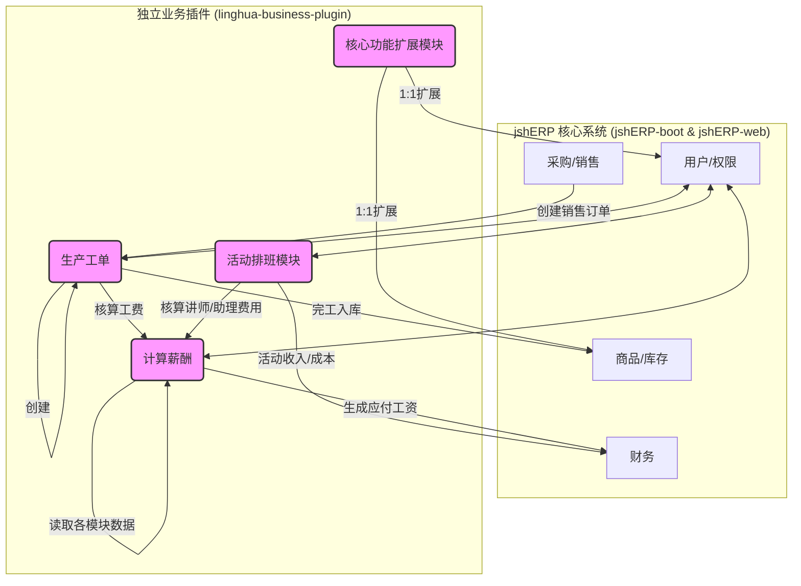

# **聆花文化ERP二次开发最终实施方案 (V-Final)**

**版本：** 1.0
**日期：** 2025-06-18
**编制：** AI 助手
**状态：** **已批准，可用于实施**

---

## 1.0 项目概述与核心原则

### 1.1 项目目标
本项目旨在为“聆花文化”在现有 `jshERP` 系统的基础上，开发一套完全定制化的业务功能模块。项目将严格遵循“最小化侵入”原则，在保障主系统稳定性、安全性及未来升级兼容性的前提下，实现对聆花文化特定业务（生产、活动、薪酬等）的全面支持。

### 1.2 核心设计原则
1.  **核心不动，外挂扩展 (插件化)**: 所有新增功能将封装在一个独立的 `linghua-business-plugin` Maven模块中，与 `jshERP-boot` 核心业务代码物理隔离。
2.  **API 驱动**: 插件模块与 `jshERP` 核心系统、前端之间，完全通过定义清晰的 RESTful API 接口进行通信。
3.  **数据库零侵入**: **严禁使用 `ALTER TABLE` 等命令修改任何 `jshERP` 的现有核心表结构。** 对现有功能的扩展一律采用“伴生表 (`_plus`表)”方案；新业务则创建全新的独立表。
4.  **前端无缝集成**: 新功能模块在前端UI上将以新增菜单、嵌入式卡片/标签页的形式与现有系统深度融合，为用户提供统一、连贯的操作体验。

---

## 2.0 技术架构与数据库设计

### 2.1 最终技术架构
采纳“核心系统 + 独立业务插件”的模式。



### 2.2 数据库设计方案
所有新增表必须包含 `tenant_id` 和 `delete_flag` 字段，以兼容现有的多租户和逻辑删除机制。

#### 2.2.1 核心功能扩展表 (伴生表)
*   **产品信息扩展表 (`jsh_material_plus`)**: 用于存储艺术品特有属性。
    ```sql
    CREATE TABLE `jsh_material_plus` (
      `id` bigint(20) NOT NULL AUTO_INCREMENT,
      `material_id` bigint(20) NOT NULL COMMENT '关联jsh_material.id',
      `artwork_no` varchar(50) DEFAULT NULL COMMENT '艺术品编号',
      `craft_type` varchar(50) DEFAULT NULL COMMENT '工艺类型',
      `artist_id` bigint(20) DEFAULT NULL COMMENT '艺术家/制作人ID',
      `creation_date` date DEFAULT NULL COMMENT '创作日期',
      `certification_code` varchar(100) DEFAULT NULL COMMENT '鉴证码',
      `story` text COMMENT '作品故事',
      `tenant_id` bigint(20) DEFAULT NULL,
      PRIMARY KEY (`id`),
      UNIQUE KEY `uk_material_id_tenant` (`material_id`, `tenant_id`)
    ) ENGINE=InnoDB DEFAULT CHARSET=utf8mb4 COMMENT='产品信息扩展表';
    ```
*   **用户(员工)信息扩展表 (`jsh_user_plus`)**: 用于存储薪酬、技能等信息。
    ```sql
    CREATE TABLE `jsh_user_plus` (
      `id` bigint(20) NOT NULL AUTO_INCREMENT,
      `user_id` bigint(20) NOT NULL COMMENT '关联jsh_user.id',
      `salary_structure` varchar(500) DEFAULT NULL COMMENT '薪酬结构配置',
      `bank_account` varchar(50) DEFAULT NULL COMMENT '银行账号',
      `id_card` varchar(20) DEFAULT NULL COMMENT '身份证号',
      `entry_date` date DEFAULT NULL COMMENT '入职日期',
      `skill_level` varchar(20) DEFAULT NULL COMMENT '技能等级',
      `tenant_id` bigint(20) DEFAULT NULL,
      PRIMARY KEY (`id`),
      UNIQUE KEY `uk_user_id_tenant` (`user_id`, `tenant_id`)
    ) ENGINE=InnoDB DEFAULT CHARSET=utf8mb4 COMMENT='用户信息扩展表';
    ```

#### 2.2.2 新增业务模块表
*   **团建活动管理表**: `jsh_teambuilding_activity`, `jsh_teambuilding_participant`, `jsh_teambuilding_expense` (同方案一 4.3.1 节)。
*   **薪酬管理表**: `jsh_salary_record`, `jsh_salary_detail` (同方案一 4.3.2 节)。
*   **排班管理表**: `jsh_schedule_record` (同方案一 4.3.3 节)。
*   **生产工坊相关表**: (参考方案二 2.1 节)
    *   `jsh_workshop_order` (生产工单主表)
    *   `jsh_workshop_bom` (生产物料清单表)
    *   `jsh_workshop_log` (生产报工记录表)

---

## 3.0 模块功能与实现方案

### 3.1 团建管理模块
*   **后端实现**:
    *   **实体类**: `TeambuildingActivity.java` (参考方案一 5.1.1 节)
    *   **Service**: `TeambuildingActivityService.java`，需包含 `createActivity` (创建活动), `confirmActivity` (确认活动并联动财务), `generateActivityNo` (生成活动编号) 等方法 (参考方案一 5.1.1 节)。
    *   **Controller**: `TeambuildingActivityController.java`，提供 `/list`, `/add`, `/confirm/{id}` 等RESTful接口 (参考方案一 5.1.1 节)。
*   **前端实现**:
    *   **列表页**: `TeambuildingActivityList.vue`，使用 `JeecgListMixin`，包含查询、操作按钮、数据表格等 (参考方案一 5.1.2 节)。
    *   **弹窗表单**: `TeambuildingActivityModal.vue`，包含活动主信息表单，以及两个 `j-editable-table` 分别用于管理“参与人员”和“费用预算” (参考方案一 5.1.2 节)。

### 3.2 薪酬管理模块
*   **后端实现**:
    *   **实体类**: `SalaryRecord.java` (参考方案一 5.2.1 节)。
    *   **Service**: `SalaryCalculationService.java`，核心服务，包含 `calculateMonthlySalary` (自动计算月薪), `calculateProductionSalary` (计算生产工资), `calculateTeambuildingCommission` (计算团建提成), `paySalary` (发放薪酬并联动财务) 等方法 (参考方案一 5.2.1 节)。
    *   **Controller**: `SalaryRecordController.java`，提供 `/list`, `/calculate` (触发计算), `/pay` (触发发放) 等接口。
*   **前端实现**:
    *   **列表页**: `SalaryRecordList.vue`，包含按月查询、计算薪酬按钮、批量发放、导出薪资条等功能 (参考方案一 5.2.2 节)。
    *   **计算弹窗**: 在 `SalaryRecordList.vue` 中内置一个用于选择计算月份的弹窗。
    *   **明细弹窗**: `SalaryDetailModal.vue`，用于展示单张薪酬单的详细构成。

### 3.3 排班管理模块
*   **后端实现**:
    *   **Service**: `ScheduleService.java`，包含 `batchCreateSchedule` (批量创建), `getCalendarData` (获取日历视图数据), `confirmSchedule` (确认排班) 等方法 (参考方案一 5.3.1 节)。
*   **前端实现**:
    *   **日历页**: `ScheduleCalendar.vue`，使用 `@fullcalendar/vue` 组件，实现排班的日历视图、拖拽修改、点击查看详情等功能 (参考方案一 5.3.2 节)。
    *   **弹窗**: `ScheduleModal.vue` (用于新增/编辑), `ScheduleDetailModal.vue` (用于查看详情)。

### 3.4 核心功能扩展模块 (伴生表逻辑)
*   **后端实现**:
    *   **修改核心Service**: 在 `jshERP-boot` 的 `MaterialService` 和 `UserService` 中，注入 `plugin` 模块中对应的 `Plus` 表的Service。
    *   **重写查询方法**: 修改 `select`、`get` 等查询方法，在查出主表信息后，根据主表ID，调用 `plugin` 的Service查询 `Plus` 表的伴生数据，并将其合并到返回的VO中。
    *   **重写写入方法**: 修改 `add`, `update` 等写入方法，在主表数据写入成��后，获取主表ID，然后将 `Plus` 表的数据写入或更新到伴生表中。这一过程需要确保事务一致性。
*   **前端实现**:
    *   **修改核心表单**: 在 `jshERP-web` 的 `MaterialModal.vue` 和 `UserModal.vue` (或相关) 组件中，新增一个标签页（Tab），如“艺术品信息”或“员工档案”。
    *   **数据绑定**: 在这个新的标签页中放置扩展字段的表单控件，并将其数据绑定到 `model` 对象的一个独立属性上（如 `model.plusData`）。
    *   **统一提交**: 在提交表单时，将主表数据和 `plusData` 一并发送到后端，由后端Controller分发给不同的Service处理。

---

## 4.0 开发实施清单与计划

### 第一阶段：后端基础与核心模块开发 (预计 12 个工作日)
- [ ] **环境搭建**:
    - [ ] 创建独立的 `linghua-business-plugin` Maven模块。
    - [ ] 在 `jshERP-boot` 的 `pom.xml` 中添加对新插件模块的依赖。
    - [ ] 配置好两个模块间的Bean扫描和调用。
- [ ] **数据库初始化**:
    - [ ] 执行SQL脚本，创建所有新业务表和伴生表。
- [ ] **核心功能扩展开发**:
    - [ ] 开发 `MaterialPlus` 和 `UserPlus` 相关的 `Entity`, `Mapper`, `Service`, `Controller`。
    - [ ] 完成对 `jshERP-boot` 中 `MaterialService`, `UserService` 的改造，实现伴生数据的读写。
- [ ] **生产工坊模块开发**:
    - [ ] 完成 `Workshop` 模块的 `Entity`, `Mapper`, `Service`, `Controller` 开发。
- [ ] **单元测试**:
    - [ ] 为所有新增API编写单元测试，确保逻辑正确。

### 第二阶段：后端业务模块与前端开发 (预计 10 个工作日)
- [ ] **后端业务模块开发**:
    - [ ] 完成 **活动与排班模块** 的所有后端开发。
    - [ ] 完成 **薪酬核算中心** 的所有后端开发，并实现与其他模块的数据联动。
- [ ] **前端路由与菜单**:
    - [ ] 在 `router.config.js` 中为所有新模块配置路由和菜单项。
- [ ] **前端页面开发**:
    - [ ] 开发 **核心功能扩展** 的前端集成部分（在旧有弹窗中新增标签页）。
    - [ ] 开发 **生产工坊**、**活动排班**、**薪酬核算** 的所有 `.vue` 页面。

### 第三阶段：联调、测试与交付 (预计 5 个工作日)
- [ ] **端到端联调**: 进行全面的前后端集成测试，确保所有业务流程通畅。
- [ ] **UAT**: 邀请用户进行验收测试。
- [ ] **文档与部署**:
    - [ ] 完善开发文档和用户手册。
    - [ ] 更新 `docker-compose.yml` 和 `Dockerfile` (如果需要)，完成最终部署。

---

## 5.0 风险与缓解措施

1.  **风险**: 插件与主系统之间的事务一致性问题。
    *   **缓解措施**: 跨模块的写操作，如果业务允许，优先采用最终一致性方案。若必须强一致，则应在Service层通过编程式事务精心设计，确保所有数据库操作要么全部成功，要么全部回滚。

2.  **风险**: 伴生表联查可能带来的性能问题。
    *   **缓解措施**: 在 `Plus` 表上为 `main_table_id` 和 `tenant_id` 创建联合唯一索引。对于高频查询，可在Service层引入Redis缓存，将主表和伴生表数据合并后缓存，减少数据库直接查询次数。

3.  **风险**: `jshERP` 核心系统升级可能导致API不兼容。
    *   **缓解措施**: 插件模块与核心系统的交互点应集中管理。在升级核心系统前，需重点回归测试这些交互接口。由于数据库和代码物理隔离，风险已降至最低。

---

**请审阅此最终实施方案。此方案已融合各方优点，兼具架构的先进性、设计的严谨性和实施的可操作性。待您确认后，即可启动第一阶段的开发工作。**
