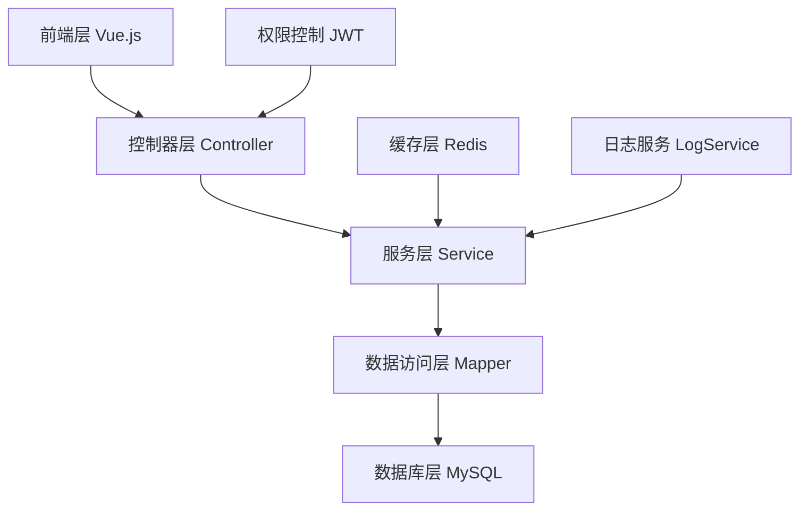

# 聆花文化ERP二次开发技术开发指南

## 文档信息

- **项目名称**: 聆花文化非遗掐丝珐琅ERP系统二次开发
- **文档版本**: v1.0.0
- **创建日期**: 2025-06-17
- **适用范围**: 聆花文化ERP二次开发项目技术团队
- **基于框架**: jshERP v3.x

## 目录

- [1. 开发环境准备](#1-开发环境准备)
- [2. jshERP架构理解](#2-jsherp架构理解)
- [3. 扩展模块开发规范](#3-扩展模块开发规范)
- [4. 核心功能模块实现](#4-核心功能模块实现)
- [5. 前端开发规范](#5-前端开发规范)
- [6. 数据库设计规范](#6-数据库设计规范)
- [7. 测试与部署](#7-测试与部署)
- [8. 常见问题解决](#8-常见问题解决)

---

## 1. 开发环境准备

### 1.1 基础环境要求

**必需软件版本**:
```
JDK: 1.8+
MySQL: 5.7+
Redis: 3.2+
Node.js: 14+
Maven: 3.6+
Git: 2.20+
```

**开发工具推荐**:
```
后端IDE: IntelliJ IDEA 2021+
前端IDE: VS Code
数据库工具: Navicat Premium
API测试: Postman
版本控制: Git + SourceTree
```

### 1.2 jshERP环境搭建

**1. 克隆jshERP项目**:
```bash
git clone https://gitee.com/jishenghua/JSH_ERP.git
cd JSH_ERP
```

**2. 数据库初始化**:
```sql
-- 创建数据库
CREATE DATABASE jshERP DEFAULT CHARACTER SET utf8mb4 COLLATE utf8mb4_unicode_ci;

-- 导入基础数据
source jshERP-boot/src/main/resources/sql/jshERP.sql;
```

**3. 配置文件修改**:
```yaml
# application-dev.yml
spring:
  datasource:
    url: jdbc:mysql://localhost:3306/jshERP?useUnicode=true&characterEncoding=UTF-8&serverTimezone=GMT%2B8
    username: root
    password: your_password
  redis:
    host: localhost
    port: 6379
    password:
```

**4. 启动验证**:
```bash
# 后端启动
cd jshERP-boot
mvn spring-boot:run

# 前端启动
cd jshERP-web
npm install
npm run serve
```

### 1.3 聆花扩展模块结构

**创建扩展模块目录**:
```
jshERP-boot/src/main/java/com/jsh/erp/expansion/linghua/
├── controller/          # 控制器层
│   ├── ProductionOrderController.java
│   ├── TeamBuildingController.java
│   ├── SalaryCalculationController.java
│   └── CoffeeShopController.java
├── service/            # 服务层
│   ├── ProductionOrderService.java
│   ├── TeamBuildingService.java
│   ├── SalaryCalculationService.java
│   └── CoffeeShopService.java
├── datasource/
│   ├── entities/       # 实体类
│   ├── mappers/        # Mapper接口
│   ├── vo/            # 视图对象
│   └── dto/           # 数据传输对象
├── utils/             # 工具类
│   ├── LinghuaConstants.java
│   └── LinghuaUtils.java
└── config/            # 配置类
    └── LinghuaConfig.java
```

---

## 2. jshERP架构理解

### 2.1 核心架构组件

**分层架构**:


**核心组件说明**:
- **BaseController**: 所有Controller的基类，提供统一的响应格式
- **JshException**: 统一异常处理机制
- **LogService**: 操作日志记录服务
- **PageUtils**: 分页处理工具
- **StringUtil**: 字符串处理工具

### 2.2 多租户架构

**多租户实现机制**:
```java
// 1. 数据隔离
@TableField("tenant_id")
private Long tenantId;

// 2. 自动注入租户ID
public Long getCurrentTenantId() {
    return SecurityUtils.getCurrentUser().getTenantId();
}

// 3. 查询时自动过滤
@Select("SELECT * FROM jsh_material WHERE tenant_id = #{tenantId} AND delete_flag = '0'")
List<Material> selectByTenantId(@Param("tenantId") Long tenantId);
```

### 2.3 权限控制机制

**JWT认证流程**:
```java
// 1. 登录验证
@PostMapping("/login")
public String login(@RequestBody User user) {
    String token = authService.login(user.getLoginName(), user.getPassword());
    return returnJson(Collections.singletonMap("token", token));
}

// 2. 权限验证
@PreAuthorize("hasAuthority('production:list')")
@GetMapping("/list")
public String getList() {
    // 业务逻辑
}

// 3. 前端权限控制
<a-button v-has="'production:add'" type="primary">新增</a-button>
```

---

## 3. 扩展模块开发规范

### 3.1 Controller层开发规范

**标准Controller模板**:
```java
@RestController
@RequestMapping(value = "/linghua/production")
@Api(tags = {"聆花生产管理"})
public class ProductionOrderController extends BaseController {
    private Logger logger = LoggerFactory.getLogger(ProductionOrderController.class);

    @Resource
    private ProductionOrderService productionOrderService;

    /**
     * 获取生产工单列表
     */
    @GetMapping(value = "/list")
    @ApiOperation(value = "获取生产工单列表")
    @PreAuthorize("hasAuthority('production:list')")
    public TableDataInfo getList(@RequestParam(value = Constants.SEARCH, required = false) String search,
                                 HttpServletRequest request) throws Exception {
        String status = StringUtil.getInfo(search, "status");
        String productType = StringUtil.getInfo(search, "productType");
        String startDate = StringUtil.getInfo(search, "startDate");
        String endDate = StringUtil.getInfo(search, "endDate");

        List<ProductionOrderVo> list = productionOrderService.select(status, productType, startDate, endDate);
        return getDataTable(list);
    }

    /**
     * 新增生产工单
     */
    @PostMapping(value = "/add")
    @ApiOperation(value = "新增生产工单")
    @PreAuthorize("hasAuthority('production:add')")
    public String addResource(@RequestBody JSONObject obj, HttpServletRequest request) throws Exception {
        Map<String, Object> objectMap = new HashMap<>();
        int insert = productionOrderService.insertProductionOrder(obj, request);
        return returnStr(objectMap, insert);
    }

    /**
     * 修改生产工单
     */
    @PutMapping(value = "/update")
    @ApiOperation(value = "修改生产工单")
    @PreAuthorize("hasAuthority('production:edit')")
    public String updateResource(@RequestBody JSONObject obj, HttpServletRequest request) throws Exception {
        Map<String, Object> objectMap = new HashMap<>();
        int update = productionOrderService.updateProductionOrder(obj, request);
        return returnStr(objectMap, update);
    }

    /**
     * 删除生产工单
     */
    @DeleteMapping(value = "/delete")
    @ApiOperation(value = "删除生产工单")
    @PreAuthorize("hasAuthority('production:delete')")
    public String deleteResource(@RequestParam("id") Long id, HttpServletRequest request) throws Exception {
        Map<String, Object> objectMap = new HashMap<>();
        int delete = productionOrderService.deleteProductionOrder(id, request);
        return returnStr(objectMap, delete);
    }

    /**
     * 批量删除生产工单
     */
    @DeleteMapping(value = "/deleteBatch")
    @ApiOperation(value = "批量删除生产工单")
    @PreAuthorize("hasAuthority('production:delete')")
    public String deleteBatch(@RequestParam("ids") String ids, HttpServletRequest request) throws Exception {
        Map<String, Object> objectMap = new HashMap<>();
        int delete = productionOrderService.batchDeleteProductionOrder(ids, request);
        return returnStr(objectMap, delete);
    }
}
```

**Controller开发要点**:
1. **必须继承BaseController**：获得统一的响应格式和工具方法
2. **使用标准API路径**：/list、/add、/update、/delete、/deleteBatch
3. **添加权限控制**：使用@PreAuthorize注解
4. **统一异常处理**：使用returnStr()方法返回结果
5. **参数解析**：使用StringUtil.getInfo()解析查询参数

### 3.2 Service层开发规范

**标准Service模板**:
```java
@Service
public class ProductionOrderService {
    private Logger logger = LoggerFactory.getLogger(ProductionOrderService.class);

    @Resource
    private ProductionOrderMapper productionOrderMapper;
    @Resource
    private ProductionOrderMapperEx productionOrderMapperEx;
    @Resource
    private LogService logService;
    @Resource
    private MaterialService materialService;

    /**
     * 查询生产工单列表
     */
    public List<ProductionOrderVo> select(String status, String productType, String startDate, String endDate) throws Exception {
        List<ProductionOrderVo> list = new ArrayList<>();
        try {
            PageUtils.startPage(); // 标准分页处理
            list = productionOrderMapperEx.selectByCondition(status, productType, startDate, endDate);

            if (list != null && list.size() > 0) {
                // 补充关联信息
                for (ProductionOrderVo order : list) {
                    if (order.getBaseMaterialId() != null) {
                        MaterialVo material = materialService.getMaterialById(order.getBaseMaterialId());
                        order.setMaterialName(material.getName());
                    }
                }
            }
        } catch (Exception e) {
            JshException.readFail(logger, e); // 标准异常处理
        }
        return list;
    }

    /**
     * 新增生产工单
     */
    @Transactional(value = "transactionManager", rollbackFor = Exception.class)
    public int insertProductionOrder(JSONObject obj, HttpServletRequest request) throws Exception {
        ProductionOrder order = JSONObject.parseObject(obj.toJSONString(), ProductionOrder.class);
        try {
            // 1. 设置基础信息
            order.setOrderNo(generateOrderNo());
            order.setProductionStatus("PENDING");
            order.setDeleteFlag("0");
            order.setTenantId(getCurrentTenantId()); // 多租户支持

            // 2. 业务逻辑验证
            validateProductionOrder(order);

            // 3. 保存数据
            productionOrderMapperEx.insertSelectiveEx(order);

            // 4. 记录操作日志
            logService.insertLog("生产管理",
                new StringBuffer(BusinessConstants.LOG_OPERATION_TYPE_ADD)
                    .append(order.getOrderNo()).toString(),
                request);

            return 1;
        } catch (BusinessRunTimeException ex) {
            throw new BusinessRunTimeException(ex.getCode(), ex.getMessage());
        } catch (Exception e) {
            JshException.writeFail(logger, e);
            return 0;
        }
    }

    /**
     * 修改生产工单
     */
    @Transactional(value = "transactionManager", rollbackFor = Exception.class)
    public int updateProductionOrder(JSONObject obj, HttpServletRequest request) throws Exception {
        ProductionOrder order = JSONObject.parseObject(obj.toJSONString(), ProductionOrder.class);
        try {
            // 1. 验证数据存在性
            ProductionOrder existOrder = productionOrderMapper.selectByPrimaryKey(order.getId());
            if (existOrder == null) {
                throw new BusinessRunTimeException(ErpInfo.ERROR.code, "生产工单不存在");
            }

            // 2. 业务逻辑验证
            validateProductionOrder(order);

            // 3. 更新数据
            productionOrderMapperEx.updateSelectiveEx(order);

            // 4. 记录操作日志
            logService.insertLog("生产管理",
                new StringBuffer(BusinessConstants.LOG_OPERATION_TYPE_EDIT)
                    .append(order.getOrderNo()).toString(),
                request);

            return 1;
        } catch (Exception e) {
            JshException.writeFail(logger, e);
            return 0;
        }
    }

    /**
     * 删除生产工单
     */
    @Transactional(value = "transactionManager", rollbackFor = Exception.class)
    public int deleteProductionOrder(Long id, HttpServletRequest request) throws Exception {
        try {
            ProductionOrder order = productionOrderMapper.selectByPrimaryKey(id);
            if (order == null) {
                throw new BusinessRunTimeException(ErpInfo.ERROR.code, "生产工单不存在");
            }

            // 逻辑删除
            order.setDeleteFlag("1");
            productionOrderMapper.updateByPrimaryKey(order);

            // 记录操作日志
            logService.insertLog("生产管理",
                new StringBuffer(BusinessConstants.LOG_OPERATION_TYPE_DELETE)
                    .append(order.getOrderNo()).toString(),
                request);

            return 1;
        } catch (Exception e) {
            JshException.writeFail(logger, e);
            return 0;
        }
    }

    /**
     * 批量删除生产工单
     */
    @Transactional(value = "transactionManager", rollbackFor = Exception.class)
    public int batchDeleteProductionOrder(String ids, HttpServletRequest request) throws Exception {
        try {
            List<Long> idList = StringUtil.strToLongList(ids);
            for (Long id : idList) {
                deleteProductionOrder(id, request);
            }
            return 1;
        } catch (Exception e) {
            JshException.writeFail(logger, e);
            return 0;
        }
    }

    /**
     * 生成工单号
     */
    private String generateOrderNo() {
        String prefix = "PO";
        String timestamp = LocalDateTime.now().format(DateTimeFormatter.ofPattern("yyyyMMddHHmmss"));
        String random = String.valueOf((int) (Math.random() * 1000));
        return prefix + timestamp + random;
    }

    /**
     * 验证生产工单数据
     */
    private void validateProductionOrder(ProductionOrder order) throws Exception {
        if (StringUtil.isEmpty(order.getProductType())) {
            throw new BusinessRunTimeException(ErpInfo.ERROR.code, "产品类型不能为空");
        }

        if (order.getBaseMaterialId() == null) {
            throw new BusinessRunTimeException(ErpInfo.ERROR.code, "底胎商品不能为空");
        }

        // 检查底胎库存
        MaterialVo material = materialService.getMaterialById(order.getBaseMaterialId());
        if (material.getStock().compareTo(order.getBaseQuantity()) < 0) {
            throw new BusinessRunTimeException(ErpInfo.ERROR.code, "底胎库存不足");
        }
    }

    /**
     * 获取当前租户ID
     */
    private Long getCurrentTenantId() {
        return SecurityUtils.getCurrentUser().getTenantId();
    }
}
```

**Service层开发要点**:
1. **事务控制**：使用@Transactional注解，指定rollbackFor = Exception.class
2. **异常处理**：使用JshException进行统一异常处理
3. **日志记录**：使用logService记录所有增删改操作
4. **多租户支持**：自动注入当前租户ID
5. **数据验证**：在业务层进行完整的数据验证
6. **逻辑删除**：使用delete_flag字段进行逻辑删除

---

## 4. 核心功能模块实现

### 4.1 生产工单管理模块

**核心功能**：
- 基于销售订单自动生成生产工单
- 工单分配和进度跟踪
- 工艺流程管理
- 质量检验记录

**关键实体设计**：
```java
@Entity
@Table(name = "jsh_production_order")
public class ProductionOrder {
    @Id
    @GeneratedValue(strategy = GenerationType.IDENTITY)
    private Long id;

    @Column(name = "order_no", unique = true, nullable = false)
    private String orderNo; // 工单号

    @Column(name = "sale_order_id")
    private Long saleOrderId; // 关联销售订单

    @Column(name = "product_type")
    private String productType; // CLOISONNE, ACCESSORY

    @Column(name = "base_material_id")
    private Long baseMaterialId; // 底胎商品ID

    @Column(name = "base_quantity", precision = 10, scale = 2)
    private BigDecimal baseQuantity; // 底胎数量

    @Column(name = "production_status")
    private String productionStatus; // PENDING, ASSIGNED, IN_PROGRESS, COMPLETED

    @Column(name = "assigned_worker_id")
    private Long assignedWorkerId; // 指派制作人

    @Column(name = "work_cost", precision = 10, scale = 2)
    private BigDecimal workCost; // 制作工费

    @Column(name = "process_flow", columnDefinition = "TEXT")
    private String processFlow; // 工艺流程JSON

    @Column(name = "quality_records", columnDefinition = "TEXT")
    private String qualityRecords; // 质检记录JSON

    @Column(name = "tenant_id")
    private Long tenantId; // 租户ID

    @Column(name = "delete_flag")
    private String deleteFlag; // 删除标记
}
```

### 4.2 团建活动管理模块

**核心功能**：
- 活动策划和预约管理
- 场地和讲师资源调度
- 预算核算和费用管理
- 客户反馈收集

**关键业务流程**：
```java
@Service
public class TeamBuildingWorkflowService {

    /**
     * 团建活动完整流程
     */
    @Transactional(rollbackFor = Exception.class)
    public TeamBuildingVo processTeamBuildingWorkflow(TeamBuildingDto dto) throws Exception {
        // 1. 创建活动
        TeamBuilding activity = createActivity(dto);

        // 2. 检查资源可用性
        checkResourceAvailability(activity);

        // 3. 分配场地和人员
        assignResources(activity);

        // 4. 计算预算
        calculateBudget(activity);

        // 5. 发送确认通知
        sendConfirmationNotification(activity);

        return convertToVo(activity);
    }

    private void checkResourceAvailability(TeamBuilding activity) throws Exception {
        // 检查场地可用性
        boolean venueAvailable = venueService.checkAvailability(
            activity.getVenueId(),
            activity.getActivityDate(),
            activity.getStartTime(),
            activity.getEndTime()
        );

        if (!venueAvailable) {
            throw new BusinessRunTimeException(ErpInfo.ERROR.code, "场地时间冲突");
        }

        // 检查讲师可用性
        boolean instructorAvailable = instructorService.checkAvailability(
            activity.getInstructorId(),
            activity.getActivityDate(),
            activity.getStartTime(),
            activity.getEndTime()
        );

        if (!instructorAvailable) {
            throw new BusinessRunTimeException(ErpInfo.ERROR.code, "讲师时间冲突");
        }
    }
}
```

### 4.3 薪酬核算中心模块

**核心功能**：
- 多维度薪酬结构管理
- 自动化数据归集
- 薪资条生成
- 薪酬统计分析

**薪酬计算引擎**：
```java
@Service
public class SalaryCalculationEngine {

    /**
     * 计算员工月度薪酬
     */
    public SalaryCalculationVo calculateMonthlySalary(Long userId, String month) throws Exception {
        SalaryCalculationVo salary = new SalaryCalculationVo();

        // 1. 基本工资
        BigDecimal baseSalary = getBaseSalary(userId);
        salary.setBaseSalary(baseSalary);

        // 2. 生产工费
        BigDecimal productionFee = calculateProductionFee(userId, month);
        salary.setProductionFee(productionFee);

        // 3. 团建提成
        BigDecimal teamBuildingCommission = calculateTeamBuildingCommission(userId, month);
        salary.setTeamBuildingCommission(teamBuildingCommission);

        // 4. 排班工资
        BigDecimal scheduleSalary = calculateScheduleSalary(userId, month);
        salary.setScheduleSalary(scheduleSalary);

        // 5. 咖啡店提成
        BigDecimal coffeeCommission = calculateCoffeeCommission(userId, month);
        salary.setCoffeeCommission(coffeeCommission);

        // 6. 其他补贴
        BigDecimal otherAllowance = calculateOtherAllowance(userId, month);
        salary.setOtherAllowance(otherAllowance);

        // 7. 计算总薪酬
        BigDecimal totalSalary = baseSalary
            .add(productionFee)
            .add(teamBuildingCommission)
            .add(scheduleSalary)
            .add(coffeeCommission)
            .add(otherAllowance);
        salary.setTotalSalary(totalSalary);

        return salary;
    }

    /**
     * 计算生产工费
     */
    private BigDecimal calculateProductionFee(Long userId, String month) throws Exception {
        // 查询该员工当月完成的生产工单
        List<ProductionOrderVo> orders = productionOrderService.getCompletedOrdersByWorker(userId, month);

        return orders.stream()
            .map(ProductionOrderVo::getWorkCost)
            .filter(Objects::nonNull)
            .reduce(BigDecimal.ZERO, BigDecimal::add);
    }

    /**
     * 计算团建提成
     */
    private BigDecimal calculateTeamBuildingCommission(Long userId, String month) throws Exception {
        // 查询该员工当月参与的团建活动
        List<TeamBuildingVo> activities = teamBuildingService.getActivitiesByInstructor(userId, month);

        BigDecimal commission = BigDecimal.ZERO;
        for (TeamBuildingVo activity : activities) {
            if (activity.getActualIncome() != null) {
                // 根据角色计算提成比例
                BigDecimal rate = getCommissionRate(userId, activity);
                BigDecimal activityCommission = activity.getActualIncome()
                    .multiply(rate)
                    .divide(BigDecimal.valueOf(100), 2, RoundingMode.HALF_UP);
                commission = commission.add(activityCommission);
            }
        }

        return commission;
    }
}
```

---

## 5. 前端开发规范

### 5.1 Vue组件开发规范

**标准列表页面模板**：
```vue
<template>
  <a-row :gutter="24">
    <a-col :md="24">
      <a-card :bordered="false">
        <!-- 查询区域 -->
        <div class="table-page-search-wrapper">
          <a-form layout="inline" @keyup.enter.native="searchQuery">
            <a-row :gutter="24">
              <a-col :md="6" :sm="24">
                <a-form-item label="工单状态" :labelCol="labelCol" :wrapperCol="wrapperCol">
                  <a-select v-model="queryParam.status" placeholder="请选择状态" allowClear>
                    <a-select-option value="PENDING">待分配</a-select-option>
                    <a-select-option value="IN_PROGRESS">制作中</a-select-option>
                    <a-select-option value="COMPLETED">已完成</a-select-option>
                  </a-select>
                </a-form-item>
              </a-col>
              <a-col :md="6" :sm="24">
                <a-form-item label="产品类型" :labelCol="labelCol" :wrapperCol="wrapperCol">
                  <a-select v-model="queryParam.productType" placeholder="请选择类型" allowClear>
                    <a-select-option value="CLOISONNE">掐丝珐琅</a-select-option>
                    <a-select-option value="ACCESSORY">配饰</a-select-option>
                  </a-select>
                </a-form-item>
              </a-col>
              <a-col :md="6" :sm="24">
                <span class="table-page-search-submitButtons">
                  <a-button type="primary" @click="searchQuery" icon="search">查询</a-button>
                  <a-button style="margin-left: 8px" @click="searchReset" icon="reload">重置</a-button>
                </span>
              </a-col>
            </a-row>
          </a-form>
        </div>

        <!-- 操作按钮区域 -->
        <div class="table-operator">
          <a-button v-has="'production:add'" type="primary" icon="plus" @click="handleAdd">新增</a-button>
          <a-button v-has="'production:edit'" type="primary" icon="edit" :disabled="!hasSelected" @click="handleEdit">编辑</a-button>
          <a-button v-has="'production:delete'" type="danger" icon="delete" :disabled="!hasSelected" @click="handleDelete">删除</a-button>
          <a-dropdown v-if="selectedRowKeys.length > 0">
            <a-menu slot="overlay">
              <a-menu-item key="1" @click="batchDelete">
                <a-icon type="delete"/>批量删除
              </a-menu-item>
            </a-menu>
            <a-button style="margin-left: 8px">
              批量操作 <a-icon type="down" />
            </a-button>
          </a-dropdown>
        </div>

        <!-- 数据表格 -->
        <a-table ref="table"
                 size="middle"
                 bordered
                 rowKey="id"
                 :columns="columns"
                 :dataSource="dataSource"
                 :pagination="ipagination"
                 :loading="loading"
                 :rowSelection="rowSelection"
                 @change="handleTableChange">

          <template slot="status" slot-scope="text">
            <a-tag :color="getStatusColor(text)">{{ getStatusText(text) }}</a-tag>
          </template>

          <template slot="action" slot-scope="text, record">
            <a-button-group size="small">
              <a-button v-has="'production:edit'" @click="handleEdit(record)">编辑</a-button>
              <a-button v-has="'production:detail'" @click="handleDetail(record)">详情</a-button>
              <a-button v-has="'production:delete'" type="danger" @click="handleDelete(record)">删除</a-button>
            </a-button-group>
          </template>
        </a-table>
      </a-card>
    </a-col>
  </a-row>

  <!-- 新增/编辑弹窗 -->
  <production-order-modal ref="modalForm" @ok="modalFormOk"></production-order-modal>
</template>

<script>
import { JeecgListMixin } from '@/mixins/JeecgListMixin'
import ProductionOrderModal from './modules/ProductionOrderModal'

export default {
  name: "ProductionOrderList",
  mixins: [JeecgListMixin], // 必须使用标准混入
  components: {
    ProductionOrderModal
  },
  data() {
    return {
      columns: [
        {title: '工单号', align: "center", dataIndex: 'orderNo', width: 120},
        {title: '产品类型', align: "center", dataIndex: 'productType', width: 100},
        {title: '底胎商品', align: "center", dataIndex: 'materialName', width: 150},
        {title: '状态', align: "center", dataIndex: 'status', width: 100, scopedSlots: {customRender: 'status'}},
        {title: '制作人员', align: "center", dataIndex: 'workerName', width: 100},
        {title: '工费', align: "center", dataIndex: 'workCost', width: 100},
        {title: '创建时间', align: "center", dataIndex: 'createTime', width: 150},
        {title: '操作', dataIndex: 'action', width: 180, scopedSlots: {customRender: 'action'}}
      ],
      url: {
        list: "/linghua/production/list",
        delete: "/linghua/production/delete",
        deleteBatch: "/linghua/production/deleteBatch"
      }
    }
  },
  methods: {
    getStatusColor(status) {
      const colorMap = {
        'PENDING': 'orange',
        'ASSIGNED': 'blue',
        'IN_PROGRESS': 'processing',
        'COMPLETED': 'success'
      }
      return colorMap[status] || 'default'
    },

    getStatusText(status) {
      const textMap = {
        'PENDING': '待分配',
        'ASSIGNED': '已分配',
        'IN_PROGRESS': '制作中',
        'COMPLETED': '已完成'
      }
      return textMap[status] || status
    }
  }
}
</script>
```

**前端开发要点**：

1. **必须使用JeecgListMixin**：提供标准的列表页面功能
2. **统一的权限控制**：使用v-has指令控制按钮显示
3. **标准的API调用**：使用url配置对象定义API路径
4. **统一的表格操作**：编辑、删除、批量操作等标准功能
5. **响应式设计**：支持不同屏幕尺寸的适配

---

## 6. 数据库设计规范

### 6.1 表命名规范

**表名规范**：
- 所有表名必须以`jsh_`开头
- 聆花扩展表建议使用`jsh_lh_`前缀
- 使用下划线分隔单词，全小写
- 表名要有明确的业务含义

**示例**：
```sql
-- 正确的表名
jsh_lh_production_order     -- 聆花生产工单表
jsh_lh_team_building       -- 聆花团建活动表
jsh_lh_salary_calculation  -- 聆花薪酬核算表

-- 错误的表名
lh_production_order        -- 缺少jsh_前缀
jsh_ProductionOrder        -- 使用了驼峰命名
jsh_lh_po                  -- 缩写不明确
```

### 6.2 字段设计规范

**必须字段**：
```sql
-- 每个业务表都必须包含以下字段
`id` bigint(20) NOT NULL AUTO_INCREMENT COMMENT '主键',
`tenant_id` bigint(20) DEFAULT NULL COMMENT '租户ID',
`delete_flag` varchar(1) DEFAULT '0' COMMENT '删除标记，0未删除，1删除',
`create_time` datetime DEFAULT CURRENT_TIMESTAMP COMMENT '创建时间',
`update_time` datetime DEFAULT CURRENT_TIMESTAMP ON UPDATE CURRENT_TIMESTAMP COMMENT '更新时间',
PRIMARY KEY (`id`),
KEY `idx_tenant_delete` (`tenant_id`, `delete_flag`)
```

**字段命名规范**：
- 使用下划线分隔，全小写
- 布尔类型字段使用`is_`前缀或`_flag`后缀
- 时间字段使用`_time`或`_date`后缀
- 金额字段使用`decimal(10,2)`类型
- 状态字段使用varchar类型存储枚举值

**完整表设计示例**：
```sql
-- 聆花生产工单表
CREATE TABLE `jsh_lh_production_order` (
  `id` bigint(20) NOT NULL AUTO_INCREMENT COMMENT '主键',
  `order_no` varchar(50) NOT NULL COMMENT '工单号',
  `sale_order_id` bigint(20) DEFAULT NULL COMMENT '关联销售订单ID',
  `product_type` varchar(20) NOT NULL COMMENT '产品类型：CLOISONNE-掐丝珐琅,ACCESSORY-配饰',
  `base_material_id` bigint(20) DEFAULT NULL COMMENT '底胎商品ID',
  `base_quantity` decimal(10,2) DEFAULT NULL COMMENT '底胎数量',
  `production_status` varchar(20) DEFAULT 'PENDING' COMMENT '生产状态：PENDING-待分配,ASSIGNED-已分配,IN_PROGRESS-制作中,COMPLETED-已完成,CANCELLED-已取消',
  `assigned_worker_id` bigint(20) DEFAULT NULL COMMENT '指派制作人ID',
  `start_time` datetime DEFAULT NULL COMMENT '开始时间',
  `complete_time` datetime DEFAULT NULL COMMENT '完成时间',
  `work_cost` decimal(10,2) DEFAULT NULL COMMENT '制作工费',
  `process_flow` text COMMENT '工艺流程JSON',
  `quality_records` text COMMENT '质检记录JSON',
  `notes` text COMMENT '备注',
  `tenant_id` bigint(20) DEFAULT NULL COMMENT '租户ID',
  `delete_flag` varchar(1) DEFAULT '0' COMMENT '删除标记，0未删除，1删除',
  `create_time` datetime DEFAULT CURRENT_TIMESTAMP COMMENT '创建时间',
  `update_time` datetime DEFAULT CURRENT_TIMESTAMP ON UPDATE CURRENT_TIMESTAMP COMMENT '更新时间',
  PRIMARY KEY (`id`),
  UNIQUE KEY `uk_order_no` (`order_no`),
  KEY `idx_sale_order` (`sale_order_id`),
  KEY `idx_status` (`production_status`),
  KEY `idx_worker` (`assigned_worker_id`),
  KEY `idx_tenant_delete` (`tenant_id`, `delete_flag`),
  KEY `idx_create_time` (`create_time`)
) ENGINE=InnoDB DEFAULT CHARSET=utf8mb4 COMMENT='聆花生产工单表';
```

### 6.3 索引设计规范

**索引命名规范**：
- 主键：`PRIMARY KEY`
- 唯一索引：`uk_字段名`
- 普通索引：`idx_字段名`
- 复合索引：`idx_字段1_字段2`

**必须创建的索引**：
1. **多租户索引**：`idx_tenant_delete` (`tenant_id`, `delete_flag`)
2. **时间索引**：`idx_create_time` (`create_time`)
3. **状态索引**：`idx_status` (`status`)
4. **外键索引**：所有外键字段都要创建索引

---

## 7. 测试与部署

### 7.1 单元测试规范

**测试类命名**：
- Service测试：`XxxServiceTest`
- Controller测试：`XxxControllerTest`
- Mapper测试：`XxxMapperTest`

**Service层测试示例**：
```java
@RunWith(SpringRunner.class)
@SpringBootTest
@Transactional
@Rollback
public class ProductionOrderServiceTest {

    @Autowired
    private ProductionOrderService productionOrderService;

    @MockBean
    private ProductionOrderMapper productionOrderMapper;

    @MockBean
    private LogService logService;

    @Test
    public void testInsertProductionOrder() throws Exception {
        // Given
        JSONObject obj = new JSONObject();
        obj.put("productType", "CLOISONNE");
        obj.put("baseMaterialId", 1L);
        obj.put("baseQuantity", new BigDecimal("10"));

        MockHttpServletRequest request = new MockHttpServletRequest();

        when(productionOrderMapper.insertSelective(any())).thenReturn(1);

        // When
        int result = productionOrderService.insertProductionOrder(obj, request);

        // Then
        assertEquals(1, result);
        verify(productionOrderMapper, times(1)).insertSelective(any());
        verify(logService, times(1)).insertLog(anyString(), anyString(), any());
    }

    @Test
    public void testSelectProductionOrders() throws Exception {
        // Given
        String status = "PENDING";
        String productType = "CLOISONNE";

        List<ProductionOrderVo> mockList = Arrays.asList(
            createMockProductionOrderVo(1L, "PO001", "PENDING"),
            createMockProductionOrderVo(2L, "PO002", "PENDING")
        );

        when(productionOrderMapperEx.selectByCondition(anyString(), anyString(), anyString(), anyString()))
            .thenReturn(mockList);

        // When
        List<ProductionOrderVo> result = productionOrderService.select(status, productType, null, null);

        // Then
        assertNotNull(result);
        assertEquals(2, result.size());
        assertEquals("PO001", result.get(0).getOrderNo());
    }

    private ProductionOrderVo createMockProductionOrderVo(Long id, String orderNo, String status) {
        ProductionOrderVo vo = new ProductionOrderVo();
        vo.setId(id);
        vo.setOrderNo(orderNo);
        vo.setProductionStatus(status);
        return vo;
    }
}
```

### 7.2 集成测试规范

**API测试示例**：
```java
@RunWith(SpringRunner.class)
@SpringBootTest(webEnvironment = SpringBootTest.WebEnvironment.RANDOM_PORT)
@AutoConfigureTestDatabase(replace = AutoConfigureTestDatabase.Replace.NONE)
public class ProductionOrderControllerIntegrationTest {

    @Autowired
    private TestRestTemplate restTemplate;

    @Autowired
    private ProductionOrderService productionOrderService;

    @Test
    public void testGetProductionOrderList() throws Exception {
        // Given
        String url = "/linghua/production/list?search=status:PENDING";

        // When
        ResponseEntity<String> response = restTemplate.getForEntity(url, String.class);

        // Then
        assertEquals(HttpStatus.OK, response.getStatusCode());

        JSONObject result = JSONObject.parseObject(response.getBody());
        assertTrue(result.getBoolean("success"));
        assertNotNull(result.getJSONObject("data"));
    }

    @Test
    public void testAddProductionOrder() throws Exception {
        // Given
        String url = "/linghua/production/add";

        JSONObject requestBody = new JSONObject();
        requestBody.put("productType", "CLOISONNE");
        requestBody.put("baseMaterialId", 1L);
        requestBody.put("baseQuantity", new BigDecimal("5"));

        HttpHeaders headers = new HttpHeaders();
        headers.setContentType(MediaType.APPLICATION_JSON);
        HttpEntity<String> entity = new HttpEntity<>(requestBody.toJSONString(), headers);

        // When
        ResponseEntity<String> response = restTemplate.postForEntity(url, entity, String.class);

        // Then
        assertEquals(HttpStatus.OK, response.getStatusCode());

        JSONObject result = JSONObject.parseObject(response.getBody());
        assertTrue(result.getBoolean("success"));
    }
}
```

### 7.3 部署配置

**生产环境配置**：
```yaml
# application-prod.yml
spring:
  datasource:
    url: jdbc:mysql://prod-mysql:3306/jshERP?useUnicode=true&characterEncoding=UTF-8&serverTimezone=GMT%2B8
    username: ${DB_USERNAME}
    password: ${DB_PASSWORD}
    hikari:
      maximum-pool-size: 20
      minimum-idle: 5
      connection-timeout: 30000
      idle-timeout: 600000
      max-lifetime: 1800000

  redis:
    host: ${REDIS_HOST}
    port: ${REDIS_PORT}
    password: ${REDIS_PASSWORD}
    timeout: 5000
    jedis:
      pool:
        max-active: 20
        max-idle: 10
        min-idle: 5

logging:
  level:
    com.jsh.erp.expansion.linghua: INFO
  file:
    name: /var/log/jshERP/linghua.log
    max-size: 100MB
    max-history: 30
```

**Docker部署配置**：
```dockerfile
FROM openjdk:8-jre-alpine

VOLUME /tmp

COPY jshERP-boot.jar app.jar

EXPOSE 9999

ENTRYPOINT ["java","-Djava.security.egd=file:/dev/./urandom","-jar","/app.jar"]
```

---

## 8. 常见问题解决

### 8.1 开发环境问题

**Q1: jshERP启动失败，提示数据库连接错误**
```
解决方案：
1. 检查MySQL服务是否启动
2. 确认数据库连接配置正确
3. 检查数据库用户权限
4. 确认数据库字符集为utf8mb4
```

**Q2: 前端页面空白，控制台报错**
```
解决方案：
1. 检查Node.js版本是否符合要求
2. 清除npm缓存：npm cache clean --force
3. 重新安装依赖：rm -rf node_modules && npm install
4. 检查API接口是否正常
```

### 8.2 开发规范问题

**Q3: Controller返回数据格式不统一**
```
解决方案：
1. 必须继承BaseController
2. 使用returnStr()方法返回结果
3. 使用getDataTable()方法返回列表数据
4. 统一异常处理机制
```

**Q4: 多租户数据隔离失效**
```
解决方案：
1. 确保所有表都有tenant_id字段
2. 查询时必须添加租户条件
3. 使用getCurrentTenantId()获取当前租户
4. 在Mapper中添加租户过滤条件
```

### 8.3 性能优化问题

**Q5: 列表查询性能慢**
```
解决方案：
1. 添加合适的数据库索引
2. 使用PageUtils.startPage()进行分页
3. 避免N+1查询问题
4. 使用Redis缓存热点数据
```

**Q6: 系统内存占用过高**
```
解决方案：
1. 调整JVM内存参数
2. 优化数据库连接池配置
3. 检查是否存在内存泄漏
4. 使用性能监控工具分析
```

---

## 总结

本技术开发指南基于jshERP框架的最佳实践，为聆花文化ERP二次开发项目提供了完整的技术规范和实施指导。开发团队应严格遵循本指南的规范要求，确保代码质量和系统稳定性。

**关键要点**：
1. 严格遵循jshERP开发规范
2. 保证多租户数据安全
3. 实施完整的测试策略
4. 建立规范的部署流程
5. 持续优化系统性能

**后续维护**：
- 定期更新技术文档
- 持续优化开发规范
- 收集开发经验和最佳实践
- 建立知识库和FAQ

---

**文档版本历史**：
- v1.0.0 (2025-06-17): 初始版本，包含完整的开发规范和实施指导