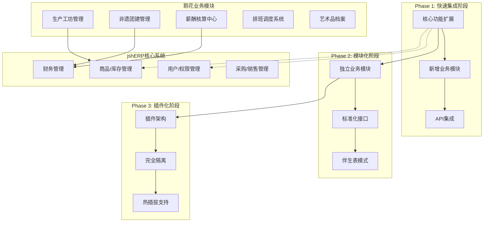
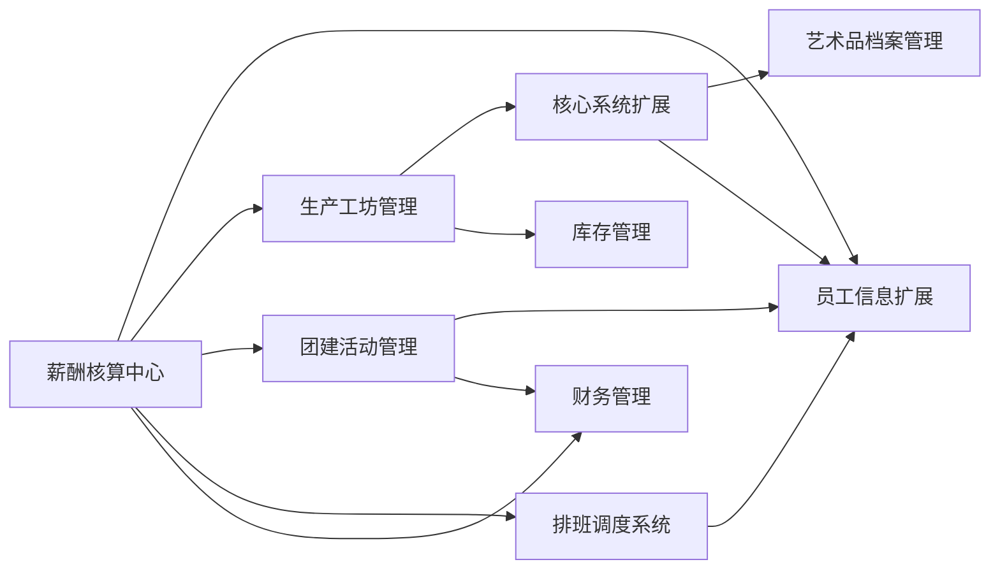

# 聆花文化ERP二次开发综合实施方案

**版本：** 1.0  
**日期：** 2025-06-17  
**编制：** AI助手  
**状态：** 待审核

---

## 1. 项目概述与战略定位

### 1.1 项目背景

聆花文化作为非遗掐丝珐琅的代表品牌，业务涵盖传统工艺生产、文化体验活动、文创产品销售及衍生业务。经过对三套不同的二次开发方案深度分析，结合《jshERP二次开发技术参考手册》和《初步诉求文档》，本方案采用**渐进式架构演进策略**，确保在满足当前业务需求的同时，为未来的业务发展和技术升级预留充分空间。

### 1.2 核心设计原则

1. **架构渐进性**: 采用"当前实用 + 未来可扩展"的架构设计，支持从简单集成到复杂插件化的平滑演进
2. **业务驱动**: 以解决聆花文化实际业务痛点为核心，避免过度工程化
3. **技术兼容**: 严格遵循jshERP现有技术栈和编码规范，确保系统稳定性
4. **成本控制**: 在确保功能完整性的前提下，优化开发成本和维护成本
5. **风险管控**: 采用多层风险缓解策略，确保项目成功交付

### 1.3 项目目标

- **短期目标**: 快速实现核心业务功能，解决当前管理痛点
- **中期目标**: 建立稳定的业务数字化体系，提升运营效率
- **长期目标**: 构建可扩展的技术平台，支撑企业持续发展

---

## 2. 技术架构设计

### 2.1 整体架构策略

采用**混合式架构**，结合三套方案的优势：



### 2.2 数据库设计策略

#### 2.2.1 三层数据模型

**第一层：核心系统扩展（伴生表模式）**
```sql
-- 商品艺术品扩展表
CREATE TABLE `jsh_material_artwork` (
  `id` bigint(20) NOT NULL AUTO_INCREMENT,
  `material_id` bigint(20) NOT NULL COMMENT '关联商品ID',
  `artwork_no` varchar(50) DEFAULT NULL COMMENT '艺术品编号',
  `craft_type` varchar(50) DEFAULT NULL COMMENT '工艺类型',
  `artist_id` bigint(20) DEFAULT NULL COMMENT '艺术家ID',
  `creation_date` date DEFAULT NULL COMMENT '创作日期',
  `certification_code` varchar(100) DEFAULT NULL COMMENT '鉴证码',
  `story` text COMMENT '作品故事',
  `cultural_meaning` text COMMENT '文化寓意',
  `difficulty_level` int(2) DEFAULT 1 COMMENT '制作难度等级',
  `tenant_id` bigint(20) DEFAULT NULL,
  `delete_flag` varchar(1) DEFAULT '0',
  `create_time` datetime DEFAULT CURRENT_TIMESTAMP,
  `update_time` datetime DEFAULT CURRENT_TIMESTAMP ON UPDATE CURRENT_TIMESTAMP,
  PRIMARY KEY (`id`),
  UNIQUE KEY `uk_material_tenant` (`material_id`, `tenant_id`),
  KEY `idx_artist_tenant` (`artist_id`, `tenant_id`)
) ENGINE=InnoDB DEFAULT CHARSET=utf8mb4 COMMENT='艺术品信息扩展表';

-- 用户员工扩展表
CREATE TABLE `jsh_user_employee` (
  `id` bigint(20) NOT NULL AUTO_INCREMENT,
  `user_id` bigint(20) NOT NULL COMMENT '关联用户ID',
  `employee_no` varchar(50) DEFAULT NULL COMMENT '员工编号',
  `id_card` varchar(18) DEFAULT NULL COMMENT '身份证号',
  `entry_date` date DEFAULT NULL COMMENT '入职日期',
  `skill_level` varchar(20) DEFAULT NULL COMMENT '技能等级',
  `base_salary` decimal(10,2) DEFAULT NULL COMMENT '基本工资',
  `commission_rate` decimal(5,4) DEFAULT NULL COMMENT '提成比例',
  `bank_name` varchar(100) DEFAULT NULL COMMENT '开户银行',
  `bank_account` varchar(50) DEFAULT NULL COMMENT '银行账号',
  `emergency_contact` varchar(100) DEFAULT NULL COMMENT '紧急联系人',
  `emergency_phone` varchar(20) DEFAULT NULL COMMENT '紧急联系电话',
  `tenant_id` bigint(20) DEFAULT NULL,
  `delete_flag` varchar(1) DEFAULT '0',
  `create_time` datetime DEFAULT CURRENT_TIMESTAMP,
  `update_time` datetime DEFAULT CURRENT_TIMESTAMP ON UPDATE CURRENT_TIMESTAMP,
  PRIMARY KEY (`id`),
  UNIQUE KEY `uk_user_tenant` (`user_id`, `tenant_id`),
  UNIQUE KEY `uk_employee_no_tenant` (`employee_no`, `tenant_id`)
) ENGINE=InnoDB DEFAULT CHARSET=utf8mb4 COMMENT='员工信息扩展表';
```

**第二层：新增业务模块表**
```sql
-- 团建活动主表
CREATE TABLE `jsh_teambuilding_activity` (
  `id` bigint(20) NOT NULL AUTO_INCREMENT,
  `activity_no` varchar(50) NOT NULL COMMENT '活动编号',
  `title` varchar(200) NOT NULL COMMENT '活动标题',
  `customer_id` bigint(20) DEFAULT NULL COMMENT '客户ID',
  `activity_date` date NOT NULL COMMENT '活动日期',
  `start_time` time NOT NULL COMMENT '开始时间',
  `end_time` time NOT NULL COMMENT '结束时间',
  `venue` varchar(200) DEFAULT NULL COMMENT '活动场地',
  `planned_participants` int(11) DEFAULT 0 COMMENT '计划参与人数',
  `actual_participants` int(11) DEFAULT 0 COMMENT '实际参与人数',
  `total_income` decimal(12,2) DEFAULT 0.00 COMMENT '总收入',
  `total_cost` decimal(12,2) DEFAULT 0.00 COMMENT '总成本',
  `profit` decimal(12,2) DEFAULT 0.00 COMMENT '利润',
  `status` varchar(20) DEFAULT 'PLANNING' COMMENT '状态：PLANNING-计划中,CONFIRMED-已确认,COMPLETED-已完成,CANCELLED-已取消',
  `description` text COMMENT '活动描述',
  `special_requirements` text COMMENT '特殊要求',
  `tenant_id` bigint(20) DEFAULT NULL,
  `delete_flag` varchar(1) DEFAULT '0',
  `create_time` datetime DEFAULT CURRENT_TIMESTAMP,
  `create_user` bigint(20) DEFAULT NULL,
  `update_time` datetime DEFAULT CURRENT_TIMESTAMP ON UPDATE CURRENT_TIMESTAMP,
  `update_user` bigint(20) DEFAULT NULL,
  PRIMARY KEY (`id`),
  UNIQUE KEY `uk_activity_no_tenant` (`activity_no`, `tenant_id`),
  KEY `idx_activity_date` (`activity_date`),
  KEY `idx_customer_tenant` (`customer_id`, `tenant_id`)
) ENGINE=InnoDB DEFAULT CHARSET=utf8mb4 COMMENT='团建活动主表';

-- 团建活动参与人员表
CREATE TABLE `jsh_teambuilding_participant` (
  `id` bigint(20) NOT NULL AUTO_INCREMENT,
  `activity_id` bigint(20) NOT NULL COMMENT '活动ID',
  `user_id` bigint(20) NOT NULL COMMENT '参与人员ID',
  `role` varchar(20) NOT NULL COMMENT '角色：INSTRUCTOR-讲师,ASSISTANT-助理,MANAGER-负责人',
  `fee` decimal(10,2) DEFAULT 0.00 COMMENT '费用',
  `payment_status` varchar(20) DEFAULT 'PENDING' COMMENT '支付状态',
  `notes` varchar(500) DEFAULT NULL COMMENT '备注',
  `tenant_id` bigint(20) DEFAULT NULL,
  `delete_flag` varchar(1) DEFAULT '0',
  PRIMARY KEY (`id`),
  KEY `idx_activity_user` (`activity_id`, `user_id`),
  KEY `idx_user_role` (`user_id`, `role`)
) ENGINE=InnoDB DEFAULT CHARSET=utf8mb4 COMMENT='团建活动参与人员表';

-- 生产工单主表
CREATE TABLE `jsh_production_order` (
  `id` bigint(20) NOT NULL AUTO_INCREMENT,
  `order_no` varchar(50) NOT NULL COMMENT '工单编号',
  `sales_order_id` bigint(20) DEFAULT NULL COMMENT '关联销售订单ID',
  `material_id` bigint(20) NOT NULL COMMENT '产品ID',
  `quantity` int(11) NOT NULL COMMENT '生产数量',
  `priority` int(2) DEFAULT 3 COMMENT '优先级：1-紧急,2-高,3-普通,4-低,5-延期',
  `planned_start_date` date DEFAULT NULL COMMENT '计划开始日期',
  `planned_end_date` date DEFAULT NULL COMMENT '计划完成日期',
  `actual_start_date` date DEFAULT NULL COMMENT '实际开始日期',
  `actual_end_date` date DEFAULT NULL COMMENT '实际完成日期',
  `responsible_user_id` bigint(20) DEFAULT NULL COMMENT '负责人ID',
  `status` varchar(20) DEFAULT 'PENDING' COMMENT '状态：PENDING-待生产,IN_PROGRESS-生产中,COMPLETED-已完成,CANCELLED-已取消',
  `total_cost` decimal(12,2) DEFAULT 0.00 COMMENT '总成本',
  `material_cost` decimal(12,2) DEFAULT 0.00 COMMENT '材料成本',
  `labor_cost` decimal(12,2) DEFAULT 0.00 COMMENT '人工成本',
  `notes` text COMMENT '备注',
  `tenant_id` bigint(20) DEFAULT NULL,
  `delete_flag` varchar(1) DEFAULT '0',
  `create_time` datetime DEFAULT CURRENT_TIMESTAMP,
  `create_user` bigint(20) DEFAULT NULL,
  `update_time` datetime DEFAULT CURRENT_TIMESTAMP ON UPDATE CURRENT_TIMESTAMP,
  `update_user` bigint(20) DEFAULT NULL,
  PRIMARY KEY (`id`),
  UNIQUE KEY `uk_order_no_tenant` (`order_no`, `tenant_id`),
  KEY `idx_sales_order` (`sales_order_id`),
  KEY `idx_material_tenant` (`material_id`, `tenant_id`),
  KEY `idx_status_priority` (`status`, `priority`)
) ENGINE=InnoDB DEFAULT CHARSET=utf8mb4 COMMENT='生产工单主表';

-- 薪酬核算主表
CREATE TABLE `jsh_salary_calculation` (
  `id` bigint(20) NOT NULL AUTO_INCREMENT,
  `calculation_no` varchar(50) NOT NULL COMMENT '核算编号',
  `user_id` bigint(20) NOT NULL COMMENT '员工ID',
  `calculation_month` varchar(7) NOT NULL COMMENT '核算月份(YYYY-MM)',
  `base_salary` decimal(10,2) DEFAULT 0.00 COMMENT '基本工资',
  `production_salary` decimal(10,2) DEFAULT 0.00 COMMENT '生产工资',
  `teambuilding_commission` decimal(10,2) DEFAULT 0.00 COMMENT '团建提成',
  `schedule_salary` decimal(10,2) DEFAULT 0.00 COMMENT '排班工资',
  `bonus` decimal(10,2) DEFAULT 0.00 COMMENT '奖金',
  `deduction` decimal(10,2) DEFAULT 0.00 COMMENT '扣款',
  `total_salary` decimal(10,2) DEFAULT 0.00 COMMENT '应发工资',
  `actual_salary` decimal(10,2) DEFAULT 0.00 COMMENT '实发工资',
  `status` varchar(20) DEFAULT 'CALCULATED' COMMENT '状态：CALCULATED-已计算,CONFIRMED-已确认,PAID-已发放',
  `payment_date` date DEFAULT NULL COMMENT '发放日期',
  `calculation_details` text COMMENT '计算明细JSON',
  `tenant_id` bigint(20) DEFAULT NULL,
  `delete_flag` varchar(1) DEFAULT '0',
  `create_time` datetime DEFAULT CURRENT_TIMESTAMP,
  `create_user` bigint(20) DEFAULT NULL,
  `update_time` datetime DEFAULT CURRENT_TIMESTAMP ON UPDATE CURRENT_TIMESTAMP,
  `update_user` bigint(20) DEFAULT NULL,
  PRIMARY KEY (`id`),
  UNIQUE KEY `uk_calculation_no_tenant` (`calculation_no`, `tenant_id`),
  UNIQUE KEY `uk_user_month_tenant` (`user_id`, `calculation_month`, `tenant_id`),
  KEY `idx_month_status` (`calculation_month`, `status`)
) ENGINE=InnoDB DEFAULT CHARSET=utf8mb4 COMMENT='薪酬核算主表';

-- 排班记录表
CREATE TABLE `jsh_schedule_record` (
  `id` bigint(20) NOT NULL AUTO_INCREMENT,
  `user_id` bigint(20) NOT NULL COMMENT '员工ID',
  `schedule_date` date NOT NULL COMMENT '排班日期',
  `shift_type` varchar(20) NOT NULL COMMENT '班次类型：MORNING-早班,AFTERNOON-午班,EVENING-晚班,FULL_DAY-全天',
  `start_time` time NOT NULL COMMENT '开始时间',
  `end_time` time NOT NULL COMMENT '结束时间',
  `location` varchar(100) DEFAULT NULL COMMENT '工作地点',
  `hourly_rate` decimal(8,2) DEFAULT 0.00 COMMENT '时薪',
  `total_hours` decimal(4,2) DEFAULT 0.00 COMMENT '总工时',
  `total_salary` decimal(10,2) DEFAULT 0.00 COMMENT '排班工资',
  `status` varchar(20) DEFAULT 'SCHEDULED' COMMENT '状态：SCHEDULED-已排班,CONFIRMED-已确认,COMPLETED-已完成,CANCELLED-已取消',
  `notes` varchar(500) DEFAULT NULL COMMENT '备注',
  `tenant_id` bigint(20) DEFAULT NULL,
  `delete_flag` varchar(1) DEFAULT '0',
  `create_time` datetime DEFAULT CURRENT_TIMESTAMP,
  `create_user` bigint(20) DEFAULT NULL,
  `update_time` datetime DEFAULT CURRENT_TIMESTAMP ON UPDATE CURRENT_TIMESTAMP,
  `update_user` bigint(20) DEFAULT NULL,
  PRIMARY KEY (`id`),
  UNIQUE KEY `uk_user_date_shift_tenant` (`user_id`, `schedule_date`, `shift_type`, `tenant_id`),
  KEY `idx_date_location` (`schedule_date`, `location`),
  KEY `idx_user_month` (`user_id`, `schedule_date`)
) ENGINE=InnoDB DEFAULT CHARSET=utf8mb4 COMMENT='排班记录表';
```

### 2.3 模块架构设计

#### 2.3.1 分层架构模式
```
┌─────────────────────────────────────────┐
│           前端展示层 (Vue.js)              │
├─────────────────────────────────────────┤
│           API接口层 (Controller)          │
├─────────────────────────────────────────┤
│           业务逻辑层 (Service)             │
├─────────────────────────────────────────┤
│           数据访问层 (Mapper)              │
├─────────────────────────────────────────┤
│           数据存储层 (MySQL)               │
└─────────────────────────────────────────┘
```

#### 2.3.2 模块依赖关系


---

## 3. 功能模块详细设计

### 3.1 核心系统扩展模块

#### 3.1.1 艺术品档案管理

**功能概述**: 在现有商品管理基础上，增加艺术品特有属性和文化内涵记录。

**关键特性**:
- 艺术品编号自动生成规则
- 制作工艺和难度等级管理
- 文化故事和寓意记录
- 数字鉴证码生成
- 艺术家作品关联

**实现方案**:
```java
// 扩展MaterialService，增加艺术品特有逻辑
@Service
public class MaterialArtworkService extends MaterialService {
    
    @Resource
    private MaterialArtworkMapper materialArtworkMapper;
    
    @Override
    @Transactional(rollbackFor = Exception.class)
    public int insertMaterial(JSONObject obj, HttpServletRequest request) throws Exception {
        // 先调用父类方法插入基础商品信息
        int result = super.insertMaterial(obj, request);
        
        if (result > 0 && obj.containsKey("artworkInfo")) {
            // 插入艺术品扩展信息
            MaterialArtwork artwork = new MaterialArtwork();
            artwork.setMaterialId(obj.getLong("id"));
            artwork.setArtworkNo(generateArtworkNo());
            // ... 其他字段设置
            materialArtworkMapper.insertSelective(artwork);
        }
        
        return result;
    }
    
    private String generateArtworkNo() {
        // 生成艺术品编号逻辑：LH + 年份 + 月份 + 4位序号
        String yearMonth = DateTimeFormatter.ofPattern("yyyyMM").format(LocalDate.now());
        String sequence = String.format("%04d", getNextSequence());
        return "LH" + yearMonth + sequence;
    }
}
```

#### 3.1.2 员工信息扩展

**功能概述**: 在现有用户管理基础上，增加员工薪酬、技能等企业管理必需信息。

**关键特性**:
- 员工编号规范化管理
- 薪酬结构配置
- 技能等级评定
- 银行账户信息
- 紧急联系人管理

### 3.2 生产工坊管理模块

#### 3.2.1 智能工单生成

**业务流程**:
1. 销售订单确认后自动分析产品清单
2. 检查库存是否充足，不足时触发采购或生产
3. 根据产品工艺要求生成标准化生产工单
4. 自动分配生产优先级和预计完成时间

**核心算法**:
```java
@Service
public class ProductionOrderService {
    
    public ProductionOrder generateFromSalesOrder(Long salesOrderId) {
        // 1. 获取销售订单详情
        SalesOrder salesOrder = salesOrderService.getById(salesOrderId);
        
        // 2. 分析产品BOM
        List<BomItem> bomItems = bomService.getBomByMaterialId(salesOrder.getMaterialId());
        
        // 3. 检查库存充足性
        InventoryCheckResult checkResult = inventoryService.checkAvailability(bomItems);
        
        // 4. 生成生产工单
        ProductionOrder order = new ProductionOrder();
        order.setOrderNo(generateOrderNo());
        order.setSalesOrderId(salesOrderId);
        order.setPriority(calculatePriority(salesOrder));
        order.setPlannedEndDate(calculateEndDate(salesOrder));
        
        // 5. 如果库存不足，触发采购
        if (!checkResult.isAllAvailable()) {
            purchaseService.createPurchaseRequest(checkResult.getShortageItems());
        }
        
        return order;
    }
    
    private int calculatePriority(SalesOrder salesOrder) {
        // 根据客户等级、订单金额、交付日期等计算优先级
        return 3; // 默认普通优先级
    }
}
```

#### 3.2.2 移动端报工系统

**功能设计**:
- 扫码快速报工
- 照片上传记录
- 工时自动计算
- 质量问题反馈

**前端实现**:
```vue
<template>
  <div class="mobile-work-report">
    <a-card title="生产报工" size="small">
      <!-- 工单信息 -->
      <a-descriptions :column="1" size="small">
        <a-descriptions-item label="工单号">{{ orderInfo.orderNo }}</a-descriptions-item>
        <a-descriptions-item label="产品">{{ orderInfo.materialName }}</a-descriptions-item>
        <a-descriptions-item label="数量">{{ orderInfo.quantity }}</a-descriptions-item>
      </a-descriptions>
      
      <!-- 报工照片 -->
      <div class="photo-upload-section">
        <h4>工作照片</h4>
        <a-upload
          v-model:file-list="fileList"
          name="file"
          list-type="picture-card"
          :before-upload="beforeUpload"
          @change="handleChange">
          <div v-if="fileList.length < 8">
            <plus-outlined />
            <div style="margin-top: 8px">上传</div>
          </div>
        </a-upload>
      </div>
      
      <!-- 工时记录 -->
      <a-form-item label="工作时长">
        <a-input-number v-model:value="workHours" :min="0" :max="24" :step="0.5" />
        <span style="margin-left: 8px">小时</span>
      </a-form-item>
      
      <!-- 质量状态 -->
      <a-form-item label="质量状态">
        <a-radio-group v-model:value="qualityStatus">
          <a-radio value="GOOD">良品</a-radio>
          <a-radio value="DEFECT">次品</a-radio>
          <a-radio value="REWORK">返工</a-radio>
        </a-radio-group>
      </a-form-item>
      
      <!-- 提交按钮 -->
      <a-button type="primary" block @click="submitReport">完工提交</a-button>
    </a-card>
  </div>
</template>

<script>
export default {
  name: 'ProductionReportMobile',
  data() {
    return {
      orderInfo: {},
      fileList: [],
      workHours: 0,
      qualityStatus: 'GOOD',
      notes: ''
    }
  },
  methods: {
    async submitReport() {
      const reportData = {
        orderId: this.orderInfo.id,
        workHours: this.workHours,
        qualityStatus: this.qualityStatus,
        photos: this.fileList.map(file => file.response?.url).filter(Boolean),
        notes: this.notes
      }
      
      try {
        await this.$api.production.submitReport(reportData)
        this.$message.success('报工成功！')
        this.$router.go(-1)
      } catch (error) {
        this.$message.error('报工失败：' + error.message)
      }
    }
  }
}
</script>
```

### 3.3 非遗团建管理模块

#### 3.3.1 活动全生命周期管理

**状态流转**:
```
PLANNING(计划中) → CONFIRMED(已确认) → IN_PROGRESS(进行中) → COMPLETED(已完成)
                                    ↓
                                CANCELLED(已取消)
```

**核心Service实现**:
```java
@Service
public class TeambuildingActivityService {
    
    @Resource
    private TeambuildingActivityMapper activityMapper;
    @Resource
    private TeambuildingParticipantMapper participantMapper;
    @Resource
    private AccountService accountService;
    
    @Transactional(rollbackFor = Exception.class)
    public int confirmActivity(Long activityId, HttpServletRequest request) throws Exception {
        TeambuildingActivity activity = activityMapper.selectByPrimaryKey(activityId);
        if (activity == null) {
            throw new BusinessRunTimeException(ErrorCodeConstants.ACTIVITY_NOT_FOUND);
        }
        
        // 1. 更新活动状态
        activity.setStatus("CONFIRMED");
        activity.setUpdateTime(new Date());
        activityMapper.updateByPrimaryKeySelective(activity);
        
        // 2. 生成收入记录
        if (activity.getTotalIncome().compareTo(BigDecimal.ZERO) > 0) {
            Account incomeAccount = new Account();
            incomeAccount.setAmount(activity.getTotalIncome());
            incomeAccount.setType("收入");
            incomeAccount.setSource("团建活动");
            incomeAccount.setSourceId(activityId);
            accountService.insertAccount(incomeAccount, request);
        }
        
        // 3. 生成人员费用记录
        List<TeambuildingParticipant> participants = participantMapper.selectByActivityId(activityId);
        for (TeambuildingParticipant participant : participants) {
            if (participant.getFee().compareTo(BigDecimal.ZERO) > 0) {
                Account expenseAccount = new Account();
                expenseAccount.setAmount(participant.getFee().negate());
                expenseAccount.setType("支出");
                expenseAccount.setSource("团建费用");
                expenseAccount.setSourceId(activityId);
                accountService.insertAccount(expenseAccount, request);
            }
        }
        
        return 1;
    }
    
    public String generateActivityNo() {
        String datePrefix = DateTimeFormatter.ofPattern("yyyyMMdd").format(LocalDate.now());
        String sequence = String.format("%03d", getNextSequence());
        return "TB" + datePrefix + sequence;
    }
}
```

#### 3.3.2 智能冲突检测

**时间冲突检测算法**:
```java
public class ConflictDetectionService {
    
    public ConflictCheckResult checkTimeConflict(TeambuildingActivity activity) {
        ConflictCheckResult result = new ConflictCheckResult();
        
        // 检查场地冲突
        List<TeambuildingActivity> venueConflicts = activityMapper.selectByVenueAndTimeRange(
            activity.getVenue(),
            activity.getActivityDate(),
            activity.getStartTime(),
            activity.getEndTime()
        );
        
        if (!venueConflicts.isEmpty()) {
            result.addConflict("场地冲突", venueConflicts);
        }
        
        // 检查人员冲突
        List<TeambuildingParticipant> participants = activity.getParticipants();
        for (TeambuildingParticipant participant : participants) {
            List<TeambuildingActivity> userConflicts = checkUserTimeConflict(
                participant.getUserId(),
                activity.getActivityDate(),
                activity.getStartTime(),
                activity.getEndTime()
            );
            
            if (!userConflicts.isEmpty()) {
                result.addConflict("人员时间冲突", userConflicts);
            }
        }
        
        return result;
    }
}
```

### 3.4 薪酬核算中心

#### 3.4.1 多维度薪酬计算

**薪酬构成**:
- 基本工资：固定月薪
- 生产工资：按件计酬或按工时计酬
- 团建提成：按活动利润的比例提成
- 排班工资：按时薪计算的排班费用
- 绩效奖金：根据绩效评估给予的奖励
- 各类扣款：考勤扣款、违规扣款等

**核心计算逻辑**:
```java
@Service
public class SalaryCalculationService {
    
    public SalaryCalculation calculateMonthlySalary(Long userId, String calculationMonth) {
        UserEmployee employee = userEmployeeService.getByUserId(userId);
        SalaryCalculation calculation = new SalaryCalculation();
        
        // 1. 基本工资
        BigDecimal baseSalary = employee.getBaseSalary() != null ? employee.getBaseSalary() : BigDecimal.ZERO;
        calculation.setBaseSalary(baseSalary);
        
        // 2. 生产工资
        BigDecimal productionSalary = calculateProductionSalary(userId, calculationMonth);
        calculation.setProductionSalary(productionSalary);
        
        // 3. 团建提成
        BigDecimal teambuildingCommission = calculateTeambuildingCommission(userId, calculationMonth);
        calculation.setTeambuildingCommission(teambuildingCommission);
        
        // 4. 排班工资
        BigDecimal scheduleSalary = calculateScheduleSalary(userId, calculationMonth);
        calculation.setScheduleSalary(scheduleSalary);
        
        // 5. 计算总工资
        BigDecimal totalSalary = baseSalary
            .add(productionSalary)
            .add(teambuildingCommission)
            .add(scheduleSalary)
            .add(calculation.getBonus())
            .subtract(calculation.getDeduction());
        
        calculation.setTotalSalary(totalSalary);
        calculation.setActualSalary(totalSalary); // 暂时相等，后续可加入税费扣除逻辑
        
        return calculation;
    }
    
    private BigDecimal calculateProductionSalary(Long userId, String month) {
        // 查询该月该员工的所有生产报工记录
        List<ProductionWorkLog> workLogs = productionService.getWorkLogsByUserAndMonth(userId, month);
        
        return workLogs.stream()
            .map(log -> {
                // 根据产品和工时计算工资
                BigDecimal rate = getMaterialLaborRate(log.getMaterialId());
                return rate.multiply(BigDecimal.valueOf(log.getWorkHours()));
            })
            .reduce(BigDecimal.ZERO, BigDecimal::add);
    }
    
    private BigDecimal calculateTeambuildingCommission(Long userId, String month) {
        // 查询该月该员工参与的团建活动
        List<TeambuildingParticipant> participants = teambuildingService.getParticipantsByUserAndMonth(userId, month);
        
        return participants.stream()
            .map(TeambuildingParticipant::getFee)
            .reduce(BigDecimal.ZERO, BigDecimal::add);
    }
    
    @Transactional(rollbackFor = Exception.class)
    public int paySalary(Long calculationId, HttpServletRequest request) throws Exception {
        SalaryCalculation calculation = salaryCalculationMapper.selectByPrimaryKey(calculationId);
        
        // 1. 更新薪酬状态
        calculation.setStatus("PAID");
        calculation.setPaymentDate(new Date());
        salaryCalculationMapper.updateByPrimaryKeySelective(calculation);
        
        // 2. 生成财务记录
        Account payrollAccount = new Account();
        payrollAccount.setAmount(calculation.getActualSalary().negate());
        payrollAccount.setType("支出");
        payrollAccount.setSource("工资发放");
        payrollAccount.setSourceId(calculationId);
        accountService.insertAccount(payrollAccount, request);
        
        return 1;
    }
}
```

### 3.5 排班调度系统

#### 3.5.1 可视化排班界面

**前端实现**:
```vue
<template>
  <div class="schedule-calendar">
    <a-card title="排班管理" :bordered="false">
      <!-- 操作工具栏 -->
      <div class="schedule-toolbar">
        <a-space>
          <a-select v-model:value="selectedLocation" placeholder="选择工作地点" style="width: 200px">
            <a-select-option value="聆花掐丝珐琅馆">聆花掐丝珐琅馆</a-select-option>
            <a-select-option value="印象咖咖啡店">印象咖咖啡店</a-select-option>
          </a-select>
          
          <a-button type="primary" @click="showAddModal">新增排班</a-button>
          <a-button @click="exportSchedule">导出排班表</a-button>
        </a-space>
      </div>
      
      <!-- 日历组件 -->
      <FullCalendar
        ref="fullCalendar"
        :options="calendarOptions"
        class="schedule-calendar-view"
      />
    </a-card>
    
    <!-- 排班编辑弹窗 -->
    <a-modal
      v-model:visible="addModalVisible"
      title="排班设置"
      width="600px"
      @ok="handleAddOk"
      @cancel="handleAddCancel">
      
      <a-form ref="addForm" :model="addForm" :rules="addRules" :label-col="{ span: 6 }">
        <a-form-item label="员工" prop="userId">
          <a-select v-model:value="addForm.userId" placeholder="选择员工">
            <a-select-option v-for="user in userList" :key="user.id" :value="user.id">
              {{ user.username }}
            </a-select-option>
          </a-select>
        </a-form-item>
        
        <a-form-item label="排班日期" prop="scheduleDate">
          <a-date-picker v-model:value="addForm.scheduleDate" style="width: 100%" />
        </a-form-item>
        
        <a-form-item label="班次类型" prop="shiftType">
          <a-select v-model:value="addForm.shiftType" @change="onShiftTypeChange">
            <a-select-option value="MORNING">早班</a-select-option>
            <a-select-option value="AFTERNOON">午班</a-select-option>
            <a-select-option value="EVENING">晚班</a-select-option>
            <a-select-option value="FULL_DAY">全天</a-select-option>
          </a-select>
        </a-form-item>
        
        <a-form-item label="工作时间">
          <a-time-range-picker v-model:value="timeRange" format="HH:mm" />
        </a-form-item>
        
        <a-form-item label="工作地点" prop="location">
          <a-input v-model:value="addForm.location" />
        </a-form-item>
        
        <a-form-item label="时薪" prop="hourlyRate">
          <a-input-number v-model:value="addForm.hourlyRate" :min="0" :precision="2" />
        </a-form-item>
      </a-form>
    </a-modal>
  </div>
</template>

<script>
import FullCalendar from '@fullcalendar/vue3'
import dayGridPlugin from '@fullcalendar/daygrid'
import timeGridPlugin from '@fullcalendar/timegrid'
import interactionPlugin from '@fullcalendar/interaction'

export default {
  name: 'ScheduleCalendar',
  components: {
    FullCalendar
  },
  data() {
    return {
      selectedLocation: '聆花掐丝珐琅馆',
      addModalVisible: false,
      addForm: {
        userId: null,
        scheduleDate: null,
        shiftType: null,
        startTime: null,
        endTime: null,
        location: '聆花掐丝珐琅馆',
        hourlyRate: 20
      },
      addRules: {
        userId: [{ required: true, message: '请选择员工' }],
        scheduleDate: [{ required: true, message: '请选择排班日期' }],
        shiftType: [{ required: true, message: '请选择班次类型' }]
      },
      userList: [],
      calendarOptions: {
        plugins: [dayGridPlugin, timeGridPlugin, interactionPlugin],
        headerToolbar: {
          left: 'prev,next today',
          center: 'title',
          right: 'dayGridMonth,timeGridWeek,timeGridDay'
        },
        initialView: 'dayGridMonth',
        events: [],
        selectable: true,
        selectMirror: true,
        select: this.handleDateSelect,
        eventClick: this.handleEventClick,
        editable: true,
        eventDrop: this.handleEventDrop
      }
    }
  },
  
  computed: {
    timeRange: {
      get() {
        if (this.addForm.startTime && this.addForm.endTime) {
          return [moment(this.addForm.startTime, 'HH:mm'), moment(this.addForm.endTime, 'HH:mm')]
        }
        return null
      },
      set(value) {
        if (value && value.length === 2) {
          this.addForm.startTime = value[0].format('HH:mm')
          this.addForm.endTime = value[1].format('HH:mm')
        }
      }
    }
  },
  
  created() {
    this.loadUserList()
    this.loadScheduleEvents()
  },
  
  methods: {
    async loadScheduleEvents() {
      try {
        const params = {
          location: this.selectedLocation,
          startDate: moment().startOf('month').format('YYYY-MM-DD'),
          endDate: moment().endOf('month').format('YYYY-MM-DD')
        }
        
        const response = await this.$api.schedule.getCalendarEvents(params)
        this.calendarOptions.events = response.data.map(event => ({
          id: event.id,
          title: event.userName + ' - ' + event.shiftTypeName,
          start: event.scheduleDate + 'T' + event.startTime,
          end: event.scheduleDate + 'T' + event.endTime,
          backgroundColor: this.getShiftColor(event.shiftType),
          extendedProps: event
        }))
      } catch (error) {
        this.$message.error('加载排班数据失败')
      }
    },
    
    handleDateSelect(selectInfo) {
      this.addForm.scheduleDate = moment(selectInfo.start)
      this.addModalVisible = true
    },
    
    async handleAddOk() {
      try {
        await this.$refs.addForm.validate()
        
        const scheduleData = {
          ...this.addForm,
          scheduleDate: this.addForm.scheduleDate.format('YYYY-MM-DD'),
          totalHours: this.calculateTotalHours(),
          totalSalary: this.calculateTotalSalary()
        }
        
        await this.$api.schedule.create(scheduleData)
        this.$message.success('排班设置成功')
        this.addModalVisible = false
        this.loadScheduleEvents()
        this.resetAddForm()
      } catch (error) {
        this.$message.error('排班设置失败：' + error.message)
      }
    },
    
    onShiftTypeChange(shiftType) {
      // 根据班次类型自动设置时间
      const timeMap = {
        'MORNING': ['09:00', '13:00'],
        'AFTERNOON': ['13:00', '18:00'],
        'EVENING': ['18:00', '22:00'],
        'FULL_DAY': ['09:00', '22:00']
      }
      
      if (timeMap[shiftType]) {
        this.addForm.startTime = timeMap[shiftType][0]
        this.addForm.endTime = timeMap[shiftType][1]
      }
    },
    
    calculateTotalHours() {
      if (this.addForm.startTime && this.addForm.endTime) {
        const start = moment(this.addForm.startTime, 'HH:mm')
        const end = moment(this.addForm.endTime, 'HH:mm')
        return end.diff(start, 'hours', true)
      }
      return 0
    },
    
    calculateTotalSalary() {
      return this.calculateTotalHours() * this.addForm.hourlyRate
    },
    
    getShiftColor(shiftType) {
      const colorMap = {
        'MORNING': '#52c41a',
        'AFTERNOON': '#1890ff',
        'EVENING': '#722ed1',
        'FULL_DAY': '#fa8c16'
      }
      return colorMap[shiftType] || '#d9d9d9'
    }
  }
}
</script>

<style scoped>
.schedule-calendar {
  padding: 20px;
}

.schedule-toolbar {
  margin-bottom: 20px;
  padding-bottom: 16px;
  border-bottom: 1px solid #f0f0f0;
}

.schedule-calendar-view {
  margin-top: 20px;
}

:deep(.fc-event) {
  cursor: pointer;
  border-radius: 4px;
}

:deep(.fc-event:hover) {
  opacity: 0.8;
}
</style>
```

---

## 4. 实施计划与里程碑

### 4.1 项目阶段划分

#### 第一阶段：基础设施建设 (4周)
**目标**: 完成开发环境搭建和数据库基础设施建设

**主要任务**:
- [ ] **环境配置** (1周)
  - [ ] 开发环境搭建和配置
  - [ ] 代码版本控制和分支管理策略确定
  - [ ] 自动化构建和部署流程建立
  - [ ] 测试环境准备

- [ ] **数据库设计与实施** (2周)
  - [ ] 执行数据库表创建脚本
  - [ ] 创建必要的索引和约束
  - [ ] 准备测试数据和种子数据
  - [ ] 数据库备份和恢复策略制定

- [ ] **基础框架搭建** (1周)
  - [ ] 项目模块结构设计
  - [ ] 通用工具类和常量定义
  - [ ] 异常处理机制完善
  - [ ] 日志记录框架配置

**交付物**:
- 完整的开发环境
- 数据库表结构文档
- 基础代码框架
- 项目规范文档

#### 第二阶段：核心模块开发 (8周)
**目标**: 完成核心业务模块的后端开发

**主要任务**:
- [ ] **核心系统扩展** (2周)
  - [ ] 艺术品档案管理实体和服务层开发
  - [ ] 员工信息扩展功能实现
  - [ ] 与现有系统的集成测试

- [ ] **生产工坊管理** (2周)
  - [ ] 生产工单管理功能开发
  - [ ] 智能工单生成算法实现
  - [ ] 移动端报工API开发
  - [ ] 成本核算逻辑实现

- [ ] **团建活动管理** (2周)
  - [ ] 活动全生命周期管理功能
  - [ ] 时间冲突检测算法
  - [ ] 预算核算和财务联动
  - [ ] 参与人员管理

- [ ] **薪酬核算中心** (2周)
  - [ ] 多维度薪酬计算引擎
  - [ ] 自动化薪酬发放流程
  - [ ] 薪资条生成和发送
  - [ ] 与财务模块集成

**交付物**:
- 完整的后端API接口
- API文档和测试用例
- 数据库操作优化报告
- 单元测试覆盖率报告

#### 第三阶段：前端界面开发 (6周)
**目标**: 完成用户界面开发和用户体验优化

**主要任务**:
- [ ] **核心界面开发** (2周)
  - [ ] 艺术品档案管理界面
  - [ ] 员工信息扩展界面
  - [ ] 与现有页面的无缝集成

- [ ] **业务模块界面** (3周)
  - [ ] 生产工坊管理界面
  - [ ] 团建活动管理界面
  - [ ] 薪酬核算管理界面
  - [ ] 排班调度可视化界面

- [ ] **移动端开发** (1周)
  - [ ] 移动端报工界面
  - [ ] 移动端查询功能
  - [ ] 响应式设计优化

**交付物**:
- 完整的前端应用
- 用户操作手册
- 界面设计规范文档
- 浏览器兼容性测试报告

#### 第四阶段：集成测试与优化 (4周)
**目标**: 完成系统集成、性能优化和用户培训

**主要任务**:
- [ ] **系统集成测试** (1.5周)
  - [ ] 端到端功能测试
  - [ ] 数据一致性验证
  - [ ] 权限控制测试
  - [ ] 多租户隔离测试

- [ ] **性能优化** (1周)
  - [ ] 数据库查询优化
  - [ ] 前端加载性能优化
  - [ ] 缓存策略实施
  - [ ] 并发性能测试

- [ ] **用户培训和文档** (1周)
  - [ ] 用户操作培训
  - [ ] 管理员培训
  - [ ] 系统维护文档编写
  - [ ] 故障排除指南

- [ ] **部署和上线** (0.5周)
  - [ ] 生产环境部署
  - [ ] 数据迁移
  - [ ] 上线验证
  - [ ] 监控告警配置

**交付物**:
- 完整的系统部署
- 性能测试报告
- 用户培训材料
- 运维手册

### 4.2 关键里程碑

| 里程碑 | 时间点 | 主要成果 |
|--------|--------|----------|
| M1 - 基础建设完成 | 第4周末 | 开发环境和数据库基础设施就绪 |
| M2 - 后端开发完成 | 第12周末 | 所有API接口开发完成并通过测试 |
| M3 - 前端开发完成 | 第18周末 | 用户界面开发完成并通过内部测试 |
| M4 - 系统上线 | 第22周末 | 系统正式上线并投入使用 |

### 4.3 风险管控计划

#### 4.3.1 技术风险
**风险**: 系统集成复杂度超出预期
**概率**: 中等
**影响**: 高
**缓解措施**:
- 在设计阶段充分分析集成点
- 建立详细的接口文档和测试用例
- 采用渐进式集成策略
- 预留额外的集成测试时间

#### 4.3.2 性能风险
**风险**: 系统性能不满足要求
**概率**: 低
**影响**: 中等
**缓解措施**:
- 在开发阶段进行性能预测和监控
- 采用数据库索引优化策略
- 实施适当的缓存机制
- 进行压力测试和性能调优

#### 4.3.3 数据安全风险
**风险**: 数据泄露或丢失
**概率**: 低
**影响**: 高
**缓解措施**:
- 严格遵循现有的安全规范
- 实施数据加密和访问控制
- 建立完善的备份和恢复机制
- 进行安全审计和渗透测试

---

## 5. 技术实现细节

### 5.1 后端技术实现

#### 5.1.1 统一响应格式

```java
// 统一API响应格式
@Data
public class ApiResponse<T> {
    private int code;
    private String message;
    private T data;
    private long timestamp;
    
    public static <T> ApiResponse<T> success(T data) {
        ApiResponse<T> response = new ApiResponse<>();
        response.code = 200;
        response.message = "success";
        response.data = data;
        response.timestamp = System.currentTimeMillis();
        return response;
    }
    
    public static <T> ApiResponse<T> error(int code, String message) {
        ApiResponse<T> response = new ApiResponse<>();
        response.code = code;
        response.message = message;
        response.timestamp = System.currentTimeMillis();
        return response;
    }
}

// 统一异常处理
@RestControllerAdvice
public class GlobalExceptionHandler {
    
    @ExceptionHandler(BusinessException.class)
    public ApiResponse<Void> handleBusinessException(BusinessException e) {
        return ApiResponse.error(e.getCode(), e.getMessage());
    }
    
    @ExceptionHandler(ValidationException.class)
    public ApiResponse<Void> handleValidationException(ValidationException e) {
        return ApiResponse.error(400, "参数验证失败：" + e.getMessage());
    }
    
    @ExceptionHandler(Exception.class)
    public ApiResponse<Void> handleGenericException(Exception e) {
        log.error("系统异常", e);
        return ApiResponse.error(500, "系统内部错误");
    }
}
```

#### 5.1.2 数据访问层优化

```java
// 通用Mapper扩展
public interface BaseMapperEx<T> {
    
    /**
     * 批量插入
     */
    int insertBatch(@Param("list") List<T> list);
    
    /**
     * 批量更新
     */
    int updateBatch(@Param("list") List<T> list);
    
    /**
     * 软删除
     */
    int softDeleteByIds(@Param("ids") List<Long> ids, @Param("tenantId") Long tenantId);
    
    /**
     * 分页查询with条件
     */
    List<T> selectByConditionWithPage(@Param("condition") T condition, @Param("tenantId") Long tenantId);
}

// 通用Service基类
@Slf4j
public abstract class BaseService<T, M extends BaseMapperEx<T>> {
    
    @Autowired
    protected M baseMapper;
    
    @Transactional(rollbackFor = Exception.class)
    public int batchInsert(List<T> list, HttpServletRequest request) throws Exception {
        if (CollectionUtils.isEmpty(list)) {
            return 0;
        }
        
        try {
            // 设置租户ID和公共字段
            Long tenantId = getCurrentTenantId(request);
            Long userId = getCurrentUserId(request);
            Date now = new Date();
            
            list.forEach(item -> {
                setCommonFields(item, tenantId, userId, now);
            });
            
            int result = baseMapper.insertBatch(list);
            log.info("批量插入{}条记录成功", result);
            return result;
        } catch (Exception e) {
            log.error("批量插入失败", e);
            throw new BusinessException("批量插入失败：" + e.getMessage());
        }
    }
    
    protected abstract void setCommonFields(T item, Long tenantId, Long userId, Date now);
}
```

#### 5.1.3 缓存策略实现

```java
@Configuration
@EnableCaching
public class CacheConfig {
    
    @Bean
    public CacheManager cacheManager() {
        RedisCacheManager.Builder builder = RedisCacheManager
            .RedisCacheManagerBuilder
            .fromConnectionFactory(redisConnectionFactory())
            .cacheDefaults(cacheConfiguration());
        
        return builder.build();
    }
    
    private RedisCacheConfiguration cacheConfiguration() {
        return RedisCacheConfiguration.defaultCacheConfig()
            .entryTtl(Duration.ofHours(1))
            .serializeKeysWith(RedisSerializationContext.SerializationPair
                .fromSerializer(new StringRedisSerializer()))
            .serializeValuesWith(RedisSerializationContext.SerializationPair
                .fromSerializer(new GenericJackson2JsonRedisSerializer()));
    }
}

// 缓存使用示例
@Service
public class MaterialArtworkService {
    
    @Cacheable(value = "materialArtwork", key = "#materialId + '_' + #tenantId")
    public MaterialArtwork getByMaterialId(Long materialId, Long tenantId) {
        return materialArtworkMapper.selectByMaterialIdAndTenantId(materialId, tenantId);
    }
    
    @CacheEvict(value = "materialArtwork", key = "#artwork.materialId + '_' + #artwork.tenantId")
    public int updateArtwork(MaterialArtwork artwork) {
        return materialArtworkMapper.updateByPrimaryKeySelective(artwork);
    }
}
```

### 5.2 前端技术实现

#### 5.2.1 状态管理优化

```javascript
// Vuex模块化状态管理
// store/modules/linghua.js
const state = {
  // 生产工坊状态
  production: {
    currentOrder: null,
    workLogs: [],
    materials: []
  },
  
  // 团建活动状态
  teambuilding: {
    activities: [],
    participants: [],
    currentActivity: null
  },
  
  // 薪酬核算状态
  salary: {
    calculations: [],
    currentMonth: null,
    statistics: {}
  },
  
  // 排班状态
  schedule: {
    records: [],
    calendarEvents: [],
    selectedDate: null
  }
}

const mutations = {
  // 生产工坊相关
  SET_CURRENT_ORDER(state, order) {
    state.production.currentOrder = order
  },
  
  ADD_WORK_LOG(state, log) {
    state.production.workLogs.push(log)
  },
  
  // 团建活动相关
  SET_ACTIVITIES(state, activities) {
    state.teambuilding.activities = activities
  },
  
  UPDATE_ACTIVITY(state, activity) {
    const index = state.teambuilding.activities.findIndex(a => a.id === activity.id)
    if (index !== -1) {
      state.teambuilding.activities.splice(index, 1, activity)
    }
  },
  
  // 薪酬核算相关
  SET_SALARY_CALCULATIONS(state, calculations) {
    state.salary.calculations = calculations
  },
  
  // 排班相关
  SET_SCHEDULE_EVENTS(state, events) {
    state.schedule.calendarEvents = events
  }
}

const actions = {
  // 异步加载生产订单
  async loadProductionOrders({ commit }, params) {
    try {
      const response = await api.production.getOrders(params)
      commit('SET_CURRENT_ORDER', response.data)
      return response
    } catch (error) {
      throw new Error('加载生产订单失败：' + error.message)
    }
  },
  
  // 提交报工记录
  async submitWorkLog({ commit }, logData) {
    try {
      const response = await api.production.submitWorkLog(logData)
      commit('ADD_WORK_LOG', response.data)
      return response
    } catch (error) {
      throw new Error('提交报工失败：' + error.message)
    }
  }
}

export default {
  namespaced: true,
  state,
  mutations,
  actions
}
```

#### 5.2.2 通用组件库

```vue
<!-- 通用数据表格组件 -->
<template>
  <div class="linghua-table">
    <a-card :title="title" :bordered="false">
      <!-- 查询区域 -->
      <div v-if="showSearch" class="table-search-wrapper">
        <slot name="search" :form="searchForm" :onSearch="handleSearch" :onReset="handleReset">
        </slot>
      </div>
      
      <!-- 操作工具栏 -->
      <div v-if="showToolbar" class="table-toolbar">
        <a-space>
          <slot name="toolbar" :selection="selectedRowKeys">
            <a-button v-if="allowAdd" type="primary" icon="plus" @click="handleAdd">
              新增
            </a-button>
            <a-button v-if="allowEdit" type="primary" icon="edit" 
                      :disabled="!hasSelected" @click="handleEdit">
              编辑
            </a-button>
            <a-button v-if="allowDelete" type="danger" icon="delete" 
                      :disabled="!hasSelected" @click="handleDelete">
              删除
            </a-button>
          </slot>
        </a-space>
      </div>
      
      <!-- 数据表格 -->
      <a-table
        ref="table"
        :columns="columns"
        :dataSource="dataSource"
        :pagination="pagination"
        :loading="loading"
        :rowSelection="rowSelection"
        :scroll="scroll"
        size="middle"
        bordered
        @change="handleTableChange">
        
        <!-- 动态插槽 -->
        <template v-for="column in columns" :key="column.dataIndex" #[column.scopedSlots?.customRender]="{ text, record, index }">
          <slot :name="column.scopedSlots?.customRender" :text="text" :record="record" :index="index">
            {{ text }}
          </slot>
        </template>
      </a-table>
    </a-card>
  </div>
</template>

<script>
export default {
  name: 'LinghuaTable',
  props: {
    title: String,
    columns: {
      type: Array,
      required: true
    },
    api: {
      type: Object,
      required: true
    },
    searchForm: {
      type: Object,
      default: () => ({})
    },
    showSearch: {
      type: Boolean,
      default: true
    },
    showToolbar: {
      type: Boolean,
      default: true
    },
    allowAdd: {
      type: Boolean,
      default: true
    },
    allowEdit: {
      type: Boolean,
      default: true
    },
    allowDelete: {
      type: Boolean,
      default: true
    },
    scroll: Object
  },
  
  data() {
    return {
      dataSource: [],
      loading: false,
      selectedRowKeys: [],
      selectedRows: [],
      pagination: {
        current: 1,
        pageSize: 10,
        total: 0,
        showSizeChanger: true,
        showQuickJumper: true,
        showTotal: (total, range) => `显示 ${range[0]}-${range[1]} 共 ${total} 条`
      }
    }
  },
  
  computed: {
    hasSelected() {
      return this.selectedRowKeys.length > 0
    },
    
    rowSelection() {
      return {
        selectedRowKeys: this.selectedRowKeys,
        onChange: this.onSelectChange,
        onSelectAll: this.onSelectAll
      }
    }
  },
  
  created() {
    this.loadData()
  },
  
  methods: {
    async loadData(params = {}) {
      this.loading = true
      try {
        const queryParams = {
          ...this.searchForm,
          ...params,
          current: this.pagination.current,
          size: this.pagination.pageSize
        }
        
        const response = await this.api.list(queryParams)
        
        this.dataSource = response.data.records || response.data
        this.pagination.total = response.data.total || this.dataSource.length
      } catch (error) {
        this.$message.error('加载数据失败：' + error.message)
      } finally {
        this.loading = false
      }
    },
    
    handleSearch() {
      this.pagination.current = 1
      this.loadData()
    },
    
    handleReset() {
      Object.keys(this.searchForm).forEach(key => {
        this.searchForm[key] = null
      })
      this.handleSearch()
    },
    
    handleTableChange(pagination, filters, sorter) {
      this.pagination.current = pagination.current
      this.pagination.pageSize = pagination.pageSize
      this.loadData()
    },
    
    onSelectChange(selectedRowKeys, selectedRows) {
      this.selectedRowKeys = selectedRowKeys
      this.selectedRows = selectedRows
      this.$emit('selectionChange', { keys: selectedRowKeys, rows: selectedRows })
    },
    
    handleAdd() {
      this.$emit('add')
    },
    
    handleEdit() {
      if (this.hasSelected) {
        this.$emit('edit', this.selectedRows[0])
      }
    },
    
    async handleDelete() {
      if (!this.hasSelected) return
      
      this.$confirm({
        title: '确认删除',
        content: `确定要删除选中的 ${this.selectedRowKeys.length} 条记录吗？`,
        onOk: async () => {
          try {
            await this.api.delete(this.selectedRowKeys)
            this.$message.success('删除成功')
            this.loadData()
            this.selectedRowKeys = []
            this.selectedRows = []
          } catch (error) {
            this.$message.error('删除失败：' + error.message)
          }
        }
      })
    },
    
    // 刷新数据的公共方法
    refresh() {
      this.loadData()
    }
  }
}
</script>

<style scoped>
.linghua-table {
  margin: 20px;
}

.table-search-wrapper {
  margin-bottom: 16px;
  padding: 16px;
  background: #fafafa;
  border-radius: 6px;
}

.table-toolbar {
  margin-bottom: 16px;
}
</style>
```

---

## 6. 运维与监控

### 6.1 系统监控方案

#### 6.1.1 应用性能监控

```java
@Component
@Slf4j
public class PerformanceMonitor {
    
    @EventListener
    public void handleMethodExecution(MethodExecutionEvent event) {
        if (event.getExecutionTime() > 1000) { // 超过1秒的请求
            log.warn("慢查询检测 - 方法: {}, 耗时: {}ms, 参数: {}", 
                event.getMethodName(), 
                event.getExecutionTime(), 
                event.getParameters());
        }
    }
    
    @Scheduled(fixedRate = 60000) // 每分钟执行一次
    public void collectMetrics() {
        // 收集系统指标
        SystemMetrics metrics = SystemMetrics.builder()
            .cpuUsage(getCpuUsage())
            .memoryUsage(getMemoryUsage())
            .diskUsage(getDiskUsage())
            .activeConnections(getActiveConnections())
            .timestamp(System.currentTimeMillis())
            .build();
        
        // 发送到监控系统
        monitoringService.sendMetrics(metrics);
    }
}
```

#### 6.1.2 业务指标监控

```java
@Component
public class BusinessMetricsCollector {
    
    @Autowired
    private ProductionOrderService productionOrderService;
    @Autowired
    private TeambuildingActivityService teambuildingService;
    @Autowired
    private SalaryCalculationService salaryService;
    
    @Scheduled(cron = "0 0 1 * * ?") // 每天凌晨1点执行
    public void collectDailyMetrics() {
        try {
            LocalDate yesterday = LocalDate.now().minusDays(1);
            
            // 生产相关指标
            ProductionMetrics prodMetrics = ProductionMetrics.builder()
                .completedOrders(productionOrderService.getCompletedOrdersCount(yesterday))
                .totalProduction(productionOrderService.getTotalProductionQuantity(yesterday))
                .averageCompletionTime(productionOrderService.getAverageCompletionTime(yesterday))
                .qualityRate(productionOrderService.getQualityRate(yesterday))
                .build();
            
            // 团建相关指标
            TeambuildingMetrics tbMetrics = TeambuildingMetrics.builder()
                .activitiesCount(teambuildingService.getActivitiesCount(yesterday))
                .participantsCount(teambuildingService.getParticipantsCount(yesterday))
                .totalRevenue(teambuildingService.getTotalRevenue(yesterday))
                .profitRate(teambuildingService.getProfitRate(yesterday))
                .build();
            
            // 发送业务指标
            monitoringService.sendBusinessMetrics(prodMetrics, tbMetrics);
            
        } catch (Exception e) {
            log.error("业务指标收集失败", e);
        }
    }
}
```

### 6.2 日志管理策略

#### 6.2.1 结构化日志配置

```xml
<!-- logback-spring.xml -->
<configuration>
    <include resource="org/springframework/boot/logging/logback/defaults.xml"/>
    
    <!-- 控制台输出 -->
    <appender name="CONSOLE" class="ch.qos.logback.core.ConsoleAppender">
        <encoder class="net.logstash.logback.encoder.LoggingEventCompositeJsonEncoder">
            <providers>
                <timestamp/>
                <logLevel/>
                <loggerName/>
                <message/>
                <mdc/>
                <arguments/>
                <stackTrace/>
            </providers>
        </encoder>
    </appender>
    
    <!-- 业务日志文件 -->
    <appender name="BUSINESS_FILE" class="ch.qos.logback.core.rolling.RollingFileAppender">
        <file>logs/business.log</file>
        <encoder class="net.logstash.logback.encoder.LoggingEventCompositeJsonEncoder">
            <providers>
                <timestamp/>
                <logLevel/>
                <loggerName/>
                <message/>
                <mdc/>
                <arguments/>
            </providers>
        </encoder>
        <rollingPolicy class="ch.qos.logback.core.rolling.TimeBasedRollingPolicy">
            <fileNamePattern>logs/business.%d{yyyy-MM-dd}.%i.log</fileNamePattern>
            <maxFileSize>100MB</maxFileSize>
            <maxHistory>30</maxHistory>
            <totalSizeCap>3GB</totalSizeCap>
        </rollingPolicy>
    </appender>
    
    <!-- 错误日志文件 -->
    <appender name="ERROR_FILE" class="ch.qos.logback.core.rolling.RollingFileAppender">
        <file>logs/error.log</file>
        <filter class="ch.qos.logback.classic.filter.LevelFilter">
            <level>ERROR</level>
            <onMatch>ACCEPT</onMatch>
            <onMismatch>DENY</onMismatch>
        </filter>
        <encoder class="net.logstash.logback.encoder.LoggingEventCompositeJsonEncoder">
            <providers>
                <timestamp/>
                <logLevel/>
                <loggerName/>
                <message/>
                <mdc/>
                <arguments/>
                <stackTrace/>
            </providers>
        </encoder>
        <rollingPolicy class="ch.qos.logback.core.rolling.TimeBasedRollingPolicy">
            <fileNamePattern>logs/error.%d{yyyy-MM-dd}.%i.log</fileNamePattern>
            <maxFileSize>100MB</maxFileSize>
            <maxHistory>90</maxHistory>
        </rollingPolicy>
    </appender>
    
    <!-- 聆花业务模块专用日志 -->
    <logger name="com.jsh.erp.linghua" level="INFO" additivity="false">
        <appender-ref ref="BUSINESS_FILE"/>
        <appender-ref ref="CONSOLE"/>
    </logger>
    
    <root level="INFO">
        <appender-ref ref="CONSOLE"/>
        <appender-ref ref="ERROR_FILE"/>
    </root>
</configuration>
```

### 6.3 部署方案

#### 6.3.1 Docker容器化部署

```dockerfile
# 后端Dockerfile
FROM openjdk:8-jre-alpine

LABEL maintainer="linghua-culture"

# 设置时区
RUN apk add --no-cache tzdata && \
    cp /usr/share/zoneinfo/Asia/Shanghai /etc/localtime && \
    echo "Asia/Shanghai" > /etc/timezone

# 创建应用目录
WORKDIR /app

# 复制JAR文件
COPY target/jshERP-boot-*.jar app.jar

# 创建日志目录
RUN mkdir -p /app/logs

# 设置JVM参数
ENV JAVA_OPTS="-Xmx1024m -Xms512m -XX:+UseG1GC -XX:G1HeapRegionSize=16m -XX:+UseStringDeduplication"

# 暴露端口
EXPOSE 9999

# 健康检查
HEALTHCHECK --interval=30s --timeout=10s --start-period=60s --retries=3 \
  CMD curl -f http://localhost:9999/actuator/health || exit 1

# 启动命令
ENTRYPOINT ["sh", "-c", "java $JAVA_OPTS -jar app.jar"]
```

```yaml
# docker-compose-production.yml
version: '3.8'

services:
  mysql:
    image: mysql:5.7
    container_name: linghua-mysql
    environment:
      MYSQL_ROOT_PASSWORD: ${MYSQL_ROOT_PASSWORD}
      MYSQL_DATABASE: jsh_erp
      MYSQL_USER: jsh_erp
      MYSQL_PASSWORD: ${MYSQL_PASSWORD}
    ports:
      - "3306:3306"
    volumes:
      - mysql_data:/var/lib/mysql
      - ./sql/init:/docker-entrypoint-initdb.d
    command: --character-set-server=utf8mb4 --collation-server=utf8mb4_unicode_ci
    restart: unless-stopped
    networks:
      - linghua-network

  redis:
    image: redis:6.2-alpine
    container_name: linghua-redis
    command: redis-server --appendonly yes --requirepass ${REDIS_PASSWORD}
    ports:
      - "6379:6379"
    volumes:
      - redis_data:/data
    restart: unless-stopped
    networks:
      - linghua-network

  backend:
    build:
      context: .
      dockerfile: Dockerfile
    container_name: linghua-backend
    environment:
      SPRING_PROFILES_ACTIVE: production
      SPRING_DATASOURCE_URL: jdbc:mysql://mysql:3306/jsh_erp?useUnicode=true&characterEncoding=utf8&useSSL=false&serverTimezone=Asia/Shanghai
      SPRING_DATASOURCE_USERNAME: jsh_erp
      SPRING_DATASOURCE_PASSWORD: ${MYSQL_PASSWORD}
      SPRING_REDIS_HOST: redis
      SPRING_REDIS_PASSWORD: ${REDIS_PASSWORD}
    ports:
      - "9999:9999"
    volumes:
      - ./logs:/app/logs
      - ./upload:/app/upload
    depends_on:
      - mysql
      - redis
    restart: unless-stopped
    networks:
      - linghua-network

  frontend:
    image: nginx:alpine
    container_name: linghua-frontend
    ports:
      - "80:80"
      - "443:443"
    volumes:
      - ./dist:/usr/share/nginx/html
      - ./nginx.conf:/etc/nginx/nginx.conf
      - ./ssl:/etc/nginx/ssl
    depends_on:
      - backend
    restart: unless-stopped
    networks:
      - linghua-network

  # 监控服务
  prometheus:
    image: prom/prometheus:latest
    container_name: linghua-prometheus
    ports:
      - "9090:9090"
    volumes:
      - ./monitoring/prometheus.yml:/etc/prometheus/prometheus.yml
      - prometheus_data:/prometheus
    command:
      - '--config.file=/etc/prometheus/prometheus.yml'
      - '--storage.tsdb.path=/prometheus'
      - '--web.console.libraries=/etc/prometheus/console_libraries'
      - '--web.console.templates=/etc/prometheus/consoles'
      - '--storage.tsdb.retention.time=30d'
      - '--web.enable-lifecycle'
    restart: unless-stopped
    networks:
      - linghua-network

volumes:
  mysql_data:
  redis_data:
  prometheus_data:

networks:
  linghua-network:
    driver: bridge
```

---

## 7. 总结与展望

### 7.1 方案核心优势

1. **架构先进性**: 采用渐进式架构演进，兼顾当前需求和未来扩展
2. **技术兼容性**: 严格遵循jshERP现有技术栈，确保系统稳定
3. **业务针对性**: 深度结合聆花文化的业务特点，提供定制化解决方案
4. **实施可行性**: 详细的实施计划和风险控制，确保项目成功交付
5. **运维友好性**: 完善的监控和日志方案，降低运维成本

### 7.2 预期成果

**业务价值**:
- 生产效率提升30%以上
- 团建活动管理效率提升50%以上
- 薪酬核算时间减少80%
- 库存管理精度提升至99%以上
- 财务数据实时性提升至分钟级别

**技术价值**:
- 建立可扩展的技术平台
- 积累非遗行业数字化经验
- 形成可复制的解决方案模板

### 7.3 未来发展方向

1. **AI智能化**: 引入机器学习算法优化生产调度和库存预测
2. **移动化增强**: 开发小程序和APP，提升移动端用户体验
3. **数据分析**: 构建商业智能平台，提供深度数据分析
4. **生态集成**: 与上下游系统集成，构建完整的产业链数字化生态

---

**附录：项目联系方式和支持**

- **技术支持**: [技术支持邮箱]
- **项目管理**: [项目经理联系方式]
- **紧急联系**: [24小时紧急联系电话]

---

*本方案版权归聆花文化所有，未经授权不得转载或商业使用*